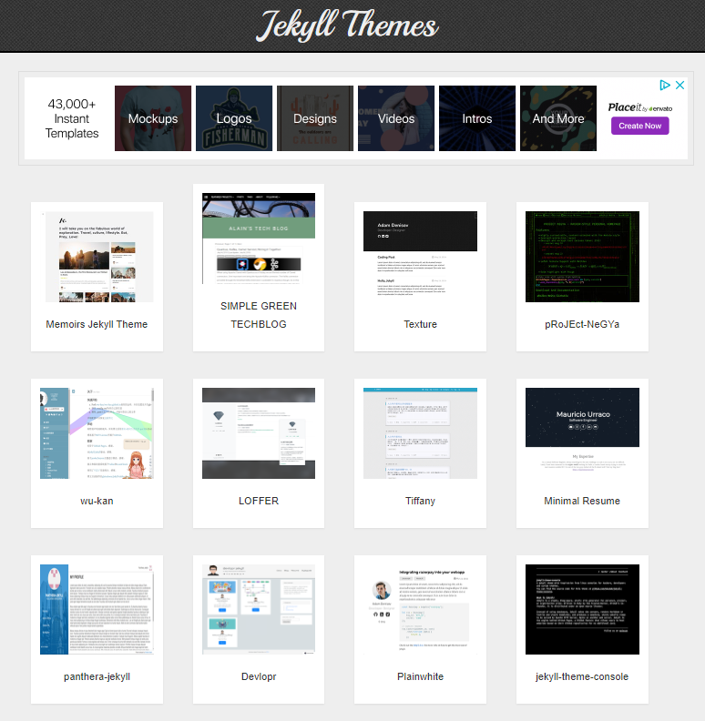

# github page로 static page 만드는 법
- 프로그램 설치 없이 빠르게 가능

- Ruby, Jekyll 설치없이 빠르게 수준급 블로그 만들기

- 순서

1. 새 저장소 (repository) 생성

2. 마음에 드는 Jekyll 테마 검색

3. _config.yml 가져와서 수정

4. index 파일 가져와서 수정

5. _posts에 글쓰기

6. 확인하기


다시 

## 1. 마음에 드는 Jekyll 테마 선정 및 환경 설정

참고: https://theorydb.github.io/envops/2019/05/02/envops-blog-theme/

## 

### Jekyll 테마 선정

#### 테마 제공 사이트

아래 사이트에서 무료로 제공되는 테마를 찾아서 선택할 수 있다. 무료지만 너무 많아서 선택이 어려울 수 도 있다.

http://jekyllthemes.org/
https://jekyllthemes.io/free
http://themes.jekyllrc.org/
https://github.com/topics/jekyll-theme




**선정기준**

모바일에서 보기 편한 **반응형**

**한글 폰트**의 가독성

**커스터마이징** 정도

**디자인**: 레이아웃, 줄간격 등

다양한 지원 기능: 검색, 태그, 댓글, syntax highlight, summary, Google analytics,  equation 등 


**Clean Blog**: ~~https://blackrockdigital.github.io/startbootstrap-clean-blog/~~
https://github.com/StartBootstrap/startbootstrap-clean-blog 

: 깔끔한 디자인, 반응형 지원, 예쁜 한글 폰트, 편리한 커스터마이징

**Minimal mistake **: https://mmistakes.github.io/minimal-mistakes/

: 깔끔한 디자인, 반응형 지원, 예쁜 한글 폰트, 편리한 커스터마이징


맘에 드는 테마를 선택한 후, JeKyll 설치 후 GitHub와 연동한다.


## 2. JeKyll 설치 및 GitHub 연동
참고: https://theorydb.github.io/envops/2019/05/03/envops-blog-github-pages-jekyll/

### GitHub 회원가입 및 Fork
GItHub에 보관할 저장소를 만드는 방법은 2가지:

* fork로 저장소 생성

  초보자에게 추천

* start a project: 직접 생성

  초보자에게는 복잡함

  


### fork 로 저장소 생성

본 사이트에서 소개하는 필자의 생성소 https://github.com/theorydb/theorydb.github.io 를 fork 하여 먼저 진행

Settings > 
Repository name: 가능하면 <username: GitHub 가입 이름>.github.io 로 설정 : ygkim912test.github.io
[v] Issues


### GIt 설치 및 clone

**GIt 설치**
https://git-scm.com/ 에 접속하여 자신의 OS에 맞는 파일을 다운로드 받아 설치
저장소 다운로드할 폴더 선택: 

 


**Git 사용자 등록**

```
git config --global user.name "사용자 이름"
git config --global user.email "사용자 이메일"
```


**git clone  으로 저장소 복사**

```
git clone https://github.com/ygkim912/ygkim912.github.io.git
```


### Ruby & Jekyll 설치

Jekyll기반으로 만들어진 테마를 수정하려면  Jekyll 설치해야 함

Jekyll은 정적 컴파일러

text로 작성한 markdown, _config.yml등의 파일들이 JeKyll통해서 _site폴더내의 산출물로 변환되고, web에서 실행됨


**Ruby 설치**

Jekyll로 Ruby로 만들어졌으므로, Ruby를 설치해야 함

Ruby 내용을 몰라도 걱정하지 말 것

윈도우 OS 인  경우  **Ruby와 개발툴 킷**을 별도로 설치해야 함: https://rubyinstaller.org/downloads/


윈도우 검색창 > start command prompt with ruby 클릭 > 


```
> chcp 65001 실행: 인코딩 부여, 진행 오류 방지
```


 

저장소 복사한 위치로 이동: `c:\_ygkim\website\ygkim912\ygkim912test.github.io\`

Ruby에서 지원하는 gem 명령어로 JeKyll과 필요한 라이브러리 설치

(gem: Ruby에서 제공하는 라이브러리 설치 지원 도구)

[x] 방법1

```
> gem install bundler jekyll minima jekyll-feed tzinfo-data rdiscount
```

초기화 진행: 여기서 문제 생김

`> jekyll new ygkim912test.github.io`


[v] 방법2: 방법1  진행에 문제 있어서 다음과 같이 함--

```shell
$ gem install bundler
$ bundle install
$ bundle exec jekyll serve # 지킬 서버 구동
```
확인
http://127.0.0.1:4000

앞으로는, 포스팅 작성시 루비에 접속하여 지킬을 실행하는 정도의 명령만 알면 됨
시작 > start command prompt with Ruby > 
cd < 저장소 복사한 위치> > jekyll serve

#### Jekyll 폴더 구조
* 글을 쓰기 위해 반드시 변경할 것들
  `_featured_tags/`: 카테고리 대분류 폴더
  `_featured_categories/`: 카테고리 소분류 (태그) 폴더
  `_data/`: 개발자, 운영자, 기타 정보 폴더 (author.yml 수정)
  `_config.yml`: 환경변수 설정 파일
  `README.md`: GitHub 프로젝트에서 보이는 readme
  `favicon.ico`: 블로그접속시 브라우저 주소창에 표시되는 아이콘
  `about.md`: About 메뉴 클릭스 나타나는 불로그에 대한 소개글

* 필요시 변경할 것들

  `assets/`: 이미지, css 등 저장

  `_layouts/`: 포스트 감싸기 위한 레이아웃 정의 (페이지, 구성요소등)

  `_includes/`: 재쇼용을 위한 기본 페이지 폴더

  `Gemfile`: 

  ..


### 파일 수정하기

**_config.yml 수정**: 환경 변수 설정 파일


## 3. Prose.io 연동으로 포스팅  및 배포 쉽게 하기


# Minimal mistake

## Quick start guide
https://mmistakes.github.io/minimal-mistakes/docs/quick-start-guide/

### Remote theme method

