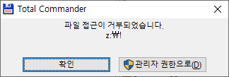
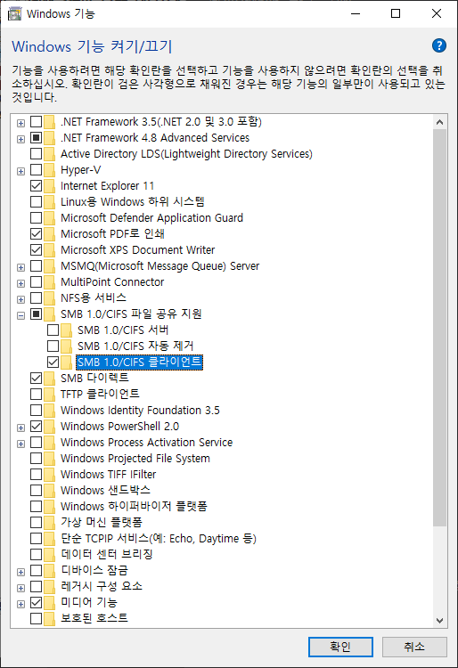
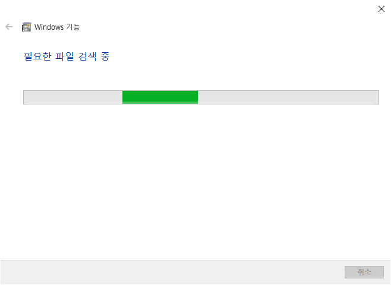
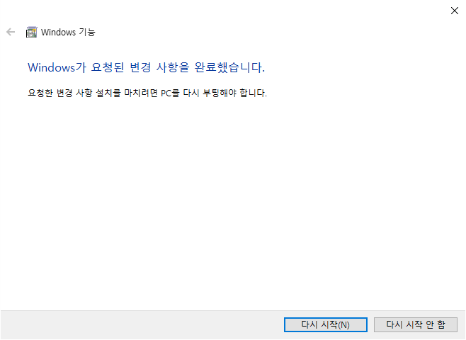

Windows에서 ubuntu의 공유폴더 접근시 다음과 같이 접근이 거부되는 경우,

예를 들면, windows를 update하면서 발생할 수 있다.

참고: https://learn.microsoft.com/ko-kr/troubleshoot/windows-client/networking/cannot-access-shared-folder-file-explorer

기존의 network drive를 다 해제하고, 다시 연결한다.

