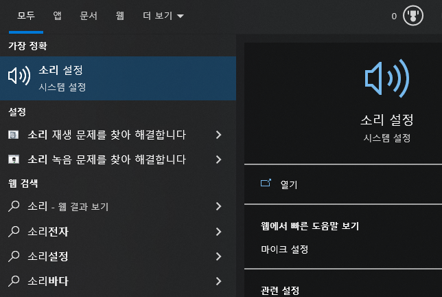
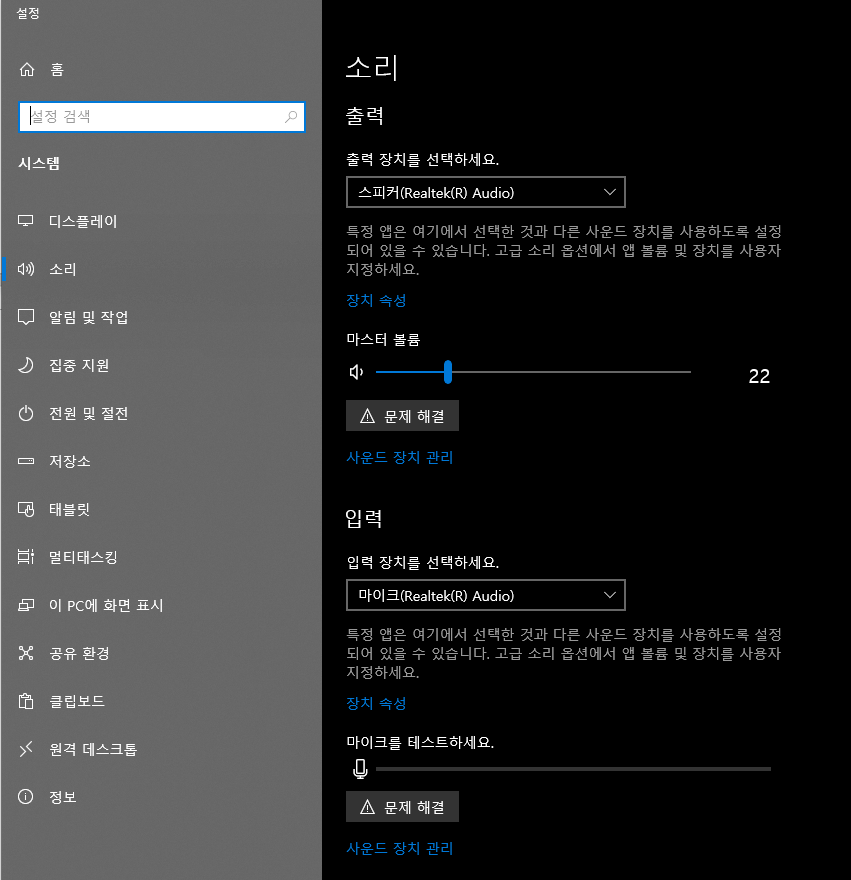
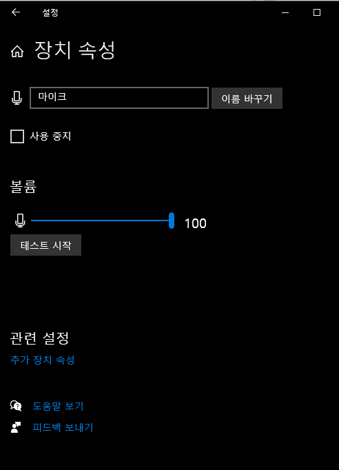
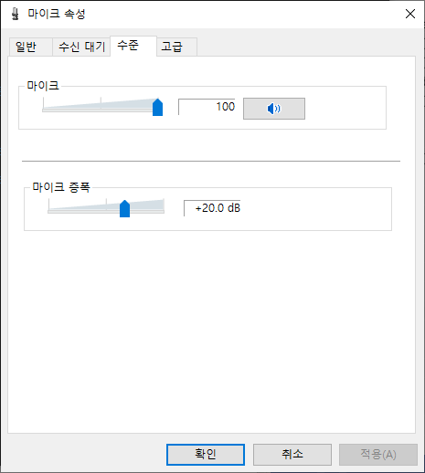
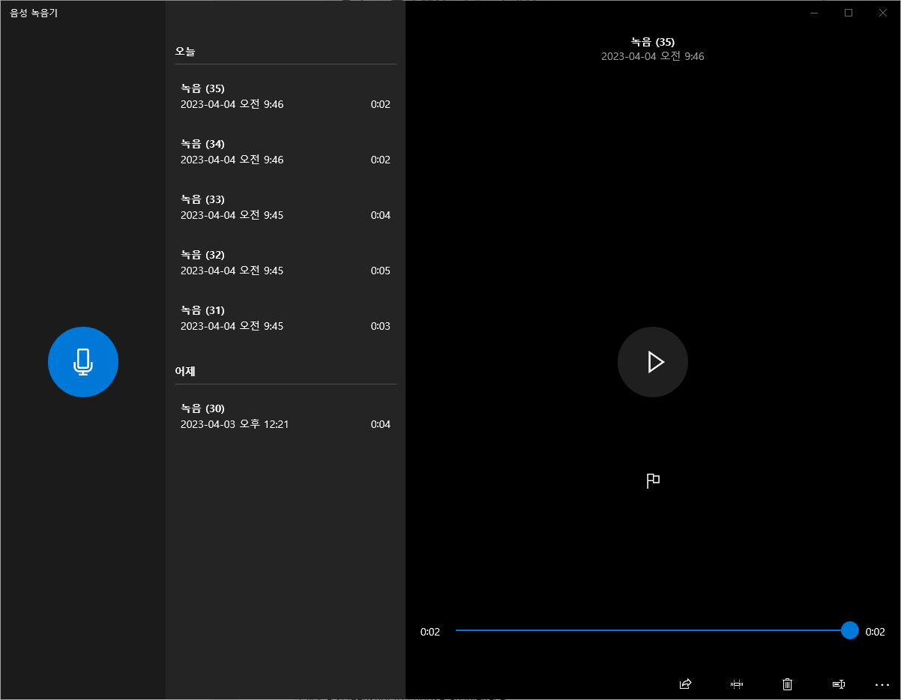
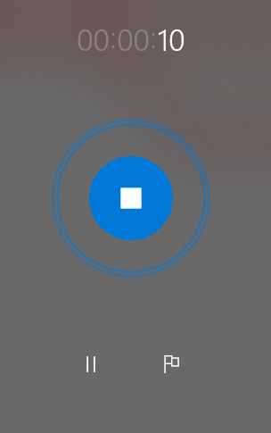

# 마이크 증폭

마이크 음량이 작을때 마이크 소리를 증폭시키는 방법을 공유합니다.

윈도우 찾기에서 `소리` 를 입력하소, `소리 설정` 에 들어갑니다.

우측 중앙의 입력 부분에서 입력 장치를 확인한 후, 중앙의 장치 속성을 선택합니다.

장치 속성이 열리면, 중앙의 볼륨을 100으로 맞춰서 최대로 볼륨으로 만듭니다.

만약, 여전히 볼륨이 작다면, 관련 설정에서 `추가 장치 속성`을 선택합니다.

마이크 속성 창에서 `수준` 탭에 들어가서, 마이크 중폭을 확인합니다.

마이크 중복의 슬라이드바를 올려주면, 볼륨을 더 크게 키울 수 있습니다.

너무 많이 올리게 되면, 잡음이 들어가거나, 소리가 변질될 수 있으므로 적절한 값으로 설정합니다.

위에서 `확인`을 누른후, 마이크 볼륨이 적절한지 확인하는 방법은 음성 녹음기를 사용해서 녹음해보는 것입니다.

윈도우 좌측 하단의 `찾기` 창에서 `녹음`을 입력하면, 음성 녹음기를 실행할 수 있습니다.

좌측의 마이크 모양 버튼을 눌러서 녹음을 하게 되면, 소리의 크기에 따라 중앙의 원이 크게 나타납니다. 중앙에서 부터 큰 원이 나타날 수록 더 소리가 증폭됨을 의미합니다.  녹음후 상단의 플레이 모양 버튼을 눌러서 녹음 결과가 적절한지에 따라, 상단의 볼륨 증폭 값을 적절히 변경하면 됩니다.

# 참고

https://haprics.com/171