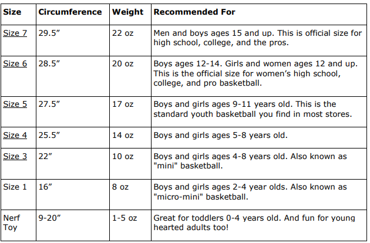

https://plymouthct.myrec.com/documents/basketball_sizechart.pdf

# 농구공 크기 추천

주위에서 아이들이 농구 연습을 하거나 경기하는 걸 보게 되면, 대부분의 아이들이 맞지 않는 농구공을 사용하는 걸 볼 수 있다. 아이들에게 맞지 않는 공은 잘못된 습관으로 이어지기 쉽고, 무거운 농구공을 사용하면서 쉽게 다칠 수 있는 위험도 있다.

아래는 전문가들이 추천하는 농구공 크기이다. 

