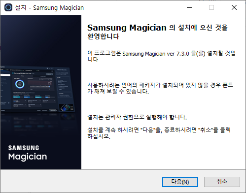
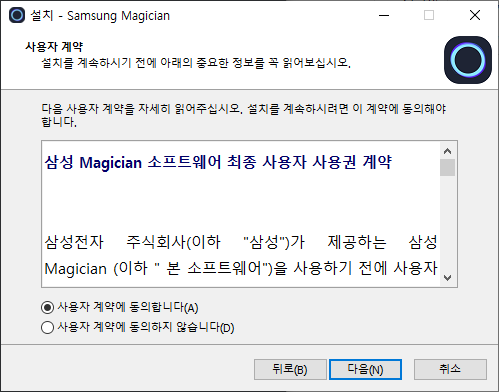
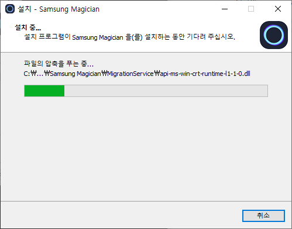
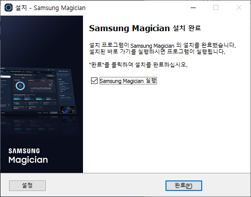
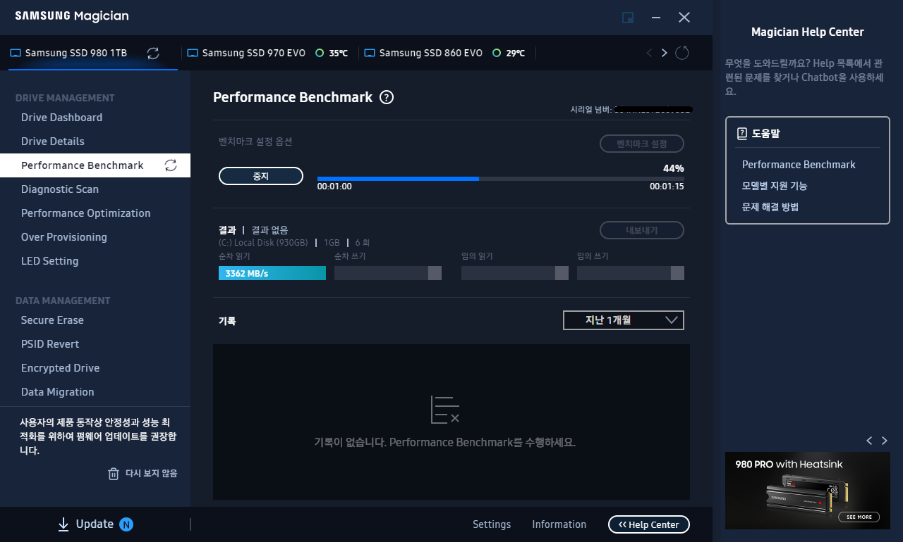
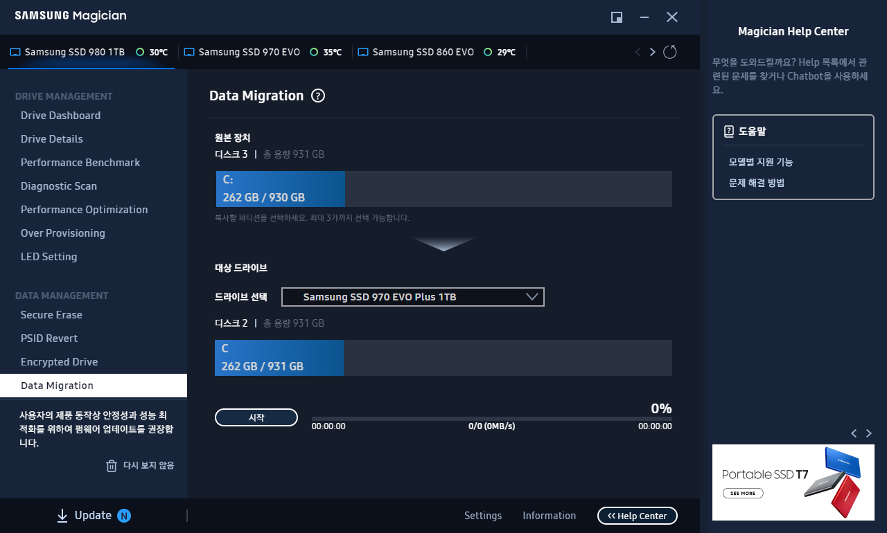

참고: https://news.samsungsemiconductor.com/kr/samsung-ssd-window-8-%EC%B2%B4%ED%97%98%EB%8B%A8-%EC%82%BC%EC%84%B1-ssd840-%EC%B5%9C%EC%A0%81%ED%99%94%EC%99%80-%EB%94%94%EC%8A%A4%ED%81%AC-%EB%B3%B5%EC%A0%9C%EB%8A%94-magician%EA%B3%BC-migration/

삼성 SSD Magician은 운영체제를 복사하는 소프트웨어로 삼성 SSD에서만 동작합니다.

설치하는 방법은 매우 단순합니다. 설치 언어를 선택하고, 사용자 계약이 동의하고 설치를 진행합니다.

프로그램을 실행하면, 다음과 같이 설치된 Samsung SSD 제품들을 확인할 수 있습니다.

운영체제 복사를 위해 Data Migration을 선택합니다. 

대상 드라이브를 선택하고, 시작 버튼을 누릅니다.

