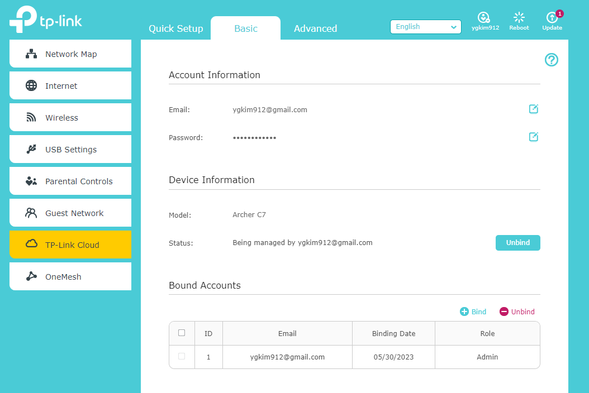
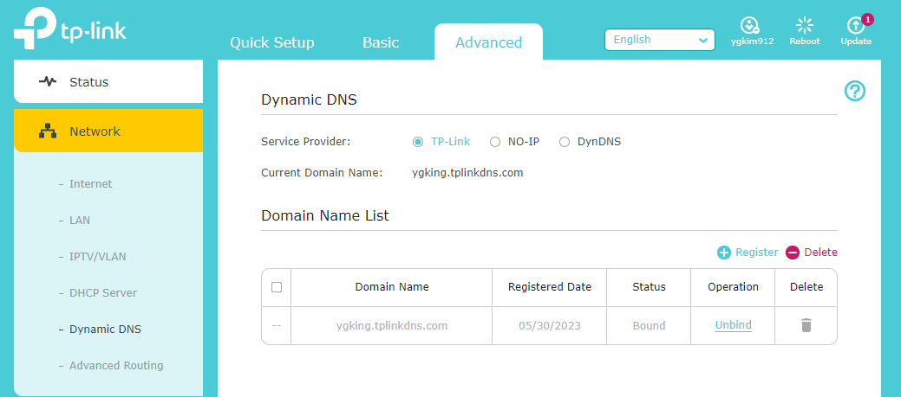
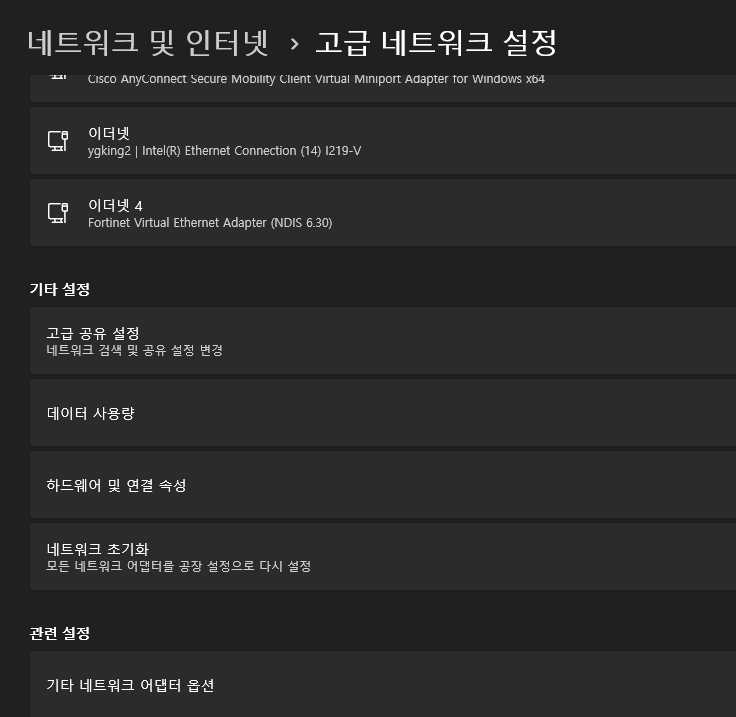
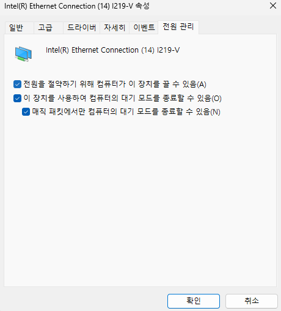

https://www.tp-link.com/us/support/faq/1366/

# TP-Link cloud 가입

# App 스토어에서 tether app 설치

----

https://www.tp-link.com/us/support/faq/1367/

다음과 같이 DDNS 설정

----

WOL 설정

https://www.tp-link.com/us/support/faq/923/

---

WOL 프로그램

https://blog.naver.com/PostView.nhn?isHttpsRedirect=true&blogId=pswon72&logNo=150093246813&redirect=Dlog&widgetTypeCall=true&directAccess=false

----

랜카드 설정

https://it.donga.com/32139/

네트워크 및 인터넷 > 고급 네트워크 설정 > 기타 네트워크 어댑터 설정

