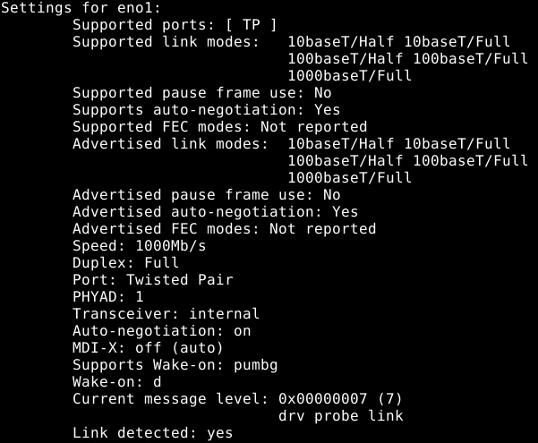

윈도우처럼 우분투도 WOL (Wake On LAN)을 지원합니다.

WOL은 원격에서 magic packet이라는 특정 패킷을 전송해서 LAN 카드를 통해 전원을 켜는 것을 말합니다.

전제 조건은 네트워크 카드가 이를 지원해야 합니다. (최근 대부분의 랜 카드들이 이를 지원합니다.)

BIOS 셋업에서도 이 설정을 On으로 해주어야 합니다.


# 준비

다음 명령어로 관련 패키지들을 설치합니다.

```
sudo apt-get install net-tools ethtool wakeonlan
```


# 설정

### 네트워크 ID 확인

네트워크 ID를 확인합니다.

```
ifconfig
```


### ethtool 실행

ethtool 을 이용해서 해당 adaptor의 wol설정 상태를 확인하고, 해당 값을 g로 변경합니다.

```
sudo ethtool eno1
```




```
sudo ethtool -s eno1 wol g
```

### 자동 재실행


이 설정은 재부팅 후에는 다시 기본값으로 돌아옵니다. 따라서, wolinit.sh를 하나 만들고 아래와 같이 기입합니다.

```
#!/bin/bash
ethtool -s eon1 wol g
exit
```

이 파일의 권한을 755로 만들고, 이 파일을 /etc/init.d 폴더로 이동합니다.

