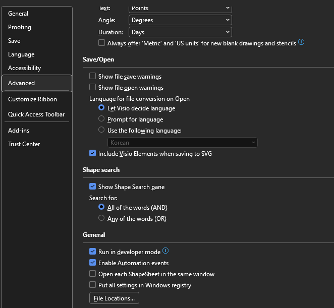
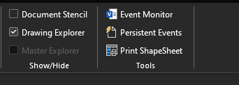
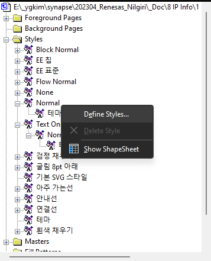
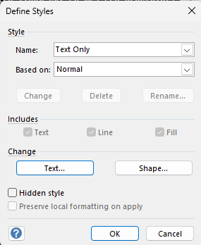
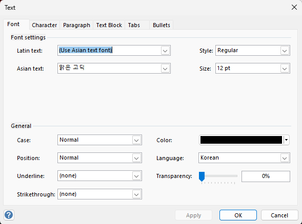

https://answers.microsoft.com/en-us/msoffice/forum/all/visio-professional-default-font-style-pt-and-color/b5e0c3cc-328d-4c36-bacb-c0ff2541026a

Advanced -> [v] Run in developer mode 선

메뉴 상단에 `Developer` 메뉴 추가 확인

Drawing Explorer 선택

Style > Normal > 우측 마우스 선택

Text 버튼 선

