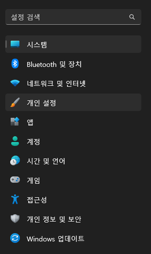

참고: https://blog.naver.com/artismart/221354116358

# 윈도우 10: 듀얼 모니터 작업 표시줄 한쪽만 표시되도록 숨기는 방법

윈도우 10에서는 듀얼 모니터 사용시 작업 표시줄이 양쪽에 표시됩니다. 

작업 표시줄에 모두 표시되면 편리할 때도 있지만, 타인과 화면을 공유할 때는 보여주고 싶지 않기도 합니다.

작업 표시줄 숨김 기능은 `개인 설정` > `작업 표시줄` 에서 설정할 수 있습니다.

작업 표시줄 동작을 찾아서, `[ ] 모든 디스플레이에 내 작업 표시줄 표시` 를 해제합니다.

주로 사용하는 모니터에만 표시가 되고, 나머지 모니터에서는 사라집니다.

