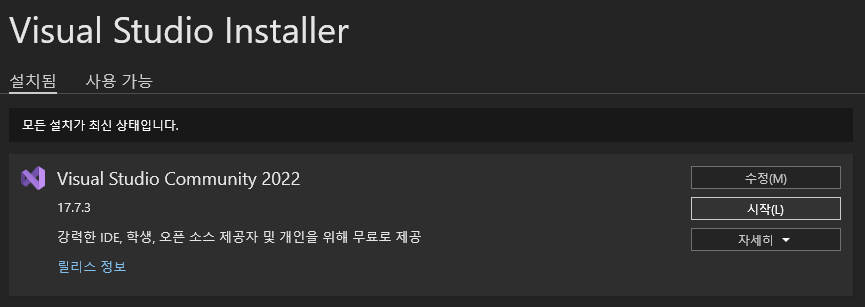
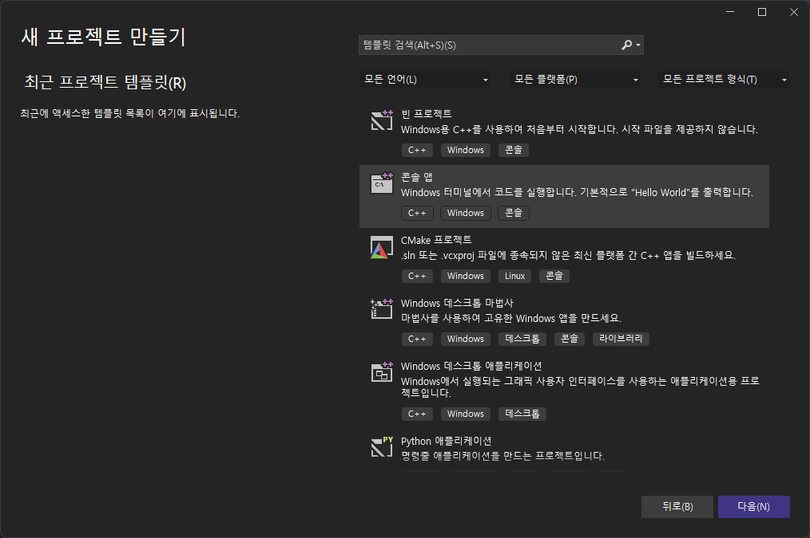

# 무료 C++ 강의

https://www.udemy.com/topic/c-plus-plus/free/

1. https://www.udemy.com/course/free-learn-c-tutorial-beginners/
2. https://www.udemy.com/course/learn-c_plus-with-real-world-examples/
3. 

# 무료 C++ 연습

https://codeup.kr/problemsetsol.php?psid=23

# 무료 컴파일러

### 1. Visual studio community

https://visualstudio.microsoft.com/ko/thank-you-downloading-visual-studio/?sku=Community&channel=Release&version=VS2022&source=VSLandingPage&passive=false&cid=2030#cplusplus

### 2. Code Block

### 3. gnu c++ compiler: Mac, Linux

### 4. Eclipse CDT C++

# Visual Studio Community 설치

C++ 설치 

Hello World 시작

