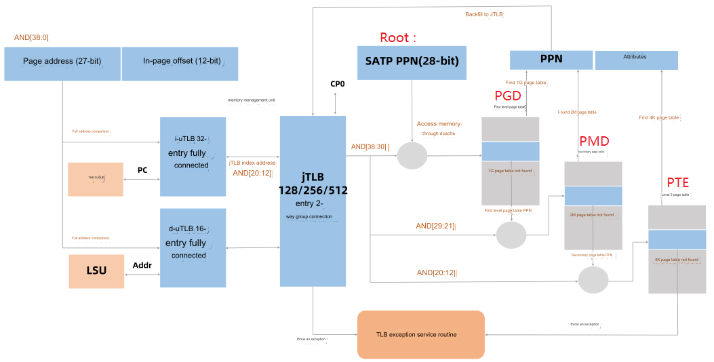

# MMU 위치

# RISCV MMU

참고: https://chromite.readthedocs.io/en/latest/mmu.html

가장 잘 설명되어 있다. 

# RISCV MMU #2 

참고: https://tinylab.org/riscv-mmu/

## 1. X86_64

64bit CPU인 x86_64는 각각 4 level 및 5 level MMU mapping에 해당하는 48 bit와 57 bit 의 두 가지 선형 주소 모드를 지원합니다.

| 선형 주소    | mmu 레벨                            | Linux 사용자 주소 공간                    | 리눅스 커널 주소 공간                     |
| :----------- | :---------------------------------- | :---------------------------------------- | :---------------------------------------- |
| Sv48(48비트) | 4레벨: pgd→pud→pmd→pte→page(4k)     | 0x00000000 00000000 - 0x00007FFF FFFFFFFF | 0xFFFF8000 00000000 - 0xFFFFFFFF FFFFFFFF |
| Sv57(57비트) | 5레벨: pgd→p4d→pud→pmd→pte→page(4k) | 0x00000000 00000000 - 0x00FFFFFFFFFFFFFF  | 0xFF000000 00000000 - 0xFFFFFFFF FFFFFFFF |

X86_64는 `CR3`레지스터를 사용하여 MMU 매핑 테이블의 루트 주소를 저장합니다.

자세한 내용은 [페이징 메커니즘에 대한 자세한 설명](https://blog.csdn.net/pwl999/article/details/109453180) 및 [커널 주소 공간 레이아웃에 대한 자세한 설명을](https://blog.csdn.net/pwl999/article/details/112055498) 참조하세요 .

## 2. C906

Sv39/Sv48/Sv57/Sv64는 riscv64에서 지원됩니다. C906에 의해 설계된 애플리케이션 시나리오에는 많은 메모리 리소스가 필요하지 않기 때문에, 현재 C906은 3 레벨 MMU 매핑에 해당하는 Sv39 모드만 지원합니다.

| 선형 주소    | mmu 레벨                    | Linux 사용자 주소 공간                    | 리눅스 커널 주소 공간                      |
| :----------- | :-------------------------- | :---------------------------------------- | :----------------------------------------- |
| Sv39(39비트) | 3레벨: pgd→pmd→pte→page(4k) | 0x00000000 00000000 - 0x0000003F FFFFFFFF | 0xFFFFFFFC0 00000000 - 0xFFFFFFFF FFFFFFFF |

x86과 유사하게 `CR3`riscv는 `SATP`레지스터를 사용하여 MMU 매핑 테이블의 루트 주소를 저장합니다. 구체적인 매핑 관계는 다음과 같습니다.

