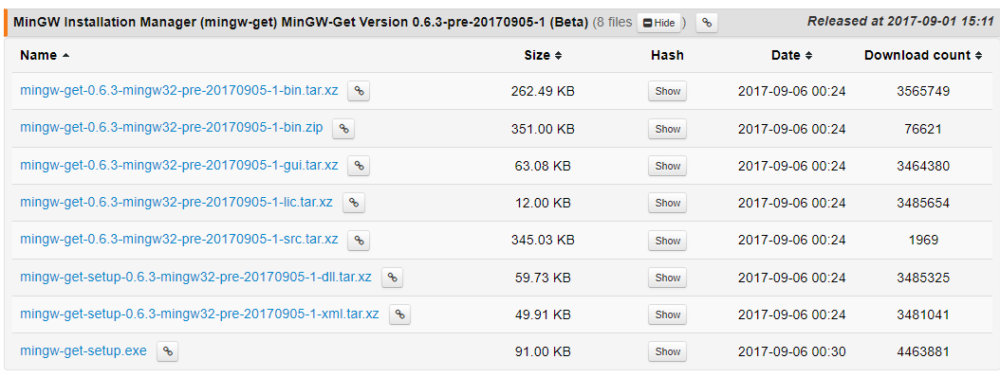

참고: 

https://medium.com/@samsorrahman/how-to-run-a-makefile-in-windows-b4d115d7c516

## 1. MinGW 다운로드 및 설치

맨 아래 mingw-get-setup.exe 선택후 설치

설치 위치 확인

환경 변수 설정: cmd 창에서 'environment variables' 입력

## 2. 