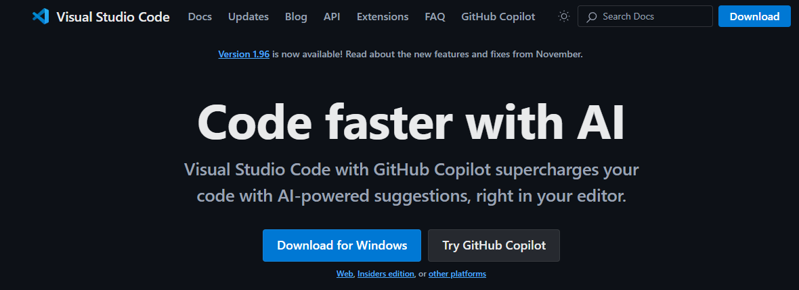
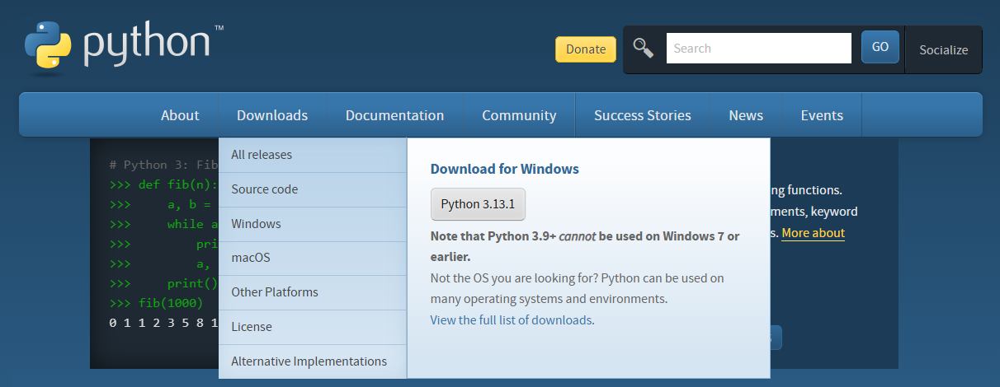
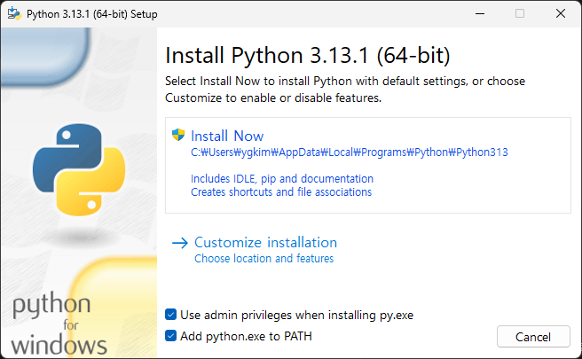
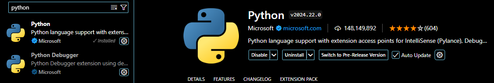
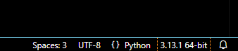
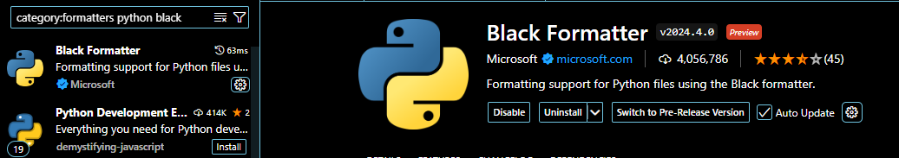

VSCode(Visual Studio Code)에서 Python을 사용하려면 다음 단계를 따라 설정하면 됩니다.

------

## 1. **VSCode 설치**

- [Visual Studio Code 공식 웹사이트](https://code.visualstudio.com/)에서 VSCode를 다운로드하고 설치하세요.
- 웹사이트에서 Download for Windows를 선택합니다.



------

## 2. **Python 설치**

- [Python 공식 웹사이트](https://www.python.org/)에서 Python을 다운로드하고 설치하세요. Downloads 탭에서 Download for WIndows를 선택합니다.



- 설치 중 **"Add Python to PATH"** 옵션을 반드시 선택하세요.




------

## 3. **Python 확장 설치**

1. VSCode를 실행합니다.
2. **Extensions** 아이콘(사이드바의 네모 아이콘)을 클릭합니다.
3. 검색창에 **"Python"**을 입력하고, Microsoft가 제공하는 Python 확장을 설치합니다.




------

## 4. **Python 인터프리터 설정**

1. VSCode의 왼쪽 하단에 있는 **Interpreter** 선택 메뉴(또는 하단 상태 표시줄에서 Python 관련 텍스트)를 클릭합니다.
2. 설치된 Python 인터프리터를 선택합니다.
   - 예: `Python 3.x.x ('python')`



------

## 5. **코드 실행 환경 설정**

### a. **Python 파일 실행**

1. ```
   .py
   ```

    파일을 생성합니다.

   - 예: `hello.py`

2. 파일에 코드를 작성합니다.

   ```python
   print("Hello, VSCode!")
   ```

3. 파일을 저장하고 상단의 **Run** 버튼(▶️ 아이콘)을 클릭하여 실행합니다.

### b. **터미널에서 실행**

- 터미널을 열려면: `Ctrl + ~`

- 명령어: 파일을 저장한 폴더로 이동해서, 아래와 같이 명령어를 입력한다.

  ```bash
  python hello.py
  ```

------

## 6. **디버깅 설정**

1. **Run and Debug** 아이콘(사이드바의 ▶️+⏹️ 아이콘)을 클릭합니다.
2. **Add Configuration**을 클릭하고 Python 디버깅 구성을 추가합니다.
3. 디버그 실행을 시작하려면 F5를 누릅니다.

------

## 7. **포맷터 및 린터 설정(선택 사항)**

### a. **코드 포맷터**

- VSCode에서 포맷터를 Black 으로 설정합니다.

   - Extension에서 Microsoft의 Black Formatter를 설치합니다.

  

  - 

- 방법 2: Black 또는  Autopep8 을 설치합니다.

   ```bash
pip install black
  ```

  * Command Palette( `Ctrl+Shift+P` ) → `Format Document With` → `Configure Default Formatter` → **Black** 선택


### b. **린터**

- Pylint 또는  Flake8  설치:

   ```bash
pip install pylint
  ```

- VSCode에서 Python 린터를 설정합니다:

  - Command Palette → `Python: Select Linter` → **Pylint** 선택

------

## 8. **필요한 확장 및 패키지 설치**

- Jupyter Notebook

  :

  ```bash
  pip install notebook
  ```

  Jupyter 파일(.ipynb)도 VSCode에서 열 수 있습니다.

- 필요한 라이브러리 설치

  :

  ```bash
  pip install <라이브러리 이름>
  ```

------

위 단계를 완료하면 VSCode에서 Python 환경을 효율적으로 설정하고 사용할 수 있습니다.


