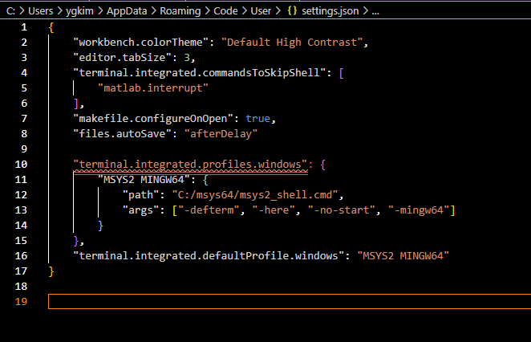

### vs code에 mys2 mingw64 terminal 추가

## tasks.json 설정 (MinGW 컴파일)

    "version": "2.0.0",
    "tasks": [
        {
            "label": "Build C++ with MSYS2",
            "type": "shell",
            "command": "g++",
            "args": [
                "-g",
                "${file}",
                "-o",
                "${fileDirname}/${fileBasenameNoExtension}.exe"
            ],
            "group": {
                "kind": "build",
                "isDefault": true
            },
            "problemMatcher": "$gcc",
            "options": {
                "shell": {
                    "executable": "C:\\msys64\\usr\\bin\\bash.exe",
                    "args": ["-l", "-c"]
                }
            }
        }
    ]