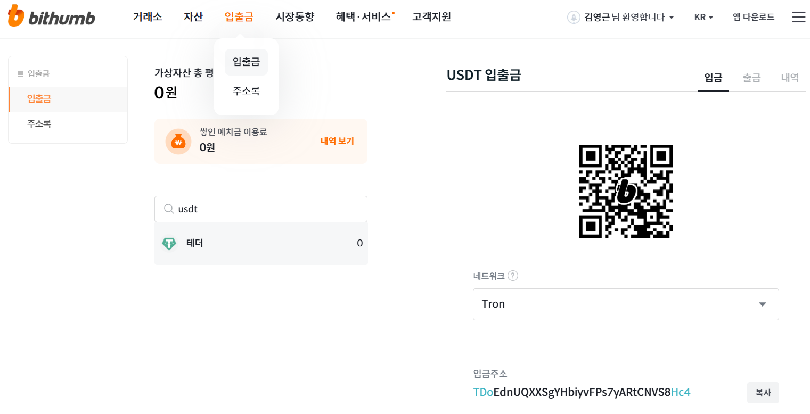

# Step-by-step (Binance → Bithumb, 저비용 경로)

1. **빗썸에서 입금주소 준비 (USDT-TRC20)**

- 빗썸 앱/웹 → **입출금** → 코인 **USDT** → **입금** → **네트워크: TRON(TRC20)** 선택
- 표시된 **입금주소**(필요 시 QR) 복사
- *메모/태그 없음(USDT-TRC20 기준)*

주소: TDoEdnUQXXSgYHbiyvFPs7yARtCNVS8Hc4

1. **바이낸스에서 ETH → USDT 교환**

- Binance 앱/웹 → **Trade(거래) → Spot**
- 종목: **ETH/USDT** → **Sell ETH** (시장가 또는 지정가)
- 체결 후 **자산에 USDT 증가** 확인

1. **바이낸스에서 출금 설정 (On-chain)**

- **Assets(자산)** → **Withdraw(출금)** → 코인 **USDT**
- **Address**: (1)에서 복사한 **빗썸 USDT-TRC20 주소** 붙여넣기
- **Network**: **TRON(TRC20)** 선택(중요)
- 금액 입력 → 수수료/도착예상 확인 → **2FA 인증** → 전송

1. **테스트 전송 → 본전송**

- 먼저 **소액(예: 10–20 USDT)** 테스트 전송
- 빗썸 **입금 반영** 확인되면
- 잔액을 **1–3회 분할**해 본전송 실행(점검/오입력 리스크 분산)

1. **빗썸에서 매도/환전 (원하시면)**

- 빗썸 입금 완료 후, 원화(KRW)나 다른 코인으로 **거래**
- 수수료 쿠폰/등급 있으면 적용

------

## 필수 체크 (실수 방지)

- **네트워크 일치**: 빗썸 입금 **TRC20 = 바이낸스 출금 TRC20**
- **주소 재확인**: 마지막 6–8자리 큰소리로 읽어 확인
- **수수료**: 출금 화면에 표시(보통 TRC20은 저렴, 빗썸 입금은 무료)
- **공지**: 전송 전 양쪽 거래소 **입출금 점검 공지** 체크

## 금액 계산 예시

- 보유 ETH 전량 → USDT로 변경
- **출금 수수료**(TRC20)는 전송 시 화면에 고정 수량으로 표시됨 →
   **수령액 = 보낸 USDT – 출금 수수료**

원하시면 지금 **스크린별 버튼 위치가 표시된 초간단 체크리스트(PDF)**를 만들어 드릴게요. 코인 금액(예: 25,000달러 상당)과 **한 번에 보낼지/분할 보낼지**만 알려주시면 바로 적용해서 드립니다