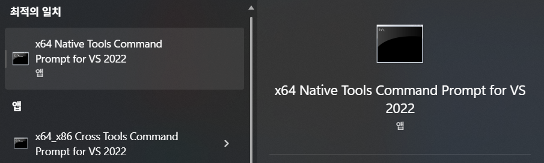
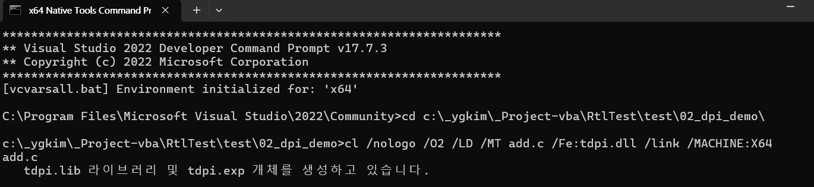
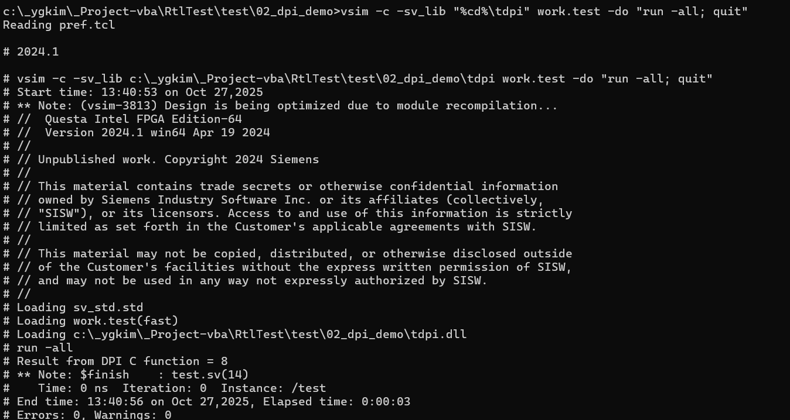

# 0) 사전 준비

1.  **Visual Studio 2022 Community (무료)** 설치
    

-   설치할 때 **“Desktop development with C++”** 워크로드 체크 → `cl.exe` 포함
    

2.  **QuestaSim(또는 Questa)** 설치 경로 확인
    

-   예: `C:\Siemens\EDA\QuestaSim` (버전에 따라 다를 수 있음)
    

> ※ Questa가 64비트라면 VS도 **x64 컴파일러**로 빌드해야 합니다. (아래 배치파일이 x64로 설정)

# 3) 수동으로 명령 실행(참고)

배치파일 대신 단계별로 직접 하고 싶다면:

1.  **x64 Native Tools Command Prompt for VS 2022** 실행 -> 64 bit 설정
    

call "C:\Program Files\Microsoft Visual Studio\2022\Community\Common7\Tools\VsDevCmd.bat" -arch=amd64

2.  작업 폴더로 이동 후 DLL 빌드
: 64 bit 빌드    
cl /nologo /O2 /LD /MT add.c /Fe:tdpi.dll /link /MACHINE:X64

: 32bit 빌드 (아래 quest 64bit와 호환 X)
`cl /LD add.c /Fe:tdpi.dll` 

3.  Questa 경로 PATH 추가
    

`set PATH=C:\altera\24.1std\questa_fe\win64;C:\altera\24.1std\questa_fe\win64\bin;%PATH%` 

C:\intelFPGA_pro\24.2\questa_fe\win64\

4.  컴파일 & 실행
    

dumpbin /headers tdpi.dll | findstr /i machine   :: (machine (x64) 가 보여야 정상)
vlog -sv test.sv
vsim -c -sv_lib "%cd%\tdpi" work.test -do "run -all; quit"
`

# 2번째 시도: ok

그 다음 **클린 후 재빌드**:

`del /q *.obj *.lib *.exp *.dll 2>nul
cl /nologo /O2 /LD /MT add.c /Fe:tdpi.dll /link /MACHINE:X64` 

### 내보낸 심볼 확인

`dumpbin /exports tdpi.dll | findstr /i add_two` 

-   여기서 `add_two` 가 보여야 합니다.
    

### 재실행

`vlog -sv test.sv
vsim -c -sv_lib "%cd%\tdpi" work.test -do "run -all; quit"`

## 체크리스트 요약

-   **x64 네이티브 툴프롬프트**에서 빌드 (이전 32-bit LNK1112는 해결됨)
    
-   함수 **export** 됨 (`__declspec(dllexport)` 또는 `/EXPORT:add_two`)
    
-   `dumpbin /exports tdpi.dll` 에 **add_two** 표시
    
-   `vsim -sv_lib "%cd%\tdpi"` (확장자 없이) 로 실행
    

이대로 하면 `(vsim-3770)` 경고/`Null foreign function pointer` 치명 오류가 사라지고, 콘솔에:

`# Result  from DPI C function  =  8` 

이 출력돼야 합니다.

