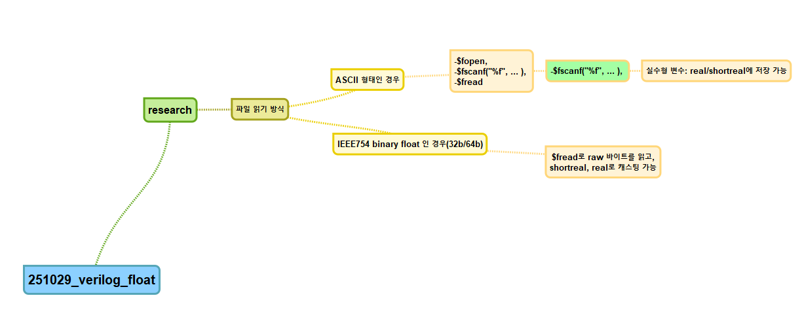

### 1. ModelSim에서 파일 읽기 방식

- ModelSim은 기본적으로 `textio` 패키지나 `$fopen`, `$fscanf`, `$fread` 같은 **Verilog/VHDL 파일 I/O**를 통해 외부 파일을 읽습니다.
- 즉, 파일 안에 있는 데이터가 **ASCII 텍스트 형태(예: `1.234e-02`)**로 저장되어 있다면 `textio.read(real'(...) )` (VHDL) 이나 `$fscanf("%f", ...)` (Verilog/SystemVerilog)로 읽어 실수형(`real`/`shortreal`) 변수에 저장할 수 있습니다.

------

### 2. 바이너리 float 저장 파일의 경우

- 만약 파일이 IEEE754 **바이너리 float (32비트/64비트)** 로 저장되어 있다면:
  - Verilog에서는 `$fread`로 raw 바이트를 읽고, `shortreal`이나 `real`로 캐스팅해야 합니다.
  - VHDL에서는 직접 `std_logic_vector(31 downto 0)` 같은 형태로 읽어서 `to_real(float32'(...))` 같은 변환 패키지를 써야 합니다.
- 이 경우 endian(리틀/빅 엔디안)과 정밀도(32bit float vs 64bit double) 일치 여부를 맞추어야 합니다.

------

### 3. 실제 시뮬레이션에서의 사용

- **텍스트 파일 float** → 가장 간단, 바로 `real`로 읽기 가능.
- **바이너리 float** → 추가 변환 로직 필요. 일반적으로 연구/검증 단계에서는 CSV나 ASCII로 저장하는 편이 훨씬 편리합니다.


# 1. ASCII 파일


## 1) 디렉터리 구조

```
modelsim_proj/
├─ rtl/
│  └─ dut.sv
├─ tb/
│  ├─ tb_top.sv
│  └─ floats.txt
└─ scripts/
   ├─ new_project.do
   ├─ compile.do
   ├─ sim.do
   └─ wave.do
```

## 2) 예시 소스

### `rtl/dut.sv` — 간단 DUT (입력 실수값을 배율 곱해서 출력하는 모형; TB에서 호출)

```
module dut;
  // 이 모듈은 포트 없이, 태스크/함수로만 TB에서 호출하는 형태의 예시입니다.
  // 실제로는 고정소수점/정수 인터페이스를 두고 변환하여 사용하세요.

  // 실수 값을 받아 scale 배를 곱해 반환
  function real scale_real(input real x, input real scale = 2.0);
    return x * scale;
  endfunction

endmodule
```

### `tb/tb_top.sv` — ASCII float 파일 읽어서 DUT 함수에 적용

```
module tb_top;
  import "DPI-C" function void sv_fatal(string msg="");

  integer fd;
  string  line;
  real    val, outv;
  real    sum = 0.0;
  int     cnt = 0;

  // DUT 인스턴스
  dut u_dut();

  initial begin
    // 파일 열기
    fd = $fopen("tb/floats.txt", "r");
    if (fd == 0) begin
      $error("cannot open tb/floats.txt");
      $finish;
    end

    // 한 줄씩 읽어서 실수 파싱
    while ($fgets(line, fd)) begin
      // 주석/빈줄 스킵
      if (!line.len()) continue;
      if (line.tolower().substr(0,0) == "#") continue;

      if ($sscanf(line, " %f ", val) == 1) begin
        outv = u_dut.scale_real(val, 1.5); // 예: 1.5배 스케일
        sum += outv;
        cnt++;
        // $display("in=%f out=%f", val, outv);
      end
    end
    $fclose(fd);

    $display("read %0d floats, sum(out)=%f, avg(out)=%f",
             cnt, sum, (cnt ? sum/cnt : 0.0));

    // 파형 관찰을 위해 약간 대기 후 종료
    #10 $finish;
  end
endmodule
```

### `tb/floats.txt` — 샘플 데이터(ASCII)

```
# sample floats
0.5
1.0
-2.75
3.14e-1
10
```

## 3) 도 스크립트

### `scripts/new_project.do` — 프로젝트/라이브러리 생성 & 파일 등록

```
transcript on

# 새 work 라이브러리
if {[file exists work]} { vdel -all }
vlib work
vmap work work

# (선택) 프로젝트 개체 생성 – GUI에서 열어볼 때 유용
# 일부 버전에서 'project' 명령이 없을 수 있으니, 실패해도 무시하도록 처리
if {[catch {project new float_proj .}]} {
    echo "project command not available; continuing with library-based flow."
} else {
    project addfile rtl/dut.sv
    project addfile tb/tb_top.sv
    project save
}

# 바로 컴파일 호출
do scripts/compile.do
```

### `scripts/compile.do` — 컴파일

```
transcript on

# SystemVerilog 컴파일
vlog -sv +acc=rn rtl/dut.sv tb/tb_top.sv
if {$? != 0} { quit -code 1 }

echo "Compile OK"
```

### `scripts/sim.do` — 시뮬레이션 & 파형 불러오기

```
transcript on

vsim -voptargs=+acc work.tb_top
do scripts/wave.do
run -all
quit -f
```

### `scripts/wave.do` — 파형 설정

```
transcript off

add wave -divider {TB}
add wave sim:/tb_top/*

add wave -divider {DUT}
add wave sim:/tb_top/u_dut/*

# 숫자 표기는 필요하면 변경하세요
# force -freeze sim:/tb_top/some_signal 0 0
```


# IEEE754 Binary 형태로 저장후 읽기

