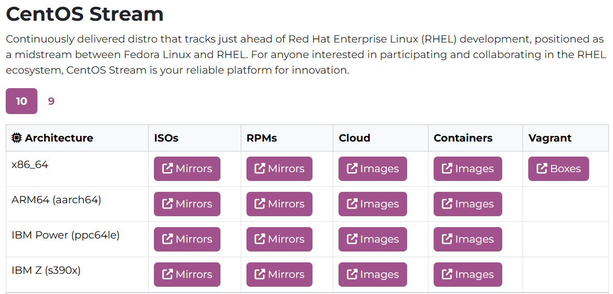

virtualbox에서 테스트용으로 **CentOS Minimal**을 설치하는 과정을 단계별로 소개합니다.

------

### **1. 준비물**

1. **VirtualBox 설치**

   - VirtualBox를 [공식 웹사이트](https://www.virtualbox.org/)에서 다운로드 및 설치.

2. **CentOS Minimal ISO 다운로드**

   - **CentOS Stream**: https://www.centos.org/download/에서 Minimal ISO 다운로드: x86_64의 ISO파일 선택

   

   - AlmaLinux

      또는 

     Rocky Linux

     : CentOS 대체를 고려할 경우 선택.

     - AlmaLinux: [https://almalinux.org](https://almalinux.org/)
     - Rocky Linux: [https://rockylinux.org](https://rockylinux.org/)

------

### **2. VirtualBox에서 가상 머신 생성**

1. **VirtualBox 실행**
   - VirtualBox를 실행하고 왼쪽 상단의 `새로 만들기` 클릭.
2. **가상 머신 설정**
   - **이름**: "TestCentOS" 등 원하는 이름 입력.
   - **유형(Type)**: `Linux` 선택.
   - **버전(Version)**: "Red Hat (64-bit)" 또는 CentOS Stream에 맞는 옵션 선택.
3. **메모리 크기 설정**
   - 최소 1GB(1024MB), 권장 2GB(2048MB) 이상.
4. **가상 하드 디스크 설정**
   - "새 가상 하드 디스크 생성" 선택 후 `만들기` 클릭.
   - 디스크 형식: 기본값 `VDI` 선택.
   - 저장 방식: "동적 할당" 선택.
   - 크기: 최소 10GB 이상 (권장 20GB).

------

### **3. CentOS Minimal 설치**

1. **ISO 파일 연결**

   - 생성된 가상 머신을 선택한 뒤, `설정(Settings)` → `저장소(Storage)`로 이동.
   - "Empty" 디스크 항목을 선택하고 오른쪽 CD 아이콘 클릭 → "디스크 파일 선택" → 다운로드한 CentOS Minimal ISO 파일 선택.

2. **가상 머신 시작**

   - VirtualBox에서 생성한 가상 머신을 선택하고 `시작(Start)`을 클릭.
   - CentOS 설치 프로그램이 실행됩니다.

3. **CentOS Minimal 설치 과정**

   - **Install CentOS** 선택.

   - 언어 선택 (기본값: English).

   - 설치 목적지(Installation Destination)

     :

     - 디스크 설정 화면에서 기본 옵션(자동 파티셔닝)을 사용.

   - 네트워크 및 호스트 이름(Network & Hostname)

     :

     - 네트워크 연결 활성화(Enable) 클릭.

   - 소프트웨어 선택(Software Selection)

     :

     - "Minimal Install" 선택.

   - "설치 시작(Begin Installation)" 클릭.

4. **루트 비밀번호 및 사용자 계정 설정**

   - 설치가 진행되는 동안 **루트 비밀번호**를 설정하고, 필요하면 추가 사용자 계정을 생성.

5. **설치 완료 및 재부팅**

   - 설치가 완료되면 시스템을 재부팅합니다.

------

### **4. 초기 설정**

1. **ISO 파일 제거**

   - 재부팅 시 ISO 파일이 연결되어 있으면 부팅 문제가 발생할 수 있습니다.
   - `설정 > 저장소`로 이동하여 ISO 파일을 제거.

2. **시스템 업데이트**

   - 설치 후 최신 업데이트 적용:

     ```bash
     sudo yum update -y
     ```

3. **네트워크 연결 확인**

   - 네트워크 인터페이스가 활성화되어 있는지 확인:

     ```bash
     nmcli device connect <인터페이스 이름>
     ```

   - DHCP로 IP 주소를 자동으로 받지 못하면 `/etc/sysconfig/network-scripts/ifcfg-<인터페이스>` 파일을 편집하여 설정합니다.

4. **유용한 패키지 설치**

   - 편리한 작업을 위해 추가 패키지 설치:

     ```bash
     sudo yum install -y epel-release
     sudo yum install -y vim net-tools wget
     ```

------

### **5. 테스트 환경 구성**

1. 필요한 소프트웨어 설치

   - 예를 들어, Apache/Nginx, MariaDB, 개발 도구 등:

     ```bash
     sudo yum install -y httpd mariadb-server
     sudo systemctl enable --now httpd mariadb
     ```

2. VirtualBox 게스트 추가 설치

    (옵션)

   - 클립보드 공유, 화면 해상도 조정을 위해 게스트 추가 도구 설치:

     ```bash
     sudo yum install -y gcc kernel-devel kernel-headers dkms make perl
     ```

------

### **6. 요약**

1. VirtualBox 설치 및 CentOS Minimal ISO 다운로드.
2. VirtualBox에서 가상 머신 생성 및 ISO 연결.
3. CentOS Minimal 설치 진행 및 초기 설정.
4. 시스템 업데이트 및 필요한 테스트 환경 구성.

CentOS Minimal은 가볍고 테스트용 서버로 적합합니다. 필요에 따라 추가 소프트웨어를 설치하며 테스트 환경을 확장할 수 있습니다! 