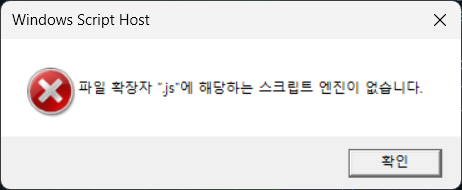
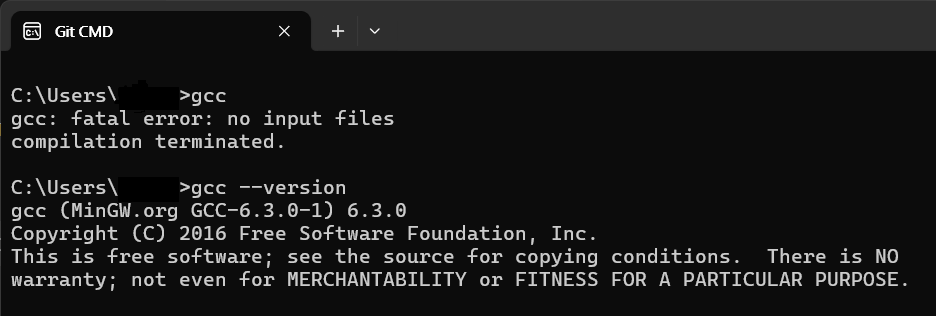

# **Windows에서 MinGW 및 GCC 설치하는 방법 (VS Code 연동 포함)**

Windows 환경에서 C/C++ 개발을 위해 **MinGW(GCC)**를 설치하고 **VS Code**에서 실행할 수 있도록 설정하는 방법을 소개합니다.

## **1. MinGW(GCC)란?**

MinGW(Minimalist GNU for Windows)는 Windows에서 **GNU GCC 컴파일러**를 사용할 수 있도록 만든 도구입니다. 이를 이용하면 C/C++ 프로그램을 Windows에서 컴파일하고 실행할 수 있습니다.

## **2. MinGW 다운로드 및 설치**

MinGW를 설치하기 위해서 **mingw.org** 라는 공식 사이트도 있지만, 좀 복잡합니다. 따라서

**sourceforge**  (https://sourceforge.net/projects/mingw/) 에서 다운을 받겠습니다.


### **1) MinGW 설치 파일 다운로드**

- [SourceForge에서 MinGW 설치 파일 다운로드](https://sourceforge.net/projects/mingw/)
- `mingw-get-setup.exe` 파일을 다운로드 후 실행합니다.

### **2) MinGW 설치 진행**

1. 설치 창이 뜨면 **설치 경로**를 선택하고 `Continue`를 클릭합니다.
2. 설치가 완료되면 다시 `Continue` 버튼을 클릭하여 MinGW 설치 관리자를 엽니다.


위의 파일을 더블 클릭하시고 install을 시작합니다.


원하는 폴더로 설정하고, continue를 누르시면, 설치가 됩니다.


다 설치가 되셨다면 continue 버튼을 한번 더 눌러주면,


## **3. MinGW 패키지 설치**

1. **MinGW 설치 관리자 실행**
2. 아래 **4개의 패키지**를 찾아 오른쪽 클릭 → `Mark for Installation` 선택
   - `mingw32-base` (필수)
   - `mingw32-gcc-g++` (C++ 컴파일러)
   - `mingw32-gcc-objc` (Objective-C 컴파일러)
   - `msys-base` (기본 유틸리티)
3. **설치 실행**
   - `Installation` → `Apply Changes` 선택
   - 다운로드 및 설치 완료 후 `Close` 버튼 클릭

아래와 같은 MinGW 설치 관리자가 뜹니다.


만약 다음과 같은 오류가 발생하면, node.js를 설치해야 합니다. https://nodejs.org/en 에 들어가서, Download Node.js 버튼을 눌러서 설치합니다. 



설치시에 필요한 툴을 자동으로 설치하는지 묻는 checkbox를 [v] 과 같이 선택하면, python과 같은 툴들을 함께 설치하게 됩니다.

설치후에는 command 창에서 "node -v" 를 실행해서 버전 정뷰가 나오면 설치가 완료된 것입니다.


이후, 위 MinGW 설치 관리자로 돌아가서, 

여기에서 **네모 칸에 마우스 왼쪽 또는 오른쪽 클릭**을 하시면, **Mark for Installation** 을 선택할 수 있는 창이 뜨고, 마크를 해 줍니다.

마크는 아래와 같이 4개를 해 주시면 되는데,

**패키지 사이에 의존성이 있으므로 모두 선택**해 주셔야 합니다.


Install을 하기 위해서는

왼쪽 상단 Installation 메뉴에서

**Apply Changes**를 누르시면 됩니다.


그럼 진행할 것인지 물어보는 창이 뜹니다.


Apply 버튼을 누르면 다운로드 하는 화면이 나타나고


다운로드가 완료되면, 다운로드된 파일들이 설치됩니다.


이 후 Close 버튼을 누르면 설치관리자로 돌아옵니다. 설치된 패키지에 초록색 표시로 바뀝니다.


## **4. 환경 변수 설정**

MinGW를 명령 프롬프트에서 사용하려면 환경 변수를 설정해야 합니다.

### **1) 환경 변수 설정 방법**

1. **Windows 검색창**에서 `환경 변수`를 검색하여 `환경 변수 편집` 실행

2. `시스템 변수`에서 `Path` 선택 후 `편집`

3. `새로 만들기`를 클릭하고 다음 경로 추가

   ```
   C:\MinGW\bin
   C:\MinGW\msys\1.0\bin
   ```

4. `확인`을 눌러 설정 저장


**MinGW 설치 폴더의 bin 폴더**로 이동하게 되면,

아래와 같이 **g++.exe, gcc.exe**가 설치된 것을 볼 수 있습니다.


MinGW 설치는 끝났으나 편리하게 사용하기 위해 환경설정을 해 봅시다.

시스템 속성에서 환경변수 버튼을 클릭하신 후


환경변수에서 시스템변수의 Path를 선택 후 편집을 누르면,


환경 변수 편집할 수 있는 창이 뜨고 새로 만들기를 하여,

**MinGW를 설치한 위치\bin**

**MinGW를 설치한 위치\msys\1.0\bin**

을 입력하시면 됩니다.


설치가 잘 되었는지 확인하기 위해 **windows 버튼 + R** 을 눌러서 명령어 실행 창을 엽니다. 여기에 **cmd** 라고 치면


이제, 여기에서 **gcc --version** 을 입력하면 아래와 같이 버전 정보가 나옵니다.



이제 설치가 완료되었습니다.