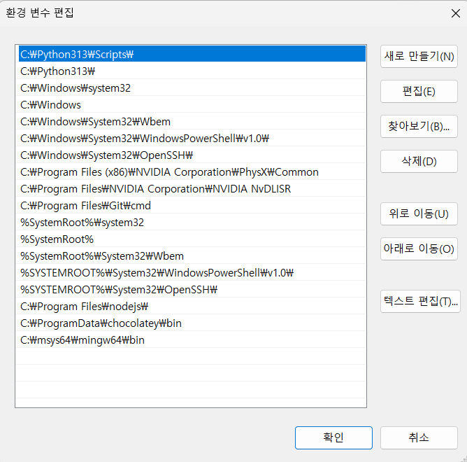

## 1. **MSYS2 사용**  

MinGW보다 더 유연한 Windows용 패키지 관리 시스템입니다.  

### **설치 방법**  

1. **MSYS2 다운로드 및 설치**  

   - [MSYS2 공식 사이트](https://www.msys2.org/)에서 설치 파일을 다운로드합니다.  
   - 설치 후 `MSYS2 MSYS` 터미널을 실행합니다.  

2. **패키지 업데이트**  

   ```bash
   pacman -Syu
   ```

3. **MinGW 개발 도구 전체 설치**  

   ```bash
   pacman -S mingw-w64-x86_64-toolchain
   ```

4. **환경 변수 설정**  

   - **경로 확인**
     - UCRT64: `C:\msys64\ucrt64\bin`
     - MINGW64: `C:\msys64\mingw64\bin`
   - 시스템 환경 변수 추가
     - `제어판 > 시스템 > 고급 시스템 설정 > 환경 변수`로 이동
     - `Path` 변수에 위의 경로를 추가

   

   - `cmd` 또는 `PowerShell`에서 `gcc --version`을 실행하여 확인합니다.  

1. ## 설치 확인**

2. 터미널에서 다음 명령어를 실행하여 MinGW가 정상적으로 설치되었는지 확인합니다.

3. ```
   sh
   
   
   CopyEdit
   gcc --version
   ```

4. 버전 정보가 출력되면 MinGW가 정상적으로 설치된 것입니다!

5. 

6. 

7. ## **3. make 설치**

8. MSYS2에서는 **make**를 다음과 같이 설치할 수 있습니다.

9. ### **(1) MinGW 환경에서 make 설치**

10. (주로 MinGW64 환경을 사용하는 경우)

11. ```
    sh
    
    
    CopyEdit
    pacman -S mingw-w64-x86_64-make
    ```

12. 설치 후에는 `mingw32-make`라는 이름으로 실행됩니다.

13. ### **(2) MSYS 환경에서 make 설치**v(*)

14. (MSYS 기본 쉘을 사용하는 경우)

15. ```
    sh
    
    
    CopyEdit
    pacman -S make
    ```

16. # png 설치

17. ```
    $ pacman -S mingw-w64-ucrt-x86_64-libpng
    ```

18. 

19. ### **(2) vcpkg 사용 (Visual Studio 환경)**

20. 1. **vcpkg 다운로드 및 설치**

       ```
       sh
       git clone https://github.com/microsoft/vcpkg.git
       cd vcpkg
       .\bootstrap-vcpkg.bat
   ```
    
2. **libpng 설치**
    
       ```
       sh
       
       
       .\vcpkg install libpng
       ```
   
    3. **CMake 또는 Visual Studio에서 vcpkg 경로 설정**

       - CMake 사용 시:

         ```
         sh
         
         
         cmake -DCMAKE_TOOLCHAIN_FILE=[vcpkg 경로]\scripts\buildsystems\vcpkg.cmake ..
         ```
         
- Visual Studio에서는 `vcpkg integrate install` 명령 실행


----

## 방법 2: MSYS2의 `autotools` 사용 (configure 문제 해결)**

`configure`가 작동하지 않는 이유는 `autoconf` 및 `automake`가 없기 때문일 수 있습니다.
 다음 명령어를 실행하여 `configure`를 사용할 수 있도록 환경을 설정하세요.

### **1. 필요한 패키지 설치**

```
sh


pacman -S autoconf automake libtool
```

### **2. `configure` 실행**

```
sh
autoreconf -fi
./configure --prefix=/mingw64 --enable-static --disable-shared
make
make install
```

이제 `configure`가 작동할 것입니다.


## 방법 2: MSYS2의 `autotools` 사용 (configure 문제 해결)**

`configure`가 작동하지 않는 이유는 `autoconf` 및 `automake`가 없기 때문일 수 있습니다.
 다음 명령어를 실행하여 `configure`를 사용할 수 있도록 환경을 설정하세요.

### **1. 필요한 패키지 설치**

```
sh


pacman -S autoconf automake libtool
```

### **2. `configure` 실행**

```
sh
autoreconf -fi
./configure --prefix=/mingw64 --enable-static --disable-shared
make
make install
```

이제 `configure`가 작동할 것입니다.


# libpng 설치

libpng를 정적 라이브러리로 만들어서 MSVCR80.dll 오류를 해결 가능

git-bash

```
git clone https://github.com/glennrp/libpng.git 

```

msys2 mingw64 터미널

: 컴파일해야 하므로 msys2가 아닌 mingw64 터미널에서 실행

```

cd libpng //cd _ygkim/synapse/202302_Imagniation_Supernova/a_test/libpng/

autoreconf -fi
./configure --prefix=/mingw64 --enable-static --disable-shared
make
make install

```


# zlib 설치


다음과 같은 오류가 나면 zlib를 설치한다.

/libpng/png.c:136:(.text+0xfe0): undefined reference to `crc32'`

MSYS2에서

`pacman -S zlib'

# zlib 설치

(OLD)

XXXXX

```

cd libpng //cd _ygkim/synapse/202302_Imagniation_Supernova/a_test/libpng/

autoreconf -fi
./configure --prefix=/mingw64 --enable-static --disable-shared
make
make install

```