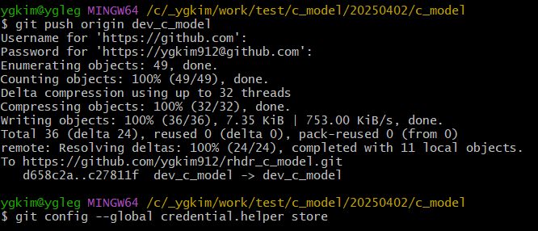

## ✅ 정리

| 목적                    | 설정                                       |
| ----------------------- | ------------------------------------------ |
| 커밋 작성자 이름/이메일 | `git config [--global] user.name/email`    |
| 인증 저장               | `git config --global credential.helper sto |
|                         |                                            |

## 

## 🔐 [1] Git 사용자 이름과 이메일 설정 (로컬/전역)

이건 **커밋 작성자 정보**에 해당됩니다.

### 📍 전역(global) 설정:

```
bashCopyEditgit config --global user.name "Your Name"
git config --global user.email "you@example.com"
```

### 📍 로컬(해당 프로젝트만) 설정:

```
bashCopyEditgit config user.name "Your Name"
git config user.email "you@example.com"
```

확인:

```
bash


CopyEdit
git config --list
```

## 🔑 [2] GitHub/GitLab 등 원격 저장소에 인증 (username/password)

현재 Git에서는 **기존의 password 인증은 사용되지 않고**, 다음 중 하나를 사용해야 합니다:

### ✅ 방법 A: HTTPS + Personal Access Token (PAT)

1. GitHub/GitLab에서 **Personal Access Token** 생성
2. `git clone` 또는 `git push` 시, 다음을 입력

- **Username**: GitHub ID (예: `daniel883`)
- **Password**: Access Token (직접 붙여넣기)

👉 자동 저장하고 싶다면:

```
bash


CopyEdit
git config --global credential.helper store
```

그다음 `git push`할 때 입력한 자격증명이 `.git-credentials`에 저장됨.


