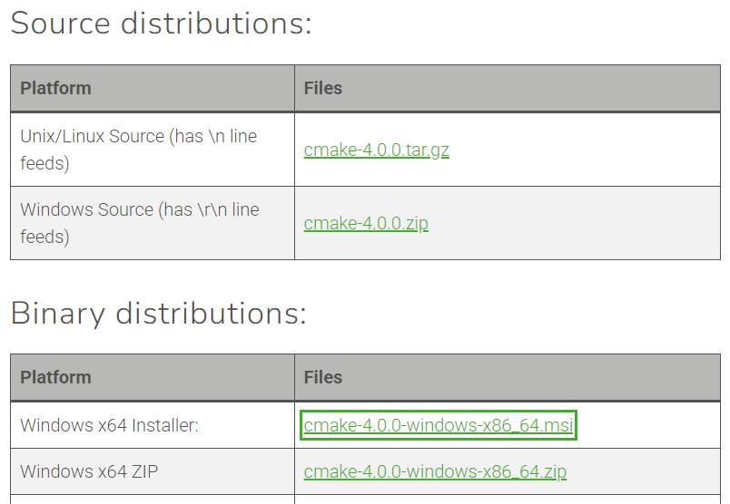

MinGW`는 컴파일러만 제공하지, `cmake`는 기본 포함되어 있지 않습니다.
 하지만 걱정 마세요 — `cmake`는 별도로 설치해서 MinGW와 문제없이 연동할 수 있습니다.

------

## CMake 설치 & MinGW에서 사용하기 (Windows 기준)

### 🔹 방법 1: CMake 공식 인스톨러 사용 (GUI + CLI 포함, 추천!)

1. 공식 다운로드 페이지 이동 (https://cmake.org/download/)

2. `Windows x64 Installer` 클릭해서 설치파일 받기

   

3. 설치할 때 **"Add CMake to system PATH for all users"** 체크 

4. 설치 후 `cmd`나 `PowerShell`에서 확인:

```bash
cmake --version
```

------

### 🔹 방법 2: zip 포터블 버전 (설치 없이 바로 실행 가능)

1. 같은 페이지에서 `Windows x64 ZIP` 다운로드
2. 원하는 위치에 압축 해제 (예: `C:\Tools\cmake`)
3. 해당 폴더의 `bin` 경로를 **환경 변수 PATH에 추가**

예:
 `C:\Tools\cmake\bin`

------

## MinGW와 함께 CMake 사용하려면?

CMake가 MinGW를 제대로 사용하도록 **MinGW Makefiles**를 지정해줘야 합니다:

```bash
cmake -G "MinGW Makefiles" ..
```

⚠️ `cmake`가 MSVC로 설정되면 `Makefile`이 아닌 `Visual Studio` 프로젝트가 만들어지니 주의하세요.

------

## 전체 예제 (OpenCV 빌드용)

```bash
mkdir build
cd build
cmake -G "MinGW Makefiles" -DCMAKE_BUILD_TYPE=Release DCMAKE_INSTALL_PREFIX=install ..
mingw32-make -j8
mingw32-make install
```

이제 OpenCV 라이브러리를 직접 빌드할 수 있게 됩니다! 🔧

------

## 💡 보너스 팁: cmake + mingw를 위한 환경 세팅 한번에 하기

```bash
set PATH=C:\mingw64\bin;C:\Tools\cmake\bin;%PATH%
```

- 위 경로는 설치한 MinGW와 CMake에 따라 조절하세요

