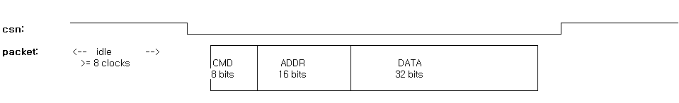
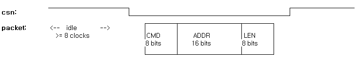

# Micro Architecture Specification

## Module: spi slave  

------

## 1. Introduction

This document describes the micro-architecture of the `spi slave` system, which receives high-speed SPI packets via a dedicated `spi_serdes` interface and routes them to one of three system targets: Wishbone (WB), DMA, or Video. The SPI interface operates at 100MHz in Quad-DDR mode, delivering up to 800 Mbps of throughput. This system is designed to operate under boot-time constraints, where only the SPI clock is available prior to PLL lock. FIFO-based CDC mechanisms and per-target FSMs ensure safe and efficient data delivery across asynchronous clock domains.

------

## 2. Top-Level Architecture

```
               +------------------+
               |   spi_serdes     |
               |  (Quad SPI I/F)  |
               |  clk: sclk       |
               |  rst: rstn       |
               +--------+---------+
                        |
                        v
               +------------------+
               | spi_pkt_router   |
               | (CMD-based MUX)  |
               |  clk: sclk       |
               |  rst: rstn       |
               +--------+---------+
               |        |         |
     +---------+        |         +------------+
     |                  |                      |
     v                  v                      v
+-----------------+ +---------------+  +-----------------+
|   spi_wb        | |   spi_dma     |  |   spi_video     |
| (WB config)     | | (burst DMA)   |  |  (stream in)    |
| wr clk: sclk    | | wr clk: sclk  |  | wr clk: sclk    |
| wr rst: rstn    | | wr rst: rstn  |  | wr rst: rstn    |
| rd clk: wb_clk  | | rd clk: mclk  |  | rd clk: pclk    |
| rd rst: wb_rstn | | rd rst: mrstn |  | rd rst: prstn   |
+-----------------+ +---------------+  +-----------------+
```

### 2.1 Description

#### 2.1.2. Boot-Time Clock Behavior

During system boot, only the reference clock is active. The Wishbone clock (`wb_clk`)—derived from the reference clock—is available immediately, allowing early access to the `spi_wb` interface for initial register programming.

DMA and Video modules depend on PLL-generated clocks (`mclk` and `pclk`), which remain invalid until the PLL locks. Therefore, the `spi_dma` and `spi_video` modules must remain idle during boot-up.

Any SPI packets targeting DMA or Video before PLL lock should be discarded or deferred until the respective clock domains become stable.


```
Time --->           ? us
               20MHz
ref_clk:      ______|‾‾‾|___|‾‾‾|___|‾‾‾|___|‾‾‾|___|‾‾‾|___|‾‾‾|___|‾‾
                    |
wb_clk:       ______|‾‾‾|___|‾‾‾|___|‾‾‾|___|‾‾‾|___|‾‾‾|___|‾‾‾|___|‾‾
                    |
mclk:         xxxxxx|~~~~~~~~~~~~~~~~~~~~~~~~~~┬_|‾|_|‾|_|‾|_|‾|_|‾|_|‾
                    |                          | ? MHz
pclk:         xxxxxx|~~~~~~~~~~~~~~~~~~~~~~~~~~┬__|‾‾|__|‾‾|__|‾‾|__|‾‾
                    |                          | ? MHz
PLL_Locked:   ______|‾‾‾‾‾‾‾‾‾‾‾‾‾‾‾‾‾‾‾‾‾‾‾‾‾‾|‾‾‾‾‾‾‾‾‾‾‾‾‾‾‾‾‾‾‾‾‾‾‾

Legend:
- `xxxxx`: unknown (unstable)
- `~~~`: stabilizing
- `|`: PLL lock edge
```

#### 2.1.2. Clock & Reset Domains

| Domain          | Clock  | Freq. (MHz) | Affected Modules                                       |
| --------------- | ------ | ----------- | ------------------------------------------------------ |
| SPI Domain      | sclk   | 100         | spi_serdes, spi_pkt_router, spi_wb, spi_dma, spi_video |
| Wishbone Domain | wb_clk | 20          | spi_wb                                                 |
| DMA Domain      | mclk   | TBD         | spi_dma (enabled post-PLL)                             |
| Video Domain    | pclk   | TBD         | spi_video (enabled post-PLL)                           |


### 2.2 Parameters

[TBD]

### 2.3 Interface Specification

[TBD]

| Signal | Dir  | Width | Description                       |
| ------ | ---- | ----- | --------------------------------- |
| rstn   | in   | 1     | Global reset (active low)         |
| sclk   | in   | 1     | SPI Clock (100MHz, DDR)           |
| csn    | in   | 1     | Chip Select (Active Low)          |
| io_in  | in   | 4     | SPI Quad Data Input               |
| io_out | out  | 4     | SPI Quad Data Output              |
| io_oe  | out  | 4     | SPI Output Enable                 |
| error  | out  | 1     | Error in spi_wb/spi_dma/spi_video |


#### 2.3.1 Valid/Ready Interface Convention

Most module-to-module communication is done through `ready/valid`-style streaming interfaces:

| Signal        | Description                                      |
| ------------- | ------------------------------------------------ |
| `rx_if.valid` | Data is valid from source to destination         |
| `rx_if.data`  | Actual data being transferred (e.g., 8-bit byte) |
| `tx_if.ready` | Destination is ready to accept new data          |
| `tx_if.data`  | Data to be transmitted from FSM to SPI TX path   |

This handshake applies to communication between:

- `spi_serdes` → `spi_pkt_router`
- `spi_pkt_router` → `spi_wb`, `spi_dma`, `spi_video`
- `spi_wb`/`spi_dma` → `spi_serdes` (via `tx_if`)


------

## 3 spi_serdes

### 3.1 Description

  This SPI SERDES (or PHY) module supports 1/2/4-bit SPI slave communication with configurable  CPOL/CPHA, DDR or SDR modes, full/half duplex transfers, and turnaround delay logic.  It implements separate RX and TX FSMs and uses a ready/valid streaming interface.  A one-clock pulse signal, new_packet_start, is generated at the start of every packet  using CSn falling edge detection.

- 1-bit full-duplex, 2/4-bit half-duplex operation
- CPOL and CPHA configurable via spi_mode[1:0]
- SDR or DDR selectable via ddr input
- Turnaround delay for half-duplex via miso_delay_clks and FSM
- External start_turnaround signal used to trigger TX phase
- Generates new_packet_start when CSn falls
- Uses ready_valid_if for RX (output) and TX (input)


### 3.2 spi_serdes Interface

| Signal           | Dir    | Width | Description                       |
| ---------------- | ------ | ----- | --------------------------------- |
| rstn             | in     | 1     | Global reset (active low)         |
| sclk             | in     | 1     | SPI Clock (100MHz, DDR)           |
| csn              | in     | 1     | Chip Select (Active Low)          |
| io_in            | in     | 4     | SPI Quad Data Input               |
| io_out           | out    | 4     | SPI Quad Data Output              |
| io_oe            | out    | 4     | SPI Output Enable                 |
| new_packet_start | out    | 1     | Packet start strobe               |
| rx_if            | master | 8     | Received byte from spi_serdes     |
| rx_if.valid      | out    | 1     | Byte valid indicator from SPI     |
| rx_if.data       | out    | 8     | Byte from SPI input               |
| tx_if            | slave  | 8     | Byte to send back over SPI        |
| tx_if.ready      | in     | 1     | Ready to accept TX byte           |
| tx_if.data       | in     | 8     | Byte to send via SPI              |
| start_turnaround | in     | 1     | Triggers TX mode in spi_serdes    |
| error            | in     | 1     | Error in spi_wb/spi_dma/spi_video |


## 4. spi_pkt_router

### 4.1 Description

 The packet_router is responsible for selecting and routing SPI payload data  to the appropriate slaves (WB/DMA/VIDEO) based on the command (cmd) detected at the start of a packet.  It listens for the new_packet_start pulse and reads the first byte (cmd) from rx_if.  The remaining payload is forwarded to the selected slave until the slave asserts done.

- Triggered by `new_packet_start`
- Decodes only the upper nibble of CMD byte (`[7:4]`) to extract target type and r/w behavior with minimal glue logic to ensure timing closure
- Routes valid SPI payload stream to one of: Wishbone, DMA, or Video module
- [TBD] Waits for selected FSM to assert done before returning to IDLE
- Interfaces use ready_valid_if and spi_slave_ctrl_if
- Operates entirely in the SPI clock domain, allowing Wishbone R/W access during boot before PLL lock


### 4.2 spi_pkt_router Interface

| Signal                    | Dir    | Width | Description                       |
| ------------------------- | ------ | ----- | --------------------------------- |
| clk                       | in     | 1     | SPI clock domain                  |
| rstn                      | in     | 1     | Global reset (active low)         |
| new_packet_start          | in     | 1     | Start of SPI packet               |
| rx_if                     | slave  | 8     | Received byte from spi_serdes     |
| start_turnaround          | out    | 1     | Triggers TX mode in spi_serdes    |
| error                     | out    | 1     | Error in spi_wb/spi_dma/spi_video |
| tx_if                     | master | 8     | Byte to send back over SPI        |
| wb_ctrl_if                | master |       | Control interface for spi_wb      |
| wb_ctrl.active            | out    | 1     | Active signal to spi_wb           |
| wb_ctrl.done              | in     | 1     | Done signal from spi_wb           |
| wb_ctrl.start_turnaround  | in     | 1     | Triggers TX mode in spi_serdes    |
| wb_ctrl.err               | in     | 1     | Error signal from spi_wb          |
| dma_ctrl_if               | master |       | Control interface for spi_dma     |
| dma_ctrl.active           | out    | 1     | Active signal to spi_dma          |
| dma_ctrl.done             | in     | 1     | Done signal from spi_dma          |
| dma_ctrl.start_turnaround | in     | 1     | Triggers TX mode in spi_serdes    |
| dma_ctrl.err              | in     | 1     | Error signal from spi_dma         |
| vid_ctrl_if               | master |       | Control interface for spi_Video   |
| vid_ctrl.active           | out    | 1     | Active signal to spi_video        |
| vid_ctrl.done             | in     | 1     | Done signal from spi_video        |
| vid_ctrl.err              | in     | 1     | Error signal from spi_video       |
| out_wb_if                 | master |       | Output to spi_wb                  |
| out_dma_if                | master |       | Output to spi_dma                 |
| out_vid_if                | master |       | Output to spi_video               |
| in_wb_if                  | slave  |       | Input from spi_wb                 |
| in_dma_if                 | slave  |       | Input from spi_dma                |


### spi_pkt_router FSM

- IDLE → ROUTE_WB/ROUTE_DMA/ROUTE_VID → DONE
- Requires CMD byte optimized to simplify decoding and routing for ZCD

### 

## 5. spi_wb

### 5.1 Description

- CMD[7:5] = 3'b001 triggers WB transfers
- Operates in a 20MHz Wishbone domain, always available during boot (pre-PLL)
- Two FIFOs: address FIFO and data FIFO decouple burst SPI writes from slow WB interface
- [`TBD`] Single and burst (16-bit LEN) RW supported
- Read response data routed back via tx FIFO through CDC


### 5.2 spi_wb Interface

| Signal     | Dir    | Width | Description                   |
| ---------- | ------ | ----- | ----------------------------- |
| sclk       | in     | 1     | SPI clock domain              |
| srstn      | in     | 1     | Reset in SPI domain           |
| rx_if      | slave  | 8     | RX data from router           |
| ctrl_if    | slave  |       | Control interface from router |
| tx_if      | master | 8     | Byte to send back over SPI    |
| wb_clk     | in     | 1     | Wishbone clock                |
| wb_rstn    | in     | 1     | Wishbone reset                |
| wb_if      | inout  |       | TBD                           |
| wb_if.ack  | in     | 1     | Wishbone acknowledge          |
| wb_if.rdat | in     | 32    | Data input from WB            |
| wb_if.adr  | out    | 16    | WB address                    |
| wb_if.we   | out    | 1     | Write enable                  |
| wb_if.stb  | out    | 1     | Strobe                        |
| wb_if.cyc  | out    | 1     | Cycle                         |
| wb_if.sel  | out    | 4     | Byte select                   |
| wb_if.wdat | out    | 32    | Write data to WB              |


### spi_wb FSM

- IDLE → CMD → ADDR → [LEN?] → DATA → [READ_RESPONSE] → DONE
- Uses dual FIFO: addr FIFO, data FIFO
- Optimized for boot-time, low-speed operation
- No overflow


## 6. spi_dma

### 6.1 Description

- CMD[7:5] = 3'b010 triggers DMA transfers
- Begins operating only after PLL lock (via `mclk`)
- 32-bit addressable, burst transfers with 32-bit LEN field
- Response data (for reads) returned to SPI via TX FIFO, controlled via `start_turnaround`


### 6.2 spi_dma Interface

| Signal       | Dir    | Width | Description                   |
| ------------ | ------ | ----- | ----------------------------- |
| sclk         | in     | 1     | SPI clock domain              |
| srstn        | in     | 1     | Reset in SPI domain           |
| rx_if        | slave  | 8     | RX data from router           |
| ctrl_if      | slave  |       | Control interface from router |
| tx_if        | master | 8     | Data to send back over SPI    |
| mclk         | in     | 1     | Memory clock                  |
| mrstn        | in     | 1     | Reset for DMA domain          |
| dma_if       | inout  |       | TBD                           |
| dma_if.ready | in     | 1     | Ready signal from DMA core    |
| dma_if.rdata | in     | 32    | Readback data from memory     |
| dma_if.addr  | out    | 5     | Address/type to DMA           |
| dma_if.we    | out    | 1     | Write enable to DMA           |
| dma_if.wdata | out    | 32    | Data to write to DMA          |


### spi_dma FSM

- IDLE → CMD → ADDR → LEN → PAYLOAD_STREAM → DONE
- Requires PLL lock; handles high-speed DMA blocks


## 7. spi_video

### 7.1 Description

- CMD[7:5] = 3'b011 triggers Video transfers
- Enabled post-PLL, clocked via `pclk`
- Handles pixel data in 24-bit units with 16-bit LEN
- Fire-and-forget semantics with optional error detection


### 7.2 spi_video Interface

| Signal      | Dir    | Width | Description                   |
| ----------- | ------ | ----- | ----------------------------- |
| sclk        | in     | 1     | SPI clock domain              |
| srstn       | in     | 1     | Reset in SPI domain           |
| rx_if       | slave  | 8     | RX data from router           |
| ctrl_if     | slave  |       | Control interface from router |
| tx_if       | master | 8     | Data to send back over SPI    |
| pclk        | in     | 1     | Pixel clock                   |
| prstn       | in     | 1     | Reset for video domain        |
| vid_if      | out    |       | TBD                           |
| vid_if.ctrl | out    | 2     | Video control signal          |
| vid_if.data | out    | 24    | Video data output             |


### spi_video FSM

- IDLE → CMD → LEN → VIDEO_STREAM → DONE
- Active only post-PLL; reads from rx FIFO into video line buffers
  

------

## 8. Timing Diagrams

[TBD]


------

## 10. Performance Considerations

### 10.1 Wishbone Write Path Analysis

This section analyzes the throughput of SPI-to-Wishbone write transactions and evaluates whether the Wishbone interface can handle the SPI's peak data rate.

- **SPI Throughput**: 100MHz × 4 lanes × DDR = 800 Mbps (theoretical)

- **Write Packet Structure**: `min 8-clock IDLE + 8-bit CMD + 16-bit ADDR + 32-bit DATA` = 64 bits

  

- **Payload Efficiency**: 32 / 64 = 50%

- **Effective Rate**: 800 Mbps ÷ 64 bits = **12.5M packets/sec = 400 Mbps**

- **Wishbone Capacity**: 32-bit writes @ 20MHz = **20M writes/sec**

#### Wishbone Throughput vs Overflow Risk

- The SPI-side throughput (12.5M packets/sec) is below the Wishbone peak (20M writes/sec)
- However, temporary stalls or contention in the WB domain can lead to overflow
- To mitigate this, `spi_wb` uses dual FIFOs (address and data) to buffer bursts safely
- **For burst write operations**, the **data FIFO depth must be increased** to absorb large SPI bursts during slow Wishbone access
- FIFO depth should consider SPI burst length and maximum stall duration in the WB path
- In particular, SPI operates without waiting for Wishbone `ack` signals; thus the interface must **assume optimistic forwarding**, relying on FIFO buffering to decouple SPI streaming from slower WB handshakes

### 10.2 Wishbone Read Path Analysis

This section evaluates whether the Wishbone interface can respond fast enough to SPI-driven read commands during sustained traffic.

- **Read Packet Structure**: `min 8-clock IDLE + 8-bit CMD + 16-bit ADDR + 8-bit LEN` = 40 bits

  

- **SPI Throughput**: 800 Mbps ÷ 40 bits = **20M read packets/sec**

- **WB Capacity**: 32-bit reads @ 20MHz = **20M reads/sec**

#### Read Throughput vs WB Response Capacity

- With the updated read packet structure (`min 8-clock IDLE + 8-bit CMD + 16-bit ADDR + 8-bit LEN` = 40 bits), the SPI master issues up to **20M read packets/sec** at 800 Mbps
- This aligns with the Wishbone's peak capability of **20M reads/sec**, assuming 1-cycle response per transaction
- In practical conditions with any delay or wait state, **TX FIFO buffering remains essential** to absorb stalled responses
- The design should still ensure **TX FIFO depth covers worst-case response latency**, especially during back-to-back read bursts

### 10.3 DMA Path Analysis

[TBD]

- Operates post-PLL using `mclk`
- Packet burst size is typically larger than Wishbone
- Adequate RX FIFO depth and write burst handling logic in `spi_dma` are critical
- Performance is gated by memory throughput and DMA backpressure

### 10.4 Video Path Analysis

[TBD]

- Triggered post-PLL using `pclk`
- Streaming data (24-bit per pixel) is ingested continuously
- The interface should ensure video-ready status and steady flow
- Packet gaps or underruns can affect frame timing, so buffering and pacing are required

## 11. TODO / Open Issues

*This interface is intended for future expansion and will be specified in upcoming revisions.*

- Fine-tune FIFO depth based on worst-case SPI burst duration
- Investigate unified response router for DMA/WB readback to SPI
- Explore minimalistic error recovery (e.g., unknown CMD abort)
- Optional: support CRC in packet format for integrity check

------

## Appendix A. Packet CMD Format

### CMD Field Structure

[TBD]

The CMD byte is structured as follows to simplify decoding and routing in `spi_pkt_router`:

```
[7:5] = Target (001: WB, 010: DMA, 011: Video, others: reserved)
[4]   = Read (0) / Write (1)
[3:0] = Opcode (target-specific)
```

### CMD Mapping Table

[TBD]

| CMD  | Target | R/W  | Type   | LEN? | Notes                                                 |
| ---- | ------ | ---- | ------ | ---- | ----------------------------------------------------- |
| 0x20 | WB     | W    | Single | No   | Boot-time write config, use addr+data FIFOs           |
| 0x21 | WB     | R    | Single | No   | Immediate read (pre-PLL) or response sent via tx FIFO |
| 0x22 | WB     | W    | Burst  | Yes  | TBD                                                   |
| 0x23 | WB     | R    | Burst  | Yes  | FIFO to buffer responses                              |
| 0x40 | DMA    | W    | Burst  | Yes  | Starts after PLL lock (mclk)                          |
| 0x41 | DMA    | R    | Burst  | Yes  | Response sent via tx FIFO                             |
| 0x60 | Video  | W    | Ingest | Yes  | 24-bit pixel stream (pclk)                            |


## Appendix B. Register Map

[TBD]
| Name | Address  | R/W   | LEN | Notes                                                 |
| ---- | ------- | ---- | ---- | ----------------------------------------------------- |
| spi_config | [TBD] | rw | 8 | cpol, cpha, sdr/ddr, data width |
| miso_delay_clks | [TBD] | rw | 4 | clock cycles for turnaround delay |