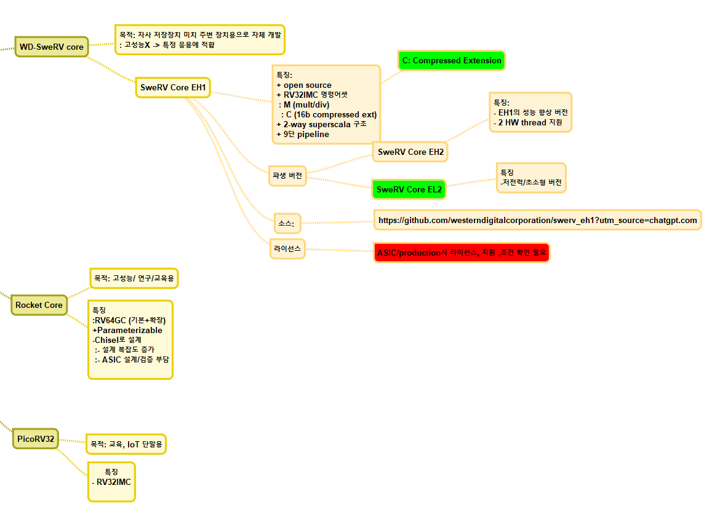

# WD - SweRV cores

**Western Digital의 SweRV Core 시리즈는 compressed instruction (즉 RVC 명령어, RV32C 확장)** 을 지원합니다.

------

### ✅ 세부 내용

| 코어            | 기본 ISA      | Compressed(RVC) 지원 여부           | 비고                                          |
| ------------- | ----------- | ------------------------------- | ------------------------------------------- |
| **SweRV EH1** | **RV32IMC** | ✅ 지원 (C = Compressed Extension) | 32-bit, 2-way superscalar, 9-stage pipeline |
| **SweRV EH2** | **RV32IMC** | ✅ 지원                            | dual-threaded version of EH1                |
| **SweRV EL2** | **RV32IMC** | ✅ 지원                            | low-power version optimized for controllers |

즉, WD가 공개한 모든 SweRV Core 시리즈(EH1, EH2, EL2)는 **“RV32IMC”** 구성을 사용하므로,
 `C` 확장이 포함되어 **16-bit compressed instruction set** 을 완전하게 지원합니다.

# Free Open-source RISC-V cores

## 선택 팁

- **라이선스**: “오픈소스”라더라도 라이선스 조건이 다양합니다. 예컨대 저작권 표시 의무, 수정 시 공개 의무 등이 있을 수 있으므로 설계에 사용하기 전에 반드시 라이선스(예: BSD, Apache, MIT 등) 확인하세요.
- **확장 지원 및 ISA 범위**: 코어마다 지원하는 RISC-V 확장이 다릅니다 (예: C=Compressed, M=Multiply/Divide, A=Atomics, F=FP 등). 설계 목적에 맞춰 지원 범위를 확인해야 합니다.
- **검증/생산적용 상태**: 일부 코어는 연구/프로토타입 용이고, ASIC/생산용 검증이 충분히 되어 있지 않을 수 있습니다.
- **면적/전력/성능**: 임베디드/저전력용 vs 고성능 서버용이 다르므로 요구성능과 맞는 코어를 선택하는 것이 중요합니다.
- **커뮤니티 및 생태계 지원**: 문서화, 예제, 툴체인(컴파일러, 시뮬레이터) 지원이 잘 되어 있는 코어가 개발 및 적용 시 유리합니다.

## 추천 Open-source RISC-V cores

# IoT 용

 **IoT(사물인터넷)** 용으로 적합한 오픈소스 RISC-V 코어는
 저전력·소형·간단한 MCU급 프로세서에 초점을 둔 것들입니다.

아래 표와 설명에서 각각의 장단점을 자세히 비교해드릴게요.

------

## 🌱 오픈소스 RISC-V 코어 — **IoT용 추천 TOP 5**

| 코어 이름                  | ISA      | 전형적 클럭/성능            | 장점                                       | 라이선스 / 언어                         | 주요 활용                    |
| ---------------------- | -------- | -------------------- | ---------------------------------------- | --------------------------------- | ------------------------ |
| **PicoRV32**           | RV32IMC  | 50~250 MHz (FPGA 기준) | 매우 작고 단순 (≈1.5–2 K LUTs), 저전력, FPGA 호환   | ISC (MIT 유사) / Verilog            | 소형 IoT MCU, 센서 노드        |
| **SweRV EL2**          | RV32IMC  | ~500 MHz (ASIC)      | WD가 실제 제품에 사용, 압축명령·멀티플라이 지원             | Apache 2.0 / SystemVerilog        | 임베디드 컨트롤러, SSD, IoT 디바이스 |
| **CORE-V CV32E40P**    | RV32IMFC | 100–400 MHz          | OpenHW 지원, 확장성 좋고 Verif 패키지 포함           | Solderpad License / SystemVerilog | 산업용 IoT, 실리콘 프로토타입       |
| **Ibex** (by lowRISC)  | RV32IMC  | 100–300 MHz          | Google OpenTitan에 채택, 보안 / 검증 잘 되어 있음    | Apache 2.0 / SystemVerilog        | 보안 IoT, TrustZone 유사 응용  |
| **Zero-riscy (RI5CY)** | RV32IMFC | 100–300 MHz          | ETH Zurich / PULP Platform, DSP F-ext 지원 | Apache 2.0 / SystemVerilog        | 저전력 IoT + DSP 기능 필요한 기기  |

# 전체 비교

[ChatGPT](https://chatgpt.com/c/690a7e96-f5cc-8331-8281-4f66f42ae6f0)

## 🧩 FPGA Implementation Comparison – picoRV32 vs CV32E40P vs SweRV (VeeR) EL2

| Category                           | **picoRV32**                                                          | **CV32E40P (OpenHW Group)**                                                                    | **SweRV / VeeR EL2 (Western Digital / CHIPS Alliance)**                        |
| ---------------------------------- | --------------------------------------------------------------------- | ---------------------------------------------------------------------------------------------- | ------------------------------------------------------------------------------ |
| **FPGA Resource Usage (LUT / FF)** | 🔹 *Very small* — ≈ 2 k – 4 k LUTs (Xilinx)   🔹 1.5 k – 2.5 k FFs | 🔸 *Medium* — ≈ 10 k – 15 k LUTs (7 k – 12 k FFs)   (may increase with FPU / Perf Counters) | 🔸 *Large* — ≈ 25 k – 40 k LUTs (≥ 20 k FFs)   Requires larger FPGA devices |
| **BRAM / Memory Blocks**           | 1 – 2 BRAM (≈ 1–2 KB local memory possible)                           | 8 – 16 BRAM (for TCM 32–64 KB + buffers)                                                       | ≥ 20 BRAM (for I/D caches and local memories)                                  |
| **Max Clock (FPGA)**               | ⚡ 250 – 400 MHz (on Artix-7 / UltraScale)                             | ⏱ 100 – 150 MHz (on Artix-7 / Zynq)                                                            | ⏱ 75 – 120 MHz (on Kintex-7 / UltraScale)                                      |
| **Pipeline / Micro-architecture**  | 1 – 4 stage (simple core)                                             | 4-stage pipeline + PULP extensions                                                             | 9-stage dual-issue superscalar pipeline                                        |
| **Supported ISA / Features**       | RV32IMC (optional M, C)  Minimal debug                             | RV32IMC + PULP extensions + Interrupt + Debug                                                  | RV32IMAC + Caches + Interrupt + Debug + Perf Counters                          |
| **Integration / Porting Ease**     | ✅ Very easy – single Verilog file, AXI/WB wrappers available          | ⚙️ Moderate – requires AXI/APB integration and multiple modules                                | ⚙️ Hard – multiple interfaces and cache hierarchy need careful adaptation      |
| **Synthesis / Build Time**         | ⏱ Very fast (Seconds – Minutes)                                       | ⏱ Moderate (Few minutes to 10 min)                                                             | ⏱ Slow (> 10 min, esp. with debug logic)                                       |
| **Recommended FPGA Class**         | Spartan-6 / Artix-7 / Cyclone-IV or higher                            | Artix-7 / Zynq / Cyclone-V or higher                                                           | Kintex-7 / Stratix-10 / Zynq UltraScale+ or higher                             |
| **Typical Use Cases**              | Education, MCU control, IoT, soft-core CPU controller                 | Mid-range SoC research, real-time control, RISC-V education platform                           | High-performance SoC prototypes, industry-grade research, Caliptra project     |
| **Complexity Level**               | 🟢 Minimal                                                            | 🟡 Medium                                                                                      | 🔴 High                                                                        |
| **Performance per Area (rough)**   | ⚙️ Low IPC (~0.3–0.5) but tiny area                                   | ⚙️ Balanced (~0.8–1 IPC)                                                                       | ⚙️ High (~1.5–2 IPC potential)                                                 |
| **Tool / Flow Support**            | Works out-of-box with Vivado, Quartus, Yosys                          | Provided by OpenHW FPGA reference flow                                                         | CHIPS Alliance build scripts available, but more complex                       |