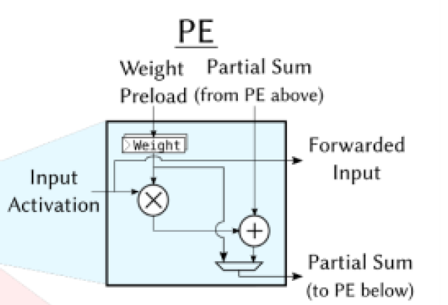
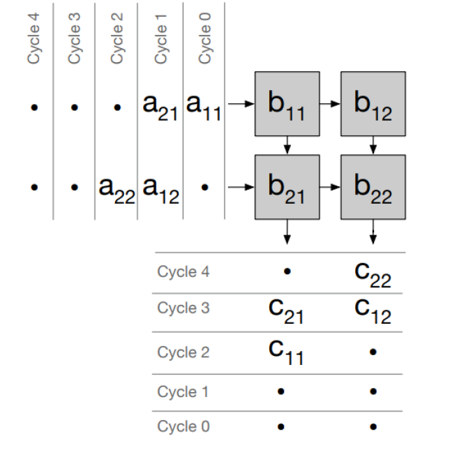
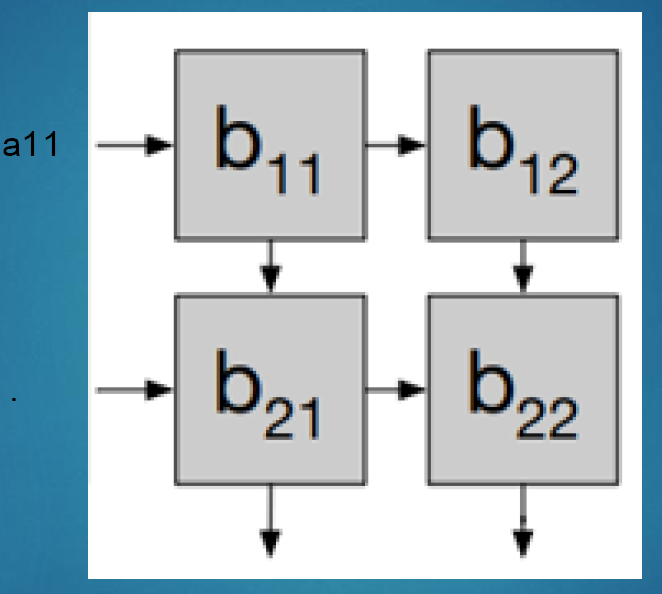
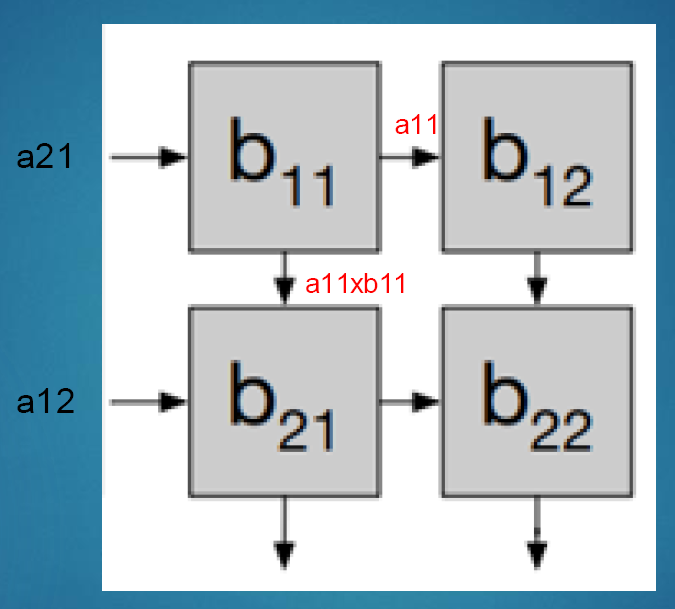
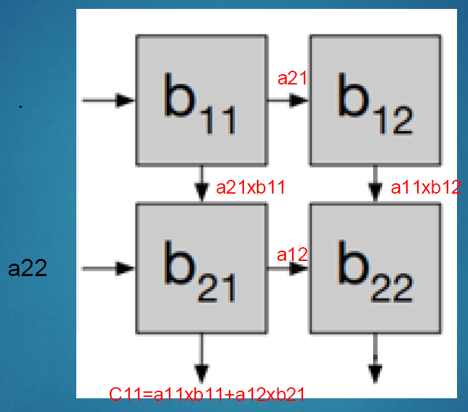
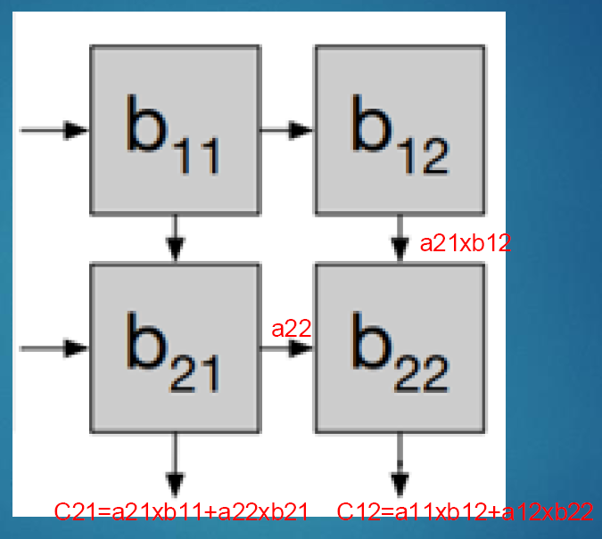
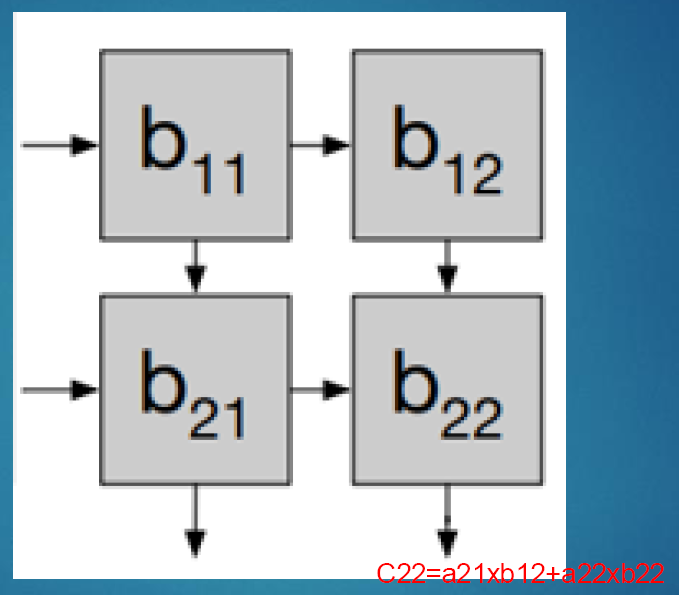
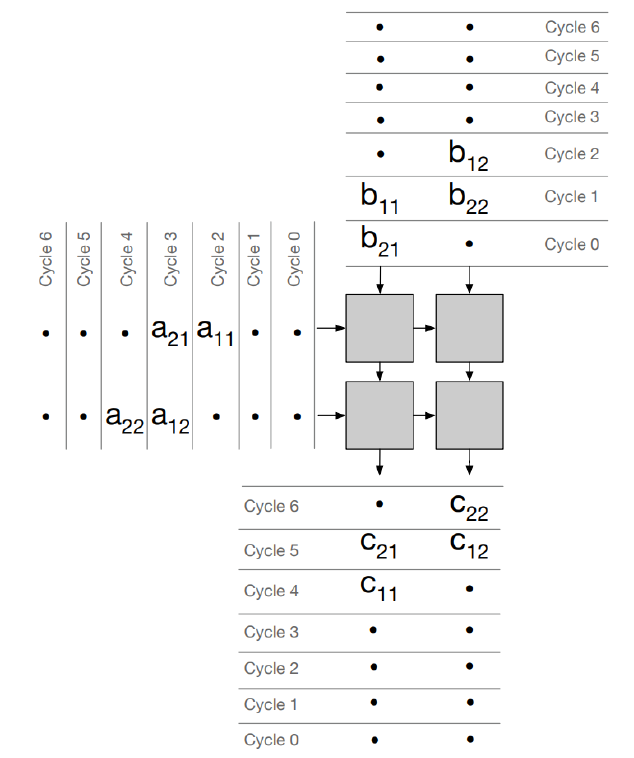
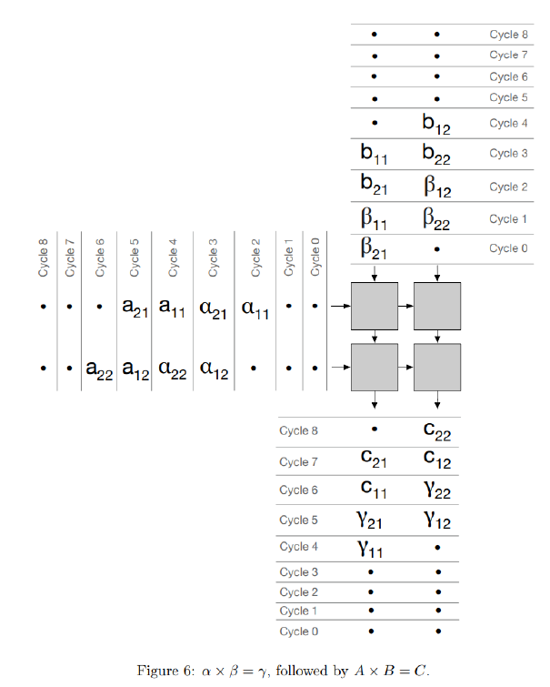

# Systolic Array implementation

# Background

Background –Matrix Multiplication
Matrix multiplication is a major part of the computation for many applications. Here we consider a 3x3 matrix multiplication: `C = AxB+ D`
For simplicity, for this lab we will ignore D and consider only `C = AxB` only. Eg:

```c
for (int k = 0; k < 3; k++) {
	for (int j = 0; j < 3; j++) {
		for (int i= 0; i< 3; i++) {
			C[i,j] += A[i,k] * B[k,j];
		}
	}
}
```


## Processing Element

A Processing Element (PE) is a basic ALU unit that we will use in this systolic array implementations.
A basic PE has 3 data inputs, 3 data outputs.
Data Inputs: 

- Input Activation (a)
- Weight Preload (b)
- Partial Sum from PE above (cin)

Data Outputs:

* Forwarded Input Activation (a) to the right
* Forwarded Weight (b) to below
* Partial Sum (cout= a*b + cin)

You are free to add any other IOs to each PE (clk, rst_n, control signals etc as you see fit)



## 2x2 Systolic Array

Let us first assume that B matrix is already loaded to the systolic array.
To compute C = AxB, we load A to the systolic array and read out the output C from the bottom.
Note that It takes 5 cycles to complete C = AxB for a 2x2 systolic array



### Cycle 0



### cycle 1



### cycle 2



### cycle 3



### cycle 4




### Preload Weight

In the above example, we assumed the B matrix is already loaded in the systolic array.
If we want to load B matrix to the array, we need additional 2 cycles of operation
In the example to the right, B matrix is first loaded in to the array (cycle 0 –2), then the matrix multiplication is performed (cycle 2 –6)





# Problem to preload weight

This example represents an major issue. The systolic array needs to sit idle while the B matrix is loading. If we want to load a new B matrix for each computation, the effective throughput is halved.


# Idea: Double buffered weight storage

To overcome this, we need to double-buffer the B matrix storage element in each PE, ie: we need two registers to store B. One register to perform the matrix multiplication for the current cycle; and another register to load the B matrix for the next matrix multiplication.
The example on the right shows a double buffered systolic array performing two consecutive matrix multiply computation.




# Development

Please write a Verilog code implementing a systolic array controller and a 2x2 systolic array.
Then write a testbench to verify the design. Your testbench must include at least two consecutive matrix multiplications as shown above. You may include other test cases in the testbench as you see fit.
Your code should have the following IOs

```verilog
module systolic( … );
	input rst_n, clk; //active low reset and clock
	input [3:0] a11, a12, a21, a22; //input A matrix, assuming each element is 4 bit
	input [3:0] b11, b12, b21, b22; //input B matrix, assuming each element is 4 bit
	input in_valid; //If high, indicates A matrix and B matrix input are valid. If Low they can be ignored
	output [8:0] c11, c12, c21, c22; //output C matrix, assuming each element is 4+4+1=9bit
	output out_valid; //Describes whether the output is valid. Only make out_validhigh when all 4 elements in the C matrix are valid
    
```


# 방식 1

## PE 구현

아래는 systolic array에서 가장 기본적이면서 안정적인 형태의 PE 구현이다.

- A는 **왼→오른쪽**으로 전달
- B는 **위→아래**로 전달
- 내부 누적합(`sum`)은 **동일 위치에서 유지됨**

```verilog
//---------------------------------------------------
// Processing Element (PE) for Systolic Array
//---------------------------------------------------
module pe #(
  parameter int DATA_W = 16
)(
  input  logic                       clk,
  input  logic                       rst_n,

  // Data inputs
  input  logic signed [DATA_W-1:0]   a_in,
  input  logic signed [DATA_W-1:0]   b_in,
  input  logic signed [2*DATA_W-1:0] sum_in,

  // Forwarding to next PEs
  output logic signed [DATA_W-1:0]   a_out,
  output logic signed [DATA_W-1:0]   b_out,
  output logic signed [2*DATA_W-1:0] sum_out
);

  always_ff @(posedge clk or negedge rst_n) begin
    if (!rst_n) begin
      a_out  <= '0;
      b_out  <= '0;
      sum_out <= '0;
    end 
    else begin
      // Shift A and B to next PEs
      a_out  <= a_in;
      b_out  <= b_in;

      // Accumulate product
      sum_out <= sum_in + (a_in * b_in);
    end
  end

endmodule
```

# 📌 이 PE의 동작 방식

| 신호      | 설명                                                   |
| --------- | ------------------------------------------------------ |
| `a_in`    | 왼쪽 PE에서 들어오는 데이터 (또는 left boundary input) |
| `a_out`   | 오른쪽 PE로 전달되는 데이터                            |
| `b_in`    | 위쪽에서 들어오는 weight/activation                    |
| `b_out`   | 아래쪽으로 전달됨                                      |
| `sum_in`  | 이전 stage(왼+위에서 도착한 누적 합)                   |
| `sum_out` | 현재 PE의 multiply-accumulate 결과                     |

매 cycle마다:

```
sum_out = sum_in + (a_in × b_in)
```

즉, systolic array의 기본적인 MAC 구조 그대로 구현됨.


## 4. 다음 단계 아이디어

이제:

- 이 **simple 버전**을 먼저 UVM testbench에서 돌려보고,
- 나중에 같은 인터페이스에 맞춰서 B쪽만 weight RAM + double buffer로 교체하면 됨.

원하면:

- 이 systolic_array용 `interface` 정의
- `sequence_item` 구조 (A, B, K, M, N 포함)
- driver에서 `start`, `a_valid`, `b_valid`를 어떻게 제어할지

까지 UVM 코드 스켈레톤도 이어서 만들어줄게.


## 4. 다음 단계 아이디어


- ROWS/COLS/K를 parameter sweep 하거나,
- 입력을 fixed pattern(eye matrix, all ones 등)으로 해서 wave 디버깅하기 편한 버전으로 바꿔주거나,
- coverage / assertions 추가하는 버전도 만들어 줄 수 있어.

##### 

# 📌 필요하면 제공할 수 있는 것

원하면 다음도 작성해줄게:

### 🔹 PE에 valid/ready protocol 넣는 버전

(파이프라인 스톨 지원)

### 🔹 클램핑(saturation) 지원 PE

(FPGA/ASIC inference 용)

### 🔹 FP16/BF16/INT8/INT4용 압축 PE 버전

(quantized deep learning accelerator 스타일)

### 🔹 multiply + add pipeline stage 포함한 2-stage / 3-stage PE

(Timing closure 용)

------

## 👉 다음 단계로 무엇을 만들고 싶어?

- 전체 systolic array full RTL?
- UVM verification 환경?
- double-buffer pipeline 타이밍 diagram?
- 실제 A,B,C 행렬을 넣어서 waveform 분석?
- RTL synthesis용 버전(ASIC/FPGA)?

원하는 방향을 말해주면 그 방향으로 쭉 이어서 만들어줄게!


1. 입력을 fixed pattern(eye matrix, all ones 등)으로 해서 wave 디버깅하기 편한 버전으로 바꿔주거나,
2. coverage / assertions 추가하는 버전도 만들어 줄 수 있어.


이제 필요하면 다음 종류의 테스트도 간단히 추가해줄 수 있어요:

------

## 🟦 1) Reset-Stress Test (reset during run)

- DUT가 RUN 중에 reset을 받았을 때 동작 확인
- pipeline flush / state reset 멋지게 되는지 확인

원하면 바로 만들어줄게요.

------

## 🟩 2) Streaming Delay Test (backpressure를 emulate)

- driver가 random delay를 넣어서
   A_valid / B_valid 을 조금씩 쉬면서 넣기
- 정상적으로 systolic array가 동작하는지 검증

------

## 🟧 3) Overflow Test

- A, B에 큰 값을 넣어서
   accumulator가 overflow 되는지 확인
- ACC_W가 충분한지 체크

------

## 🟥 4) Partial / Sparse Matrix Test

- A 또는 B의 대부분이 0인 경우
- systolic pipeline이 쓸데없는 연산 없이 정상적으로 흘러가는지 검사

------

## 🟪 5) Max Throughput Test

- A_valid/B_valid를 cycle 하나도 쉬지 않고
   연속으로 넣을 때 throughput이 보장되는지 검사

------

# 🎯 정리

> **네, UVM은 TB는 고정하고 test만 여러 개 만드는 구조가 핵심입니다.**

지금 구조는 이미 그렇게 잘 만들어져 있고,
 원하는 test를 계속 추가해나갈 수 있습니다.

------

# 😊 다음 질문

원하는 다음 테스트 타입이 어떤 건가요?

👉 예:

- eye matrix만 반복하는 테스트?
- reset 중간 삽입 테스트?
- backpressure 테스트?
- overflow 테스트?
- row/col sweeping?

바로 추가해드릴게요.


그러면 **TB(환경)는 그대로 두고, 여러 가지 테스트(test)를 쉽게 추가할 수 있는 UVM 구조**로 깔끔하게 정리해드릴게요.

그리고 앞으로:

- 랜덤 테스트
- eye matrix 테스트
- all-ones 테스트
- incremental 테스트
- reset 중간에 들어가는 테스트
- overflow 테스트

등등을 **원하는 만큼 test/sequence만 추가**해서 돌릴 수 있게 만들어줍니다


[W] pe에서 s_out이 범위를 벗어날 수 있다. 입력 4bit, 출력을 8bit로만 설정했다. clipping이 필요하다.

