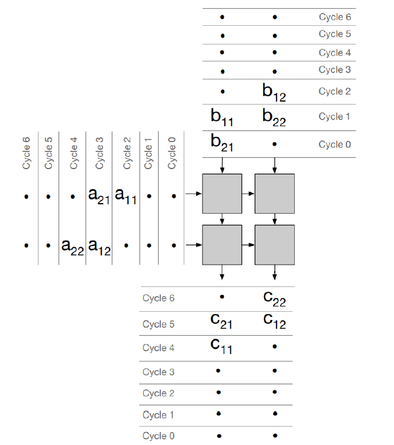
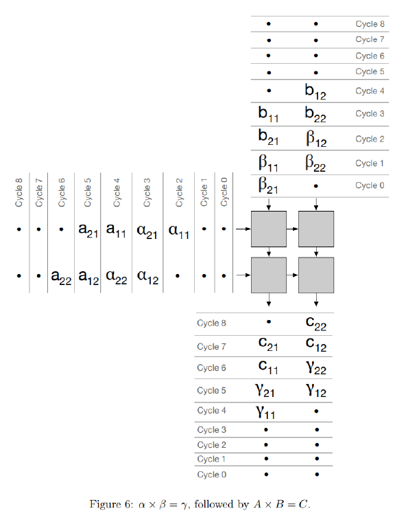
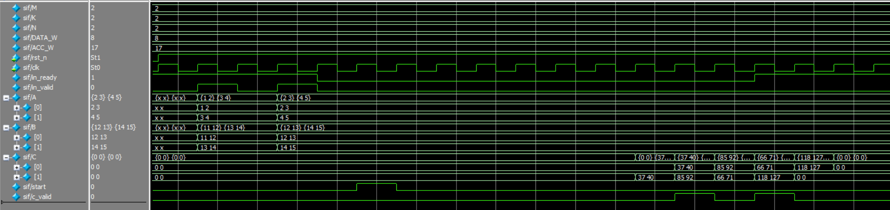
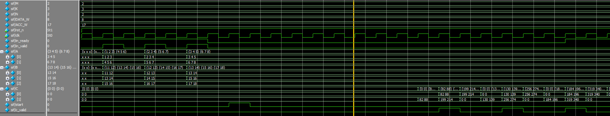

# Systolic Array Lab — Multi-Bank, Overlapped Matrix Multiplication  + UVM Verification
- **Author:** Young Kim  
- **Date:** November 2025  

This document summarizes the design, implementation, and verification of an extended and generalized version of the **“Systolic Array implementation in SystemVerilog”** assignment.  

While the original lab focused on a fixed 2×2 systolic array, this implementation significantly expands the architecture into a fully parameterizable **M×K by K×N systolic array** with multi-bank weight storage and overlapped A/B streaming to maximize throughput.  
A complete UVM-based verification environment is also included.

---

# 0. Scalability and Limitations

## 0.1. Scalability & Extensibility

This implementation is intentionally written in a modular and highly parameterized way.  Several forms of scalability are supported:

### **0.1.1. Fully Parameterizable Architecture**
All major dimensions are user-settable:

- `M` — number of rows of A  
- `K` — inner dimension (A columns, B rows)  
- `N` — number of columns of B  
- `N_A_MATS` — number of overlapped matmul jobs  
- `N_BANKS` — number of weight banks  
- Bit widths (`DATA_W`, `ACC_W`)  
- Start offsets (`A_START`, column skews, etc.)

This enables testing from small systolic arrays (2×2) up to larger ones (2×3, 4×4, 8×8, 16×N, etc.).

---

### **0.1.2. Easily Extensible UVM Testbench**

The current environment includes `matmul_seq_simple`, but additional sequences can be added:

- **Randomized sequences** (random A/B matrices)
- **All-ones sequence** (stress-pattern)
- **Pattern-based sequences** (ramp, diagonal patterns, special test inputs)
- **Mixed directed + random regressions**
- **Dynamic-array-based sequences**  
  (for variable matrix shapes or wider regression range)

The driver, monitor, and scoreboard are already general enough to support arbitrary A and B values.

---

### **0.1.3. Expandable Architectural Features**

Future extensions can include:

- Larger systolic meshes  
- Multi-job scheduling, buffering, and pipelining  
- SRAM-based weight storage  
- Bias add / activation functions  
- Tiled matrix multiplication for large matrices  

The codebase is intentionally structured to grow into a full systolic accelerator.

---

## 0.2. Limitations (Minimal Viable Implementation)

This implementation is functionally complete, but intentionally minimal:

### **0.2.1. `N_BANKS == N_A_MATS` is required**
Currently: Number of weight banks == Number of overlapped matmul jobs

If this does not hold:

- Additional bubbles or stalls must be inserted
- Weight loading and A streaming will not naturally align
- More complex scheduling is required

### **0.2.2. No repeated job execution**
Each job runs exactly once.  
Repeating jobs would require:

- Replaying A/B streams  
- Or storing job descriptors in a queue  
- Or double-buffering of job indices

### **0.2.3. No advanced flow control**
For simplicity:

- No backpressure inside the systolic array  
- No selective stalling  
- No hazard detection  
- No overflow or saturation logic  
- No SRAM/timing modeling

### **0.2.4. Finite internal job buffering**
`A_all` and `B_all` are sized for `N_A_MATS` jobs only.

### **0.2.5. No dynamic runtime scheduling**
Only the minimal start sequence is implemented:
- Load jobs  
- Assert `start`  
- System runs to completion  
- Outputs all C matrices  

---

# 1. Assignment Summary

The original assignment required:

- Implementing a **2×2 systolic array** for  **C = A × B**
- 4-bit A/B inputs, 9-bit outputs
- Inputs: A, B + `in_valid`
- Output: full C matrix + `out_valid`
- Perform **two consecutive matrix multiplications**
- Provide waveform showing both operations

### This implementation extends the assignment:

- General **M×K × K×N** systolic architecture  
- General data width (`DATA_W`)
- Multi-bank weight storage (generalized double-buffering)  
- Overlapped A/B streaming  
- Multiple matrix jobs (`N_A_MATS`)  
- Full UVM verification environment

---

# 2. Overview

## 2.1. File Structure

```text
├── rtl/
│   ├── systolic_pkg.sv
│   ├── systolic_if.sv
│   ├── systolic_array_top.sv
│   ├── ncol_feeder.sv
│   ├── systolic_array_mb.sv
│   ├── pe_mb.sv
│   ├── pipe_delay_taps.sv
│   ├── pipe_delay.sv
│
├── uvm/
│   ├── tb_top.sv
│   ├── matmul_uvm_pkg.sv
│   ├── matmul_item.svh
│   ├── matmul_seq_simple.svh
│   ├── matmul_sequencer.svh
│   ├── matmul_result.svh
│   ├── matmul_driver.svh
│   ├── matmul_monitor.svh
│   ├── matmul_scoreboard.svh
│   ├── matmul_agent.svh
│   ├── matmul_env.svh
│   ├── matmul_test.svh
│
├── rtl.f
├── run.bat
├── run_gui.bat
├── run_win.do
```


## 2.2. High-Level Block Diagram


The following diagram illustrates the overall data and control flow from the UVM environment down to the DUT and back:

### 2.2.1. **UVM Driver (Top-Left)**
   - The driver creates matrix-multiply *jobs* (matrices A and B) and drives them into the DUT using:
     - `A`, `B`
     - `in_valid` handshake
   - It waits for `in_ready` before sending each job, so that the DUT can safely buffer the next A/B set. (Not fully tested yet)

### 2.2.2. **`systolic_array_top` (Main DUT Block)**
   This is the central block that coordinates everything:
   - **Job Buffer (`A_all`, `B_all`)**
     - Stores multiple A/B matrices for up to `N_A_MATS` jobs.
     - Each time `in_valid && in_ready` is asserted, one A/B pair is captured and written into `A_all` and `B_all`.
   - **Control FSM**
     - Waits until all jobs are loaded.
     - After the external `start` is asserted, it:
       - Generates `b_load_start` for the B column loaders.
       - Generates `a_stream_start` for the A column streamers (after the configured `A_START` delay).
   - **B Column Loaders**
     - Implemented with `ncol_feeder` instances, one per B column.
     - Read B matrices from `B_all` and stream them into the top of the systolic array as:
       - `w_valid[c]`, `w_top_in[c]`, `w_bid[c]`.
     - They may start at slightly different cycles to create the proper systolic wavefront.
   - **A Column Streamers**
     - Also built with `ncol_feeder`, but for A.
     - Read A matrices from `A_all` and inject them at the left boundary of the systolic array as:
       - `a_valid[row]`, `a_left_in[row]`, `a_bid[row]`.
     - Start with an offset (`A_START`) so that A meets the correct B in the systolic array.

### 2.2.3. **`systolic_array_mb` (K × N PE Grid)**
   - This block is a mesh of `pe_mb` processing elements arranged in `K` rows and `N` columns.
   - **Data directions:**
     - A and bank index flow **horizontally** (left → right).
     - Weights B and partial sums flow **vertically** (top → bottom).
   - Each PE:
     - Selects a weight from its local weight banks using the bank index (`bid`).
     - Computes `psum_out = psum_in + A * W(bank)`.
     - Forwards updated A, psum, and bank index to neighboring PEs.
   - The bottom of the grid produces:
     - `c_out_int[c]` — partial sums that correspond to elements of C for each column.
     - `c_valid_int[c]` — valid flags indicating when a column result is ready.

### 2.2.4. **Column / Row Alignment Logic**
   - Because each column and each row of the systolic array has slightly different latency, raw outputs from the mesh do not all line up on the same cycle.
   - **Column alignment (`pipe_delay`)**
     - For each column, a small delay line compensates for the difference in pipeline depth.
     - The outputs are collected into `col_data[c]`.
   - **Row alignment (`pipe_delay_taps`)**
     - All columns are packed into a wide bus (`row_in`).
     - A multi-tap delay line generates multiple time-shifted versions (`row_taps[0..M-1]`).
     - These taps are then unpacked back into `C[r][c]`, reconstructing the entire matrix C at once.

### 2.2.5. **Final C Matrix and `c_valid`**
   - Once all rows for a given job have been aligned and captured, the logic asserts:
     - `c_valid` — a one-cycle pulse indicating that `C[0:M-1][0:N-1]` holds a complete, valid result for one job.
   - This happens once per job (e.g., 4 times if `N_A_MATS = 4`).

### 2.2.6. **UVM Monitor and Scoreboard (Right-Hand Side)**
   - The monitor observes `c_valid` and `C` through the `systolic_if`.
   - Every time `c_valid` is high, it captures the full C matrix into a `matmul_result` object.
   - The scoreboard:
     - Pops one expected C matrix from the `c_exp_q` queue (precomputed by the golden `matmult()` function).
     - Compares each element of DUT C vs. expected C.
     - Logs pass/fail per job and reports total errors at the end of the simulation.

In summary, the diagram shows a **closed loop**:
- UVM driver → job buffering → A/B scheduling → systolic compute → alignment → final C → monitor/scoreboard → test result.


```
                        +-------------------------------+
                        |         UVM Driver            |
                        |  - generates A, B, in_valid   |
                        |  - generates start            |
                        +---------------+---------------+
                                        |
                                        v
                      +-------------------------------------+
                      |   systolic_array_top                |
                      |                                     |
                      |  Job Buffer (A_all,B_all)           |
                      |         |                           |
                      |         v                           |
                      |   Control FSM (start)               |
                      |    |           |                    |
                      |    |           |                    |
                      |  b_load_start  | a_stream_start     |
                      |    |           |                    |
                      |    v           v                    |
                      |  B column    A column               |
                      |   feeders     streamers             |
                      |    |           |                    |
                      |    +-----------+                    |           
                      |                |                    |           
                      |        (w_valid, w_top_in, w_bid,   |  
                      |         a_valid, a_left_in, a_bid)  |  
                      |                |                    |
                      |      +------------------+           |
                      |      | systolic_array_mb|           |           
                      |      |  K x N pe_mb     |           |           
                      |      +--------+---------+           |           
                      |               |                     |
                      |     c_out_int[N], c_valid_int[N]    |
                      |               |                     |
                      |   Column / Row Align (pipe_delay,   |
                      |   pipe_delay_taps)                  |
                      |               |                     |
                      |        C[M][N], c_valid             |
                      +---------------+---------------------+
                                      |
                                      v
                          +------------------------+
                          |   UVM Monitor/SCB      |
                          |   - capture C          |
                          |   - compare to golden  |
                          +------------------------+

```


---

# 3. DUT Interface Overview

## `systolic_array_top`

```verilog
module systolic_array_top #(
  parameter int DATA_W   = 16,
  parameter int ACC_W    = 32,
  parameter int M        = 2,
  parameter int K        = 3,
  parameter int N        = 2,

  parameter int N_A_MATS = 3,
  parameter int N_BANKS  = 3,
  parameter int A_START  = 3
)(
  input  logic clk, rst_n,

  // job loading
  input  logic in_valid,
  output logic in_ready,
  input  logic signed [DATA_W-1:0] A [0:M-1][0:K-1],
  input  logic signed [DATA_W-1:0] B [0:K-1][0:N-1],

  // computation start
  input  logic start,

  // final result
  output logic c_valid,
  output logic signed [ACC_W-1:0] C [0:M-1][0:N-1]
);
```

## High-Level Behavior

- Stores **N_A_MATS** matrix-multiply jobs internally.
- After the user asserts `start`, it:
  - Loads all B matrices column-wise (B loaders)
  - Streams A matrices column-wise (A streamers)
  - Executes overlapped multiplications through systolic array
- Produces **one C matrix per job** with a **single-cycle `c_valid` pulse**.


---

# 4. RTL Module Descriptions

## 4.1 `systolic_pkg.sv`

Defines global parameters:

- Matrix dimensions: `M, K, N`
- Widths: `DATA_W`, `ACC_W`
- Number of jobs: `N_A_MATS`
- Number of weight banks: `N_BANKS`
- Delay between start and A streaming: `A_START`

Includes:

- UVM configuration struct
- Golden reference `matmult()`
- Utility functions

------

## 4.2 `systolic_if.sv`

A SystemVerilog interface that groups all DUT signals and defines:

- `dut_mp` — connections used by the RTL
- `drv_mp` — driver’s write access modport
- `mon_mp` — monitor’s read access modport

Used by UVM testbench to avoid direct hierarchical references.

------

## 4.3 `pe_mb.sv` (Processing Element with Multi-Bank Weights)

This module forms the fundamental PE for the K×N systolic mesh.

### Key features:

- Multiple weight banks (`w_bank[N_BANKS]`)
- Independent weight stream (`w_shift_reg`)
- Bank index selection (`bid_in`)
- MAC compute:

```verilog
psum_out = psum_in + a_in * w_bank[bid_in]
```

- Pass-through of A, psum, and bank IDs

<p align="center">


</p>


(a) Preloading weight (b) Preloading weights using double buffers for consecutive matrix multiplication


------

## 4.4 `systolic_array_mb.sv`

Implements a **K-row × N-column systolic array**:

- Instantiates `pe_mb` in a mesh
- Connects:
  - Left boundary: A + bank index
  - Top boundary: weights + psums
- Produces:
  - Column outputs `c_out[c]`
  - Per-column valid `c_valid[c]`
  - Final bank index tags for debugging or multi-job identification

------

## 4.5 `ncol_feeder.sv`

A key component that serializes matrix rows column-by-column.

Supports:

- `START_DELAY` for per-column phase shifting
- `M2M_OFFSET` for spacing consecutive jobs
- `REV_ORDER` option:
  - `1`: bottom-to-top for B loading
  - `0`: top-to-bottom for A streaming

This enables precise alignment of A and B streams for overlapped computation.

------

## 4.6 `pipe_delay.sv` / `pipe_delay_taps.sv`

Used to realign timing after the systolic mesh:

- `pipe_delay` — simple N-stage delay
- `pipe_delay_taps` — multi-tap register chain producing 0..N cycle views

Allows assembling full C matrices in correct row/column order.

------

## 4.7 `systolic_array_top.sv` (Full System)

Full orchestration module:

1. Internal job buffering (A_all, B_all)
2. Start-control FSM (`ST_WAIT_START`, `ST_WAIT_A`, `ST_RUN`)
3. Instantiation of:
   - B column loaders (`ncol_feeder`)
   - A column streamers (`ncol_feeder`)
   - Systolic array mesh (`systolic_array_mb`)
4. Column alignment using `pipe_delay`
5. Row alignment using `pipe_delay_taps`
6. Generation of final `C[M][N]` and `c_valid` pulse

This module converts multiple overlapped systolic streams into a single coherent output per job.

------

# 5. UVM Verification Environment

The verification environment is built on standard UVM components.

## 5.1 Sequence (`matmul_seq_simple`)

- Generates `N_A_MATS` jobs
- Populates A and B matrices with predictable patterns
- Computes the expected C using `matmult()`
- Pushes expected results into `c_exp_q`

## 5.2 Driver (`matmul_driver`)

- Waits for `in_ready`
- Drives A, B, and a single-cycle `in_valid`
- After all jobs are loaded, asserts `start` for 1 cycle

## 5.3 Monitor (`matmul_monitor`)

- Captures the entire C matrix when `c_valid == 1`
- Sends captured results to scoreboard

## 5.4 Scoreboard (`matmul_scoreboard`)

- Pops expected C from `c_exp_q`
- Compares each element with DUT output
- Logs errors or pass messages
- Reports total jobs and mismatches at the end

## 5.5 Agent, Environment, Test

- `matmul_agent` bundles driver, sequencer, monitor
- `matmul_env` adds the scoreboard
- `matmul_test` launches the sequence and controls simulation

------

# 6. Simulation Behavior

## Expected observable waveform events

1. **4 consecutive job loads**
2. `start` pulse
3. B loading per column (staggered due to `START_DELAY`)
4. A streaming with its own skew and offsets
5. Internal systolic activity (MAC operations)
6. `c_valid` pulses (one per job)
7. Corresponding C matrices output on those cycles

## 6.1. GUI waveform for 2x2 PE array with 2 matrix multiplication




## 6.2. GUI waveform for 3x2 PE array with 3 matrix multiplication




## 6.3. Non-GUI UVM result for 2x2 PE array with 2 matrix multiplication


```
# UVM_INFO @ 0: reporter [RNTST] Running test matmul_test...
# UVM_INFO C:\intelFPGA_pro\24.2\questa_fe\verilog_src\uvm-1.2/src/base/uvm_traversal.svh(279) @ 0: reporter [UVM/COMP/NAMECHECK] This implementation of the component name checks requires DPI to be enabled
# UVM_INFO uvm/matmul_seq_simple.svh(30) @ 0: uvm_test_top.env.agent.sqr@@seq [SEQ] Sending mat 0
# UVM_INFO uvm/matmul_driver.svh(28) @ 45000: uvm_test_top.env.agent.drv [DRV] Reset released
# UVM_INFO uvm/matmul_monitor.svh(28) @ 45000: uvm_test_top.env.agent.mon [MON] Reset released
# UVM_INFO uvm/matmul_driver.svh(67) @ 65000: uvm_test_top.env.agent.drv [DRV] Job 0 A loaded:
#   [0]: 1 2
#   [1]: 3 4
#
# UVM_INFO uvm/matmul_driver.svh(68) @ 65000: uvm_test_top.env.agent.drv [DRV] Job 0 B loaded:
#   [0]: 11 12
#   [1]: 13 14
#
# UVM_INFO uvm/matmul_seq_simple.svh(30) @ 65000: uvm_test_top.env.agent.sqr@@seq [SEQ] Sending mat 1
# UVM_INFO uvm/matmul_driver.svh(67) @ 85000: uvm_test_top.env.agent.drv [DRV] Job 1 A loaded:
#   [0]: 2 3
#   [1]: 4 5
#
# UVM_INFO uvm/matmul_driver.svh(68) @ 85000: uvm_test_top.env.agent.drv [DRV] Job 1 B loaded:
#   [0]: 12 13
#   [1]: 14 15
#
# UVM_INFO uvm/matmul_driver.svh(38) @ 85000: uvm_test_top.env.agent.drv [DRV] All jobs loaded. Sending start pulse
# UVM_INFO uvm/matmul_monitor.svh(43) @ 185000: uvm_test_top.env.agent.mon [MON] Captured C matrix for job 0
# UVM_INFO uvm/matmul_scoreboard.svh(31) @ 185000: uvm_test_top.env.scb [SCB] Checking C matrix for job 0
# UVM_INFO uvm/matmul_scoreboard.svh(48) @ 185000: uvm_test_top.env.scb [SCB] Job 0 C[0,0] = 37 (PASS)
# UVM_INFO uvm/matmul_scoreboard.svh(48) @ 185000: uvm_test_top.env.scb [SCB] Job 0 C[0,1] = 40 (PASS)
# UVM_INFO uvm/matmul_scoreboard.svh(48) @ 185000: uvm_test_top.env.scb [SCB] Job 0 C[1,0] = 85 (PASS)
# UVM_INFO uvm/matmul_scoreboard.svh(48) @ 185000: uvm_test_top.env.scb [SCB] Job 0 C[1,1] = 92 (PASS)
# UVM_INFO uvm/matmul_scoreboard.svh(54) @ 185000: uvm_test_top.env.scb [SCB] Job 0 PASSED
# UVM_INFO uvm/matmul_monitor.svh(43) @ 205000: uvm_test_top.env.agent.mon [MON] Captured C matrix for job 1
# UVM_INFO uvm/matmul_scoreboard.svh(31) @ 205000: uvm_test_top.env.scb [SCB] Checking C matrix for job 0
# UVM_INFO uvm/matmul_scoreboard.svh(48) @ 205000: uvm_test_top.env.scb [SCB] Job 0 C[0,0] = 66 (PASS)
# UVM_INFO uvm/matmul_scoreboard.svh(48) @ 205000: uvm_test_top.env.scb [SCB] Job 0 C[0,1] = 71 (PASS)
# UVM_INFO uvm/matmul_scoreboard.svh(48) @ 205000: uvm_test_top.env.scb [SCB] Job 0 C[1,0] = 118 (PASS)
# UVM_INFO uvm/matmul_scoreboard.svh(48) @ 205000: uvm_test_top.env.scb [SCB] Job 0 C[1,1] = 127 (PASS)
# UVM_INFO uvm/matmul_scoreboard.svh(54) @ 205000: uvm_test_top.env.scb [SCB] Job 0 PASSED
# UVM_INFO C:\intelFPGA_pro\24.2\questa_fe\verilog_src\uvm-1.2/src/base/uvm_objection.svh(1270) @ 1105000: reporter [TEST_DONE] 'run' phase is ready to proceed to the 'extract' phase
# UVM_INFO uvm/matmul_scoreboard.svh(65) @ 1105000: uvm_test_top.env.scb [SCB] Total jobs checked = 2, total errors = 0
# UVM_INFO C:\intelFPGA_pro\24.2\questa_fe\verilog_src\uvm-1.2/src/base/uvm_report_server.svh(847) @ 1105000: reporter [UVM/REPORT/SERVER]
# --- UVM Report Summary ---
#
# ** Report counts by severity
# UVM_INFO :   28
# UVM_WARNING :    0
# UVM_ERROR :    0
# UVM_FATAL :    0
# ** Report counts by id
# [DRV]     6
# [MON]     3
# [RNTST]     1
# [SCB]    13
# [SEQ]     2
# [TEST_DONE]     1
# [UVM/COMP/NAMECHECK]     1
# [UVM/RELNOTES]     1
#
# ** Note: $finish    : C:/intelFPGA_pro/24.2/questa_fe/verilog_src/uvm-1.2/src/base/uvm_root.svh(517)
#    Time: 1105 ns  Iteration: 69  Instance: /tb_top
# End time: 13:47:46 on Nov 19,2025, Elapsed time: 0:00:08
# Errors: 0, Warnings: 11
```


------

# 7. Running Simulation

## Windows (Questa/Modelsim)

**Non-GUI**

```
run.bat
```

**GUI**

```
run_gui.bat
```

or:

```
vsim -do run_win.do
```

Waveform will be in `dump.vcd`.

------

# 8. Summary and Future Improvements

## Achievements

- Fully parameterized systolic array
- Multi-bank weight storage
- Overlapped A/B streaming
- Complete UVM environment
- Automatic scoreboard with golden model
- Correct multi-job execution

## Future Enhancements

- Randomized regression sequences
- All-ones, diagonal, and stress patterns
- Support for mismatched `N_BANKS` and `N_A_MATS`
- Bubble insertion & advanced scheduling
- Larger matrix tiling / GEMM optimizations
- Hardware synthesis optimizations


