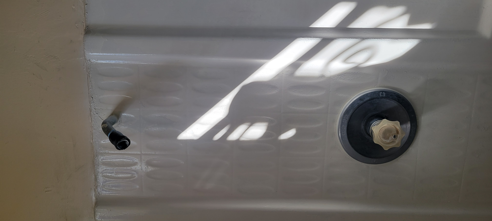
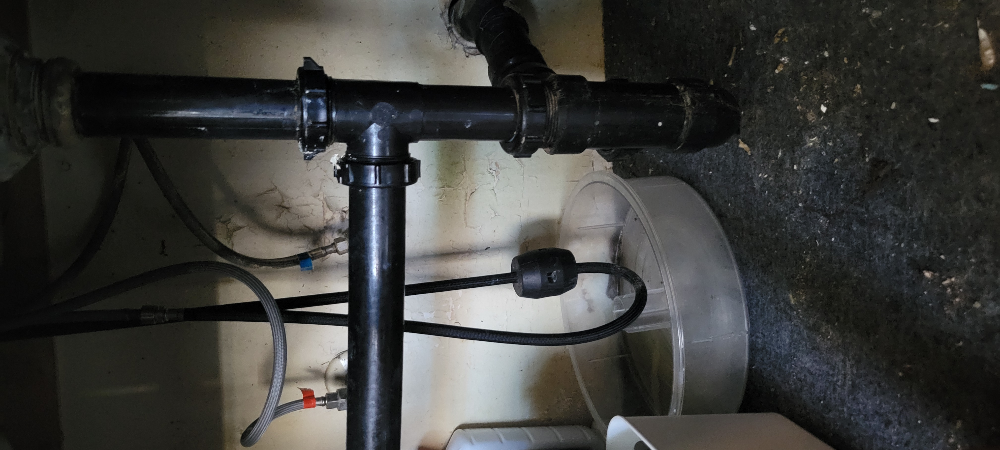
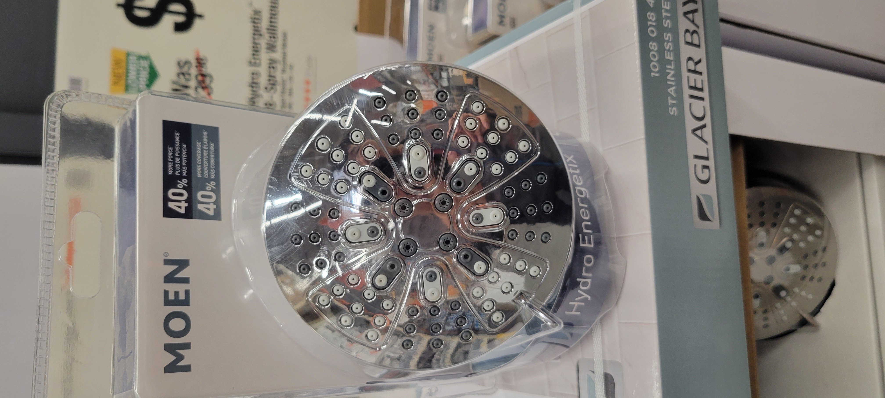
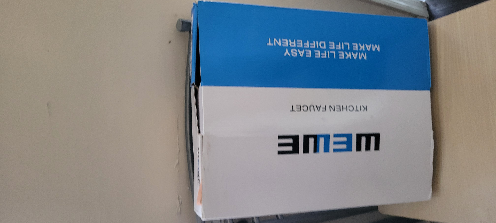

# Makee Ave - Unit A 문제 확인 및 수리

Date: 3/2/2026

Time: 9AM - 5PM

## 문제점 확인

###  Shower head 고장

### Water Leak under Kitchen top

## Part 구입 @ Home Depot

## 수리

Handyman Carlos Marinero performed

* Kitchek faucet installation 
* Seal back splash to avoid more leaks 
* New shower head installation 
* Fixed shower head issues

## 수리 비용

* Labor: $150
* Material: $60
* Total: $210

* unit B- Kitchen faucet installation 75
  unit F replace toilet filler pump and hose supply line labor and material 75,kitchen faucet installation also seal in back splah labor and material 190  shower steam labor and material 200 total of 740.00 if you have any questions text me or call me, thanks
* 