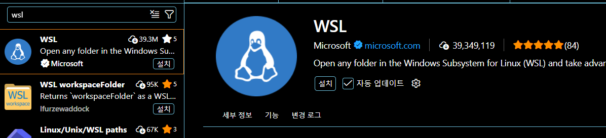
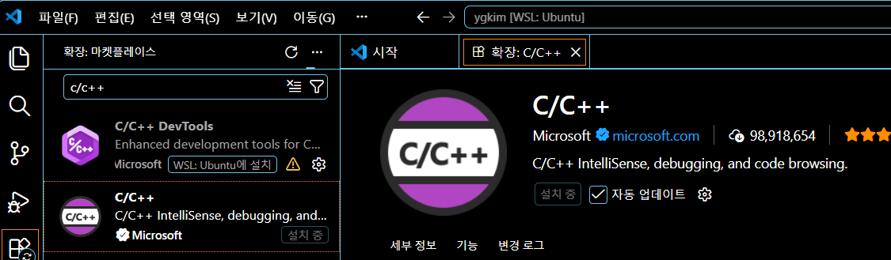

https://eecs281staff.github.io/eecs281setup/guides/windows/vscode/

WSL(Windows Server Logic)은 Windows 10 이상 버전에서 가상 머신이나 듀얼 부팅 설정 없이도 Windows와 함께 Linux 명령줄 도구 및 응용 프로그램을 사용할 수 있도록 해주는 기능입니다. WSL은 일반적으로 가상 머신보다 적은 리소스를 사용하면서도 WSL 내에서 Windows 파일 시스템에 접근할 수 있도록 해줍니다. 하지만 WSL은 기본적으로 그래픽 프로그램을 지원하지 않으며, 하드웨어에 접근하려는 프로그램에 대해서는 제한적인 지원만 제공

# ubuntu 설치

store > ubuntu 설치 > 실행

$pwd

$cd /mnt/c/User/ygkim // 내 windows 폴더

$cd ~ // ubuntu 홈 폴더 돌어가기

# vs code 설치

설치후

wsl extension 설치




## WSL에서 VS Code를 엽니다.

프로그래밍을 시작하기 전에 VS Code를 구성해야 합니다. 이제 VS Code를 다시 열겠습니다. 하지만 이번에는 WSL 파일 시스템 내에서 VS Code를 열 것입니다

### 옵션 1

우분투 터미널을 엽니다. 기본적으로 다음 디렉토리에서 시작하게 됩니다.

```
/home/USER
```


이 디렉터리는 WSL 파일 시스템 내에 있습니다. 이 디렉터리에서 다음 명령을 실행하세요.

```
code .
```


**위 명령어는 "code"라는 단어 뒤에 공백과 마침표(.)가 오는 형식입니다.** 이 명령어를 실행하면 현재 작업 디렉터리에서 VS Code가 실행됩니다. 이 경우 현재 작업 디렉터리는 `/etc/vs.js`입니다 `/home/USER`. 이제 VS Code가 WSL 파일 시스템 내에서 실행되고 있을 것입니다. VS Code 창의 왼쪽 하단에 파란색 상자가 표시되는데, 이는 VS Code가 WSL에서 실행 중임을 나타냅니다. 이 파란색 상자에는 사용 중인 Linux 배포판(이 경우 Ubuntu)도 표시됩니다.


이제 VS Code는 WSL 파일 시스템에 접근할 수 있으며, 현재 작업 디렉터리의 파일들이 파일 탐색기 인터페이스에 나타납니다. 만약 VS Code를 해당 디렉터리 내에서 실행했다면,

```
/home/USER
```


그러면 파일 탐색기 인터페이스에서 .로 시작하는 숨겨진 파일들을 볼 수 있을 겁니다 `.`. 프로그래밍을 시작할 때 파일 시스템에 대해 다시 살펴보겠습니다. 먼저 VS Code를 설정해야 합니다.


### 옵션 2

화면 하단의 검색창을 사용하여 VS Code를 실행하세요. VS Code가 실행되면 아래 그림과 유사한 창이 열립니다.


VS Code 창 왼쪽 하단에 있는 파란색 상자를 살펴보세요. 이미 WSL이라고 표시되어 있으면 완료된 것입니다. 만약 표시되어 있지 않다면, 해당 상자를 클릭하세요. 그러면 아래 그림과 같이 검색창이 있는 드롭다운 메뉴가 나타납니다.


"WSL에 연결" 옵션을 선택하세요. 그러면 아래 그림과 같이 VS Code가 WSL 파일 시스템 내에서 실행됩니다. VS Code 창 왼쪽 하단에 파란색 상자가 표시되어 VS Code가 WSL에서 실행 중임을 나타냅니다. 또한 파란색 상자에는 사용 중인 Linux 배포판(이 예에서는 Ubuntu)이 표시됩니다. 이제 VS Code가 WSL 파일 시스템에 접근할 수 있습니다.

## 윈도우 파일 시스템 사용 시 주의 사항

> VS Code를 Windows 파일 시스템 내에서 사용하면 Windows 파일 시스템과 WSL 파일 시스템 간에 tarball을 이동하는 번거로움을 피할 수 있어 편리할 수 있습니다. 하지만 **VS Code를 Windows 파일 시스템 내에서 사용하지 마십시오.** VS Code로 프로그래밍할 때는 항상 WSL 파일 시스템 내에서 작업해야 합니다. 즉, VS Code 창 왼쪽 하단의 파란색 상자에 "WSL"과 사용 중인 Linux 배포판 이름이 표시되어야 합니다. **VS Code를 Windows 파일 시스템 내에서 사용해야 하는 유일한 경우는 WSL 파일 시스템 내에서 VS Code를 열 때뿐입니다.**
>
> Windows 파일 시스템과 WSL 파일 시스템 간에 tarball을 이동하는 것이 번거롭게 느껴질 수 있지만, 이는 다른 대안보다 훨씬 낫습니다. Windows 파일 시스템 내에서 VS Code를 사용하면 난해하고 진단하기 어려운 버그가 발생할 수 있습니다. **따라서 Windows 파일 시스템 내에서 VS Code를 사용하지 마십시오.**

## 흔히 저지르는 실수


# 필요한 것들 설치

$sudo apt-get update

$sudo apt-get install -y g++ gdb make clangd curl

c++ 확장 설치




#  test

$cp -rf /mnt/d/__Backup2023b/synapse_imagination/from\ pd07/051723a_SynX022223/SynX022223/verif/c_model/ .

$code .

$sudo apt-get install libpng-dev

vs code 터미널에서  make 되는지 확인

$make


# debug

https://www.youtube.com/watch?v=wuPpFgFMhwg: 13:48 부분부터 참고

