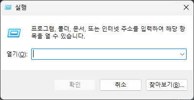
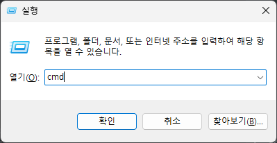
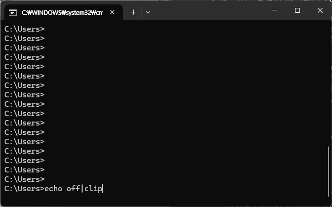
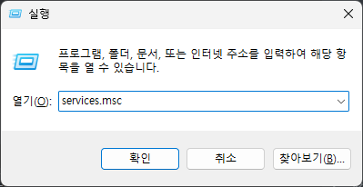
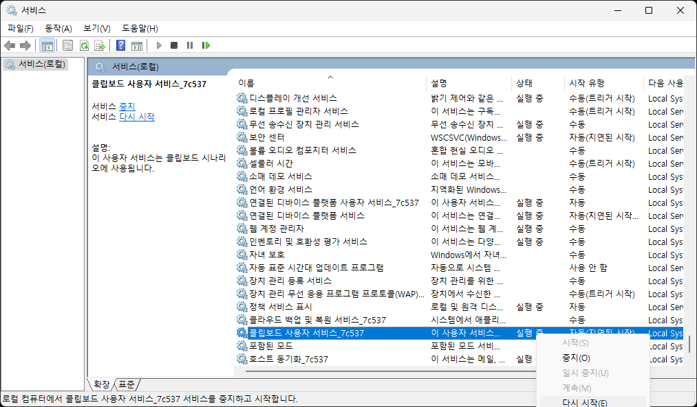
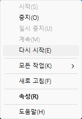
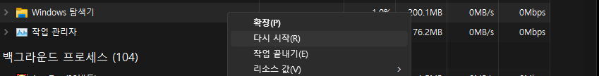

**복사 및 붙여넣기**가 작동하지 않는 경우, 다음 단계를 시도해 보십시오:

1. **컴퓨터를 다시 시작하세요**:

   - 가끔 간단히 다시 시작하면 Windows 11에서 복사/붙여넣기가 작동하지 않는 등 많은 문제가 해결될 수 있습니다. 따라서 기기를 한 번 재부팅하고 확인하세요. 복사 및 붙여넣기가 다음 로그인부터 작동하기 시작하는 경우.

2. **키보드에 하드웨어 문제가 있는지 확인하세요**:

   - 복사 및 붙여넣기가 작동하지 않는 문제는 키보드 오류로 인해 발생할 수 있습니다. 계속해서 수정 사항을 시도하기 전에 키보드에 하드웨어 문제가 있는지 확인하십시오.
   - 다른 키보드를 컴퓨터에 연결하고 **Ctrl + C** 또는 **Ctrl + V**가 효과적으로 작동하는지 확인할 수 있습니다. 다른 키보드가 없으면 Windows에서 키보드 키를 다시 매핑할 수도 있습니다. 게다가 Windows에는 Ctrl 키가 두 개 있으므로 이 키가 손상될 가능성도 배제할 수 있습니다. 최신 키보드에서는 모든 키를 제거하고 키 내부의 먼지를 청소할 수 있습니다. 먼지를 청소한 다음 모든 키를 원래 구성으로 다시 조립하십시오. 키보드에서 하드웨어 문제를 발견하지 못한 경우 다음 해결 방법을 진행하세요.

3. **클립보드 데이터 제거**

   - 대부분의 경우는 클립보드 서비스에 오류가 있어서 발생합니다.
   - 사용자가 명령한 복사하거나 잘라내기한 데이터는 저장된 정보의 위치정보를 기반으로 값을 저장하는데 위치정보가 불문명 하거나 문제가 발생되었을 때 복사tw 또는 붙여넣기 기능이 동작되지 않습니다.
   - **Win + R**을 눌러 실행 대화 상자를 엽니다.

   

   - 입력 cmd하고 Enter를 누르세요.

   

   - 위의 명령프롬프트 창에서 아래와같이 명령어를 입력합니다.
   - 
   - 명령어 입력이 완료되었다면 복사 붙여넣기가 정상적으로 동작되는지 확인하여 동작되지 않는다면 다음 처리방법으로 넘어갑니다

1. **클립보드 서비스 확인**:

   - 잘라내기, 복사 및 붙여넣기 기능은 클립보드 서비스가 활성화되고 백그라운드에서 실행되는 경우에만 작동합니다. 그렇지 않은 경우 아래 단계에 따라 이 서비스를 활성화해야 합니다.
   - **Win + R**을 눌러 실행 대화 상자를 엽니다.

   

   - 입력 `services.msc` 하고 **Enter**를 누르세요.

   

   - 서비스 창에서 **클립보드 사용자 서비스**를 찾으세요.
   - 이 서비스를 마우스 오른쪽 버튼으로 클릭하고 **시작/다시 시작**을 선택합니다.

   

   

   - 서비스 창을 닫고 Windows PC를 재부팅하십시오. 장치에 다시 로그인하고 복사 및 붙여넣기가 컴퓨터에서 정상적으로 작동하는지 확인하세요.

2. **파일 탐색기 다시 시작**:

   - 일부 내장 또는 외부 애플리케이션으로 인한 내부 결함으로 인해 Windows에서 “복사 및 붙여넣기가 작동하지 않음” 문제가 발생할 수도 있습니다. PC. 파일 탐색기를 다시 시작하면 이러한 문제를 해결할 수 있습니다.

   - 파일 탐색기는 Windows PC의 필수적인 부분이므로 재부팅하면 컴퓨터에서 복사 및 붙여넣기 기능을 복원하는 데 도움이 될 수 있습니다. Windows에서 파일 탐색기를 다시 시작하는 방법은 다음과 같습니다:

     - **Ctrl + Alt + Esc** 키를 함께 누르면 작업 관리자가 열립니다.
     - 프로세스에서 **Windows 탐색기**를 마우스 오른쪽 버튼으로 클릭하고 **다시 시작**을 선택합니다.

     

     - 화면이 깜박이고 2~3

# 참고

https://crone.tistory.com/501