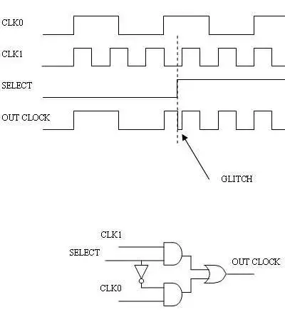
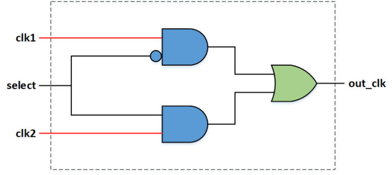
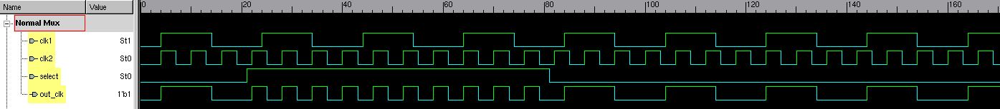
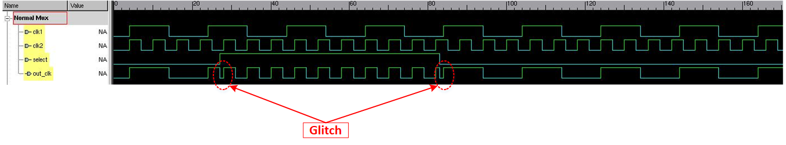
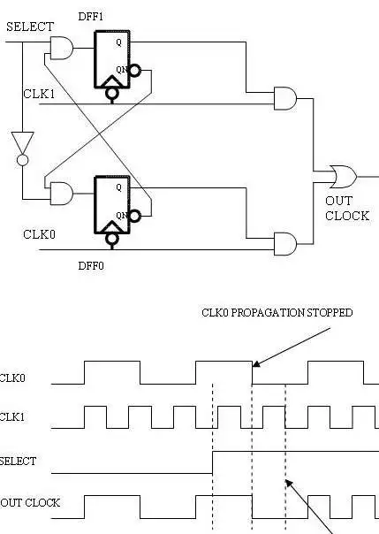
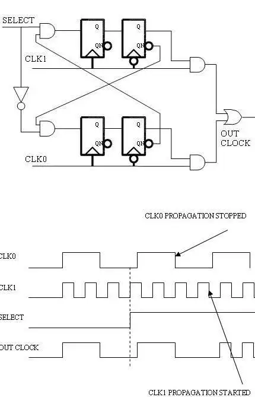

# 참고

https://www.eetimes.com/techniques-to-make-clock-switching-glitch-free/?utm_source=chatgpt.com

https://vlsitutorials.com/glitch-free-clock-mux/?utm_source=chatgpt.com

# 소개

요즘에 chips내에서 다양한 주파수의 클럭을 사용할때, 특히 통신 분야에서는, chip이 동작중일때 종종 clock을 바꿀 필요가 있게 된다.

상황: 이 클럭들은 **완전히 비동기이기도 하고, 서로 배수의 관계**일 수 도 있다. 

문제: 어느 경우던지, `switching하는 순간에 clock에 glitch가 발생`할 수 있고, 이는 동작 중인 chip에 치명적 피해를 줄 수 있다.

- Glitch on the clock line can be generated at the time of switching,
- It is hazardous to the whole chip; or system

해결: glitch 를 피하는 방법은 clock이 완전 비동기, 혹은 배수 관계에 따라 달라질 수 있다.

# Problem: chopping or glitch with the simplest and-or gate

상황: 아래 그림은 clk0, clk1, sel 입력과 출력 out_clk를 and-or gate로된 multiplexer logic을 구현한 것이다.

문제: sel신호는 언제든지 값이 바뀔 수 있다.

1) clock이 출력되는 중간에 sel이 바뀌는 경우: 온전한 clock이 출력되지 않는다
   1) **chopping**: clock이 출력되는 중간에 잘리고 (chopping),  
   2) **glitch** 처럼 짧은 clock이 나올수 있다

---

# Glitch free mux

## Idea

clk0, clk1이 둘다 0일때 clock을 바꿔야 온전한 clock duty를 가지고 간다. --> No chopping

위에서 en0, en1이 각 and gate의 출력이라면, 이들이 non-overlap되어야 glitch가 발생하지 않는다.

## Dev 1: glitch free mux for related clocks

Let: 

- in0, in1: DFF의 입력

- en0, en1: DFF의 출력

clock을 negedge에서 사용하므로, 0일때 바뀔 것 → 온전한 clock duty가 나올 것

in0 = ~sel & ~en1이므로, 시작시 sel=0, en1=0이면 in0=1이 되고, negedge에서 en0=1이 된다. 결국, out_clk = en0 & clk0가 되서, clk0가 출력된다.

이후 , sel=1이 되면, in0=0가 되고, negedge에서  en0=0가 되므로, 온전한 1 clock cycle의 클럭이 glitch없이 출력된다.

en=0가 된 후에는,

in1 = sel & ~en0이므로, in1=1이 되고, negedge에서 en1=1이 된다. 결국, 온전한 1 clock cycle의 클럭이 glitch없이 출력된다.

중요한 건, en0 → in1 → en1식으로 되므로, en0와 en1사이에 `overlap이없다`는 것이다.

두 clock이 배수의 관계를 가지면 이렇게 설계할 수 있다.

When two clocks are multiple of each other, single DFF is enough to make en0 and en1 non-overlapped to make their outputs have full clock duty cycle

the output of DFF is latched at negedge of their clocks → no glitch at the output

# Dev 2: Glitch free mux for unrelated clocks

두 clocks이 완전히 async일때는 DFF를 하나 더 두어서, meta stability를 없애면 된다.

아래 그럼에서는 posedge와 negedge를 혼용했는데, negedge만 써도 되지 않을까?

