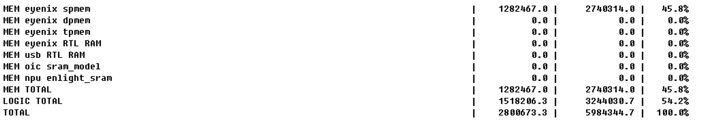
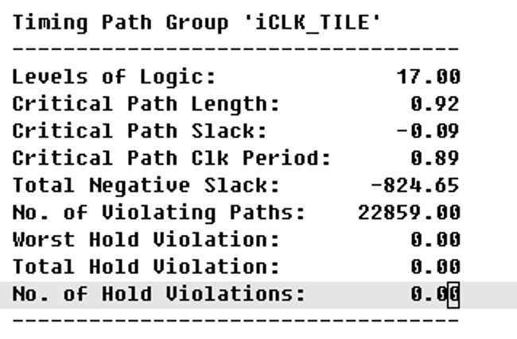
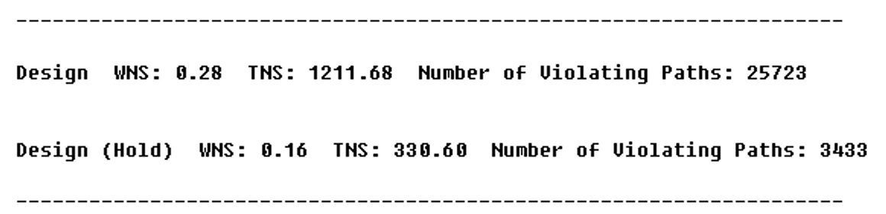
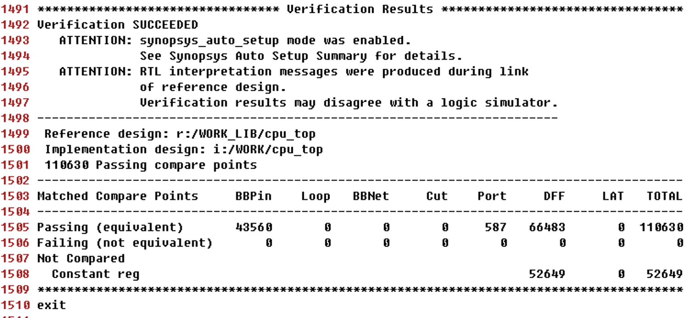

# 계산방법

# 예1: EN675

참고:

https://www.notion.so/RISC-V-Renewal-83c20866da854f60a9d2e6249a55b824#b769a12eca0b4e88910c28386d7edacf

spec: RISC-V, 4 tiles, L1 16kB, L2 512kB

clock: 675, 337.5MHz

samsung 28nm LP process,

9 track cell, 1st pass RVT, 2nd pass RVT+LVT

```
Area : 600만 gate count
```




LVT cell : 대략 22만개 ⇒ 기존 CPU를 594MHz 주파수로 합성했을 때에는 약 10만개 정도였음

**QOR (Quality of Result) : 메모리 path에서 WNS가 -0.28ns 정도 발생, iCLK_TILE에서는 -0.09ns WNS**







Formality EQ check : SUCCESS


