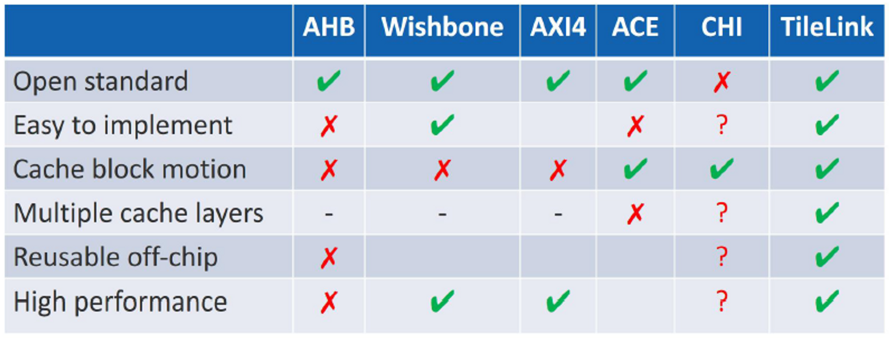
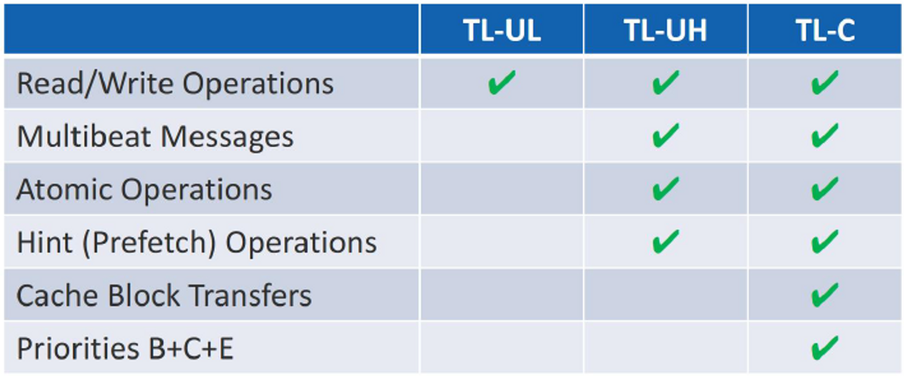
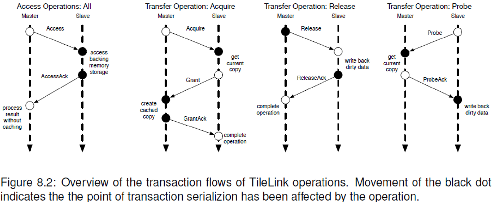

# TL <> AXI4 비교

what is the biggest difference @google

## **Comparison**

`05 西安珠海WorkshopPPT_Kevin.pdf`에서 참고한 자료임

AMBA ACE (AXI coherency extensions): https://www.youtube.com/watch?v=5p6DecfnyvY

- 별도의 snoop 채널이 있다.

# TL

TL is a **cross**bar intercon**nect** **scheme**.

**It** has 3 con**form**ance levels.

- TL-UL (Uncached Lightweight) protocol supports basic read and write
- TL-UH (Uncached Heavyweight) supports **burst** mode and a**to**mic oper**ation**
- TL-C (cached) supports **ca**che co**her**ency.

5 channels: A,B,C,D,E

- TL-U uses A,D channels for R/W
- TL-C uses B,C and E channels for cache coherency

Common signals

| opcode  | 3         |
| ------- | --------- |
| param   | 3         |
| size    | 2^n bytes |
| source  | o         |
| address | a         |
| mask    | w         |
| data    | 8w        |
| corrupt |           |

2022년 12월 6일

# Crossbar interconnect scheme

3 conformance levels:

- TL-UL (Uncached Lightweight) supporting basic R/W,
- TL-UH (Uncached Heavyweight) supporting burst mode, atomic operation,
- TL-C (cached) supporting cache coherency.

5 channels: A,B,C,D,E

- TL-U: A,D
- TL-C: B,C,E

Opcodes

- TL-U
  - Get/Put~ → AccessAck~
  - Acquire~ → Grant~
- TL-C
  - Slave?: Probe~ → ProbeAck~
  - Master: Release~ → ReleaseAck~

Signals

| opcode  | 3         |
| ------- | --------- |
| param   | 3         |
| size    | 2^n bytes |
| source  | o         |
| address | a         |
| mask    | w         |
| data    | 8w        |
| corrupt |           |
|         |           |

