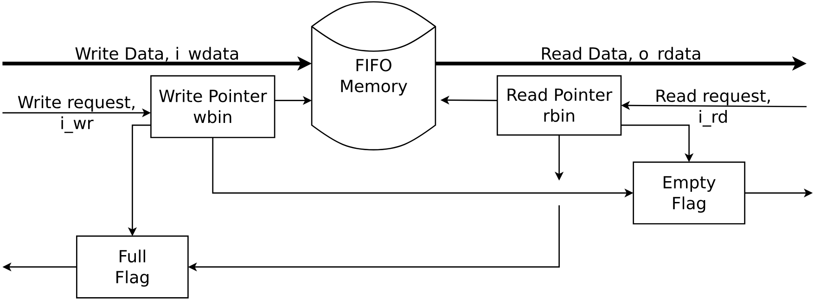
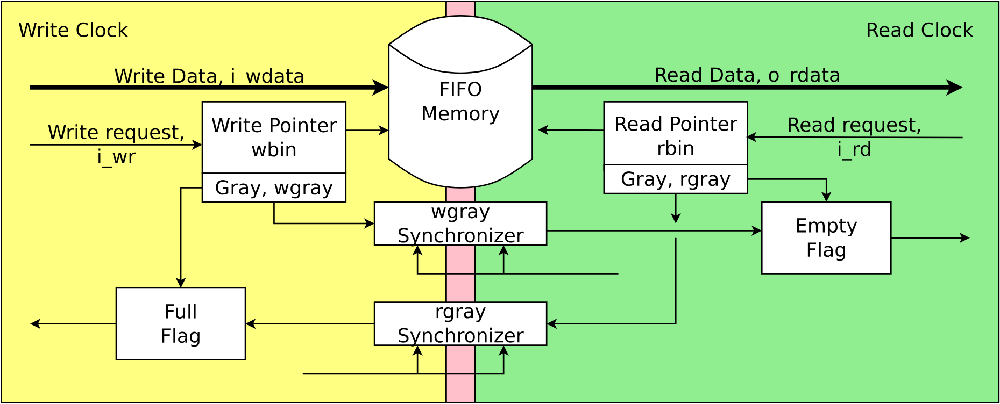
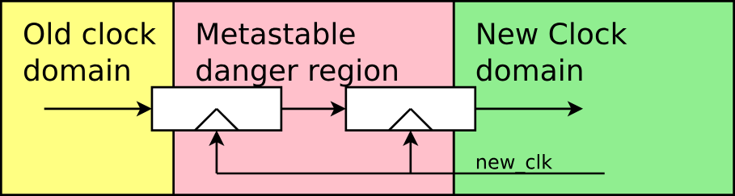
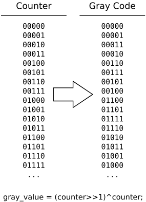

# asfifo

## 참고

https://zipcpu.com/blog/2018/07/06/afifo.html


### Basic FIFO




```jsx
@WCLK
Wptr: 
	@RSTN: 0
	@wfire: +1
	
@WCLK
mem[AW'(Wptr)] <= WDATA;
@RCLK:
Rptr:
	@RSTN: 0
	@rfire: +1
	
RDATA = mem[AW'(Rptr)]; 
```

wfull & rempty

```jsx
rempty = Wptr==Rptr;
wfull = (Wptr[AW] != Rptr[AW]
```

# CDC

여기서 문제가 생긴다.

`문제` Rptr @RCLK, Wptr@WCLK

두 pointers가 서로 다른 clock domain에서 동작한다.

따라서, rempty와 wfull은 CDC issue가 생긴다. ⇒ `metastability`

아래 그림에서 write는 yellow bg, read는 green bg에서 동작한다




# Gray codes

CDC할때는 아래와 같이 2-3 FF를 사용할 수 있다.

[그림 3]




1 bit인 경우에는 큰 문제가 되지 않는다. 즉, 1 clock 빨리 오거나, 1 clock 늦게 오거나, 둘중하나에 해당한다.

하지만, 여기서는 AW+1 bit의 Ptr을 넘겨야 한다.

즉, wfull을 만들기 위해, Rptr을 WCLK로 넘겨야 하고,

rempty를 만들기 위해 Wptr을 RCLK로 넘겨야 한다.

이때, `우리가 Gray code를 사용하면, 전체 bit가 변경되지 않고, 한번에 1 bit씩만 변경되므로, 너머지는 stable하게 유지가 된다.` **Solution is to pass pointers from one clock domain to another in a form only one bit will ever change at any time.**

[Gray Code 그림 4]




이는

```jsx
gray_code = (counter >>1) ^ counter
```

gray code인지 확인하는 방법은 이전 값과 1bit만 다른지 확인할 수 있는 systemverilog의 $onehot()함수를 사용할 수 있다.

```jsx
always @(posedge CLK)
	assert($onehot(gray_code ^ $past(gray_code)));
	 
```

따라서, 앞서 Wptr을 RCLK로 보내기 위해서는 gray code와 CDC를 사용하면 된다.

```
// Gray code
assign wptr_gray = (wptr>>1) ^ wptr;

// CDC
always_ff @(posedge RCLK or negedge RRSTN) begin
	if(!RSTN)
		{WptrGray2d, WptrGray1d} <= 'd0;
	else
		{WptrGray2d, WptrGray1d} <= {WptrGray1d, wptr_gray};
end
```

# Gray code comparison

[Pr1] Wptr @RCLK -> WptrGray2d @RCLK로 pass한 후, rempty를 만들어야 한다. 이를 위해 gray code를 다시 counter로 돌려놓아야 하나?

```
// old
assign rempty = (Wptr == Rptr);
```

만약, gray code가 counter처럼 unique하다면, Ptr대신, PtrGray2d를 사용할 수 있다. 그리고, 이들은 unique하다. `Gray code has unique values just like counters` 따라서, 그대로 비교하는데 사용할 수 있다.

```
// new
assign rempty = (WptrGray2d == rptr_gray);
```

[`Pr2`] Rptr @WCLK -> RptrGray2d @WCLK로 pass한 후, wfull을 만들어야 한다.

```
// old
assign wfull = (wptr[AW] != rptr[AW]) && (wptr[AW-1:0] == rptr[AW-1:0]);
```

이 경우, wptr - rptr = 2^N인지 check하는 것과 같고, 이는 하위 AW bits는 같고, 최상위 1 bit가 다르면 된다.

이를 아래 gray code에서 확인하면, 실험을 간단하게 하기 위해 AW=3라고 하고, 최상위 bit [3]이라고 하자. 즉, 8개의 entry만 있다고 하자. 이들이 2^3=8 차이가 나면 full인 것이다.

예를들여, rptr=0001b이고, wptr=1001b = 9d이면, 8 차이가 나므로 full이다. 이와 같이, full 조건일때 gray code를 확인헤보면,

rptr = 0001b = 0001g,이고, wptr = 1001b = 1101g (gray) 이다.

또한,

rptr = 0100b = 0110g 이고, wptr = 1100b = 1010g 이다.

즉, 상위 2bit는 opposite이고, 하위 2bit가 equal이면 wfull조건으로 쉽게 만들 수 있다.


따라서,

```jsx
// old
assign wfull = (wptr[AW] != rptr[AW]) && (wptr[AW-1:0] == rptr[AW-1:0]);

// new: Gray code
assign wfull = (wptr[AW:AW-1] != RptrGray2d[AW:AW-1]) 
&& (wptr[AW-2:0] == RptrGray2d[AW-2:0]);
```