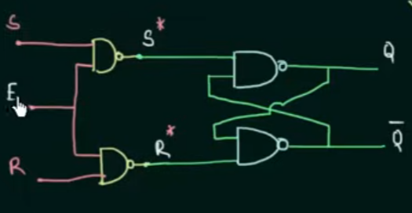

# 3) Latch vs Flip-flop

묻는이유: always_comb에서 모든 경우에 출력을 할당하지 않으면, latch가 생성 → STA에서 level-sensitive 분석 필요 (glitch, hold violation 가능): edge sensitive인 FF보다 훨씩 타이밍 복잡: closure가 어려워짐

- **차이**: Latch는 **레벨-센서티브**, FF는 **엣지-트리거**.
- **왜 문제?**: 의도치 않은 latch는 타이밍 분석을 어렵게 하고 글리치/hold 문제 유발.
- **방지**: 조합 always 블록(= `always_comb`)에서 **모든 경로 할당**; default 값 지정.

https://www.youtube.com/watch?v=-aQH0ybMd3U&list=PLTd6ceoshpreKyY55hA4vpzAUv9hSut1H

https://www.youtube.com/watch?v=m1QBxTeVaNs

### 질문 1. How a latch gets inferred in RTL design?

https://inst.eecs.berkeley.edu/~eecs151/sp19/files/discussion3.pdf

https://nandland.com/how-to-avoid-creating-a-latch/#:~:text=To avoid this%2C make sure,not include the default assignment.

A conditional statement does not cover all possible cases.

: in the `if` or `case` statements, there is no `else` or `default` statements

## 차이

- Latch

  - level-sensitive: Enable신호가 활성화되면, 입력을 출력에 전달
  - 예: D-latch: Q=D if EN=1, otherwise Q 유지
  - 구조: cross-coupled NAND/NOR + 게이트 제어 (E) 로 SR-latch 구성

  ```jsx
  // Latch (level-sensitive)
  always_comb begin
  if (en) q = d;
  end
  ```

  

  

- FF

  - Edge-triggered: 클럭의 edge 순간에 입력을 출력에 전달
  - 예: D-FF, 내부에 latch 2개 (Master-Slave) 로 구현

  ```jsx
  // Flip-Flop (edge-triggered)
  always_ff @(posedge clk) begin
  q <= d;
  end
  ```

## 비교

- Latch
  - (+) 회로 면적 low, 저젼력 설계시 clock gating과 결합 용이
  - (-) 타이밍 분석 복잡
  - (-) Enable glitch로 의도차 않은 데이터 전달 될 수 도
- FF
  - (+) 타이밍 예착 가능, 동기식 설계 용이
  - (-) 면적 high, 클럭 주파수에 비례해 전력 high

## 이슈

- always_comb에서 모든 경우에 대해 출력을 할당하지 않으면, 합성기가 이전 결과를 유지하기 위해 latch를 생성한다.

always_comb begin if (sel) y = a; // else 누락 → sel=0일 때 이전 y를 유지하려고 latch 생성 end

- always_ff 에서는 FF로 합성되므로, else 가 빠져도 FF 에서 출력이 유지되므로, latch가 생성되지 않음

```jsx
always_ff @(posedge clk)
	if(sel) y <= a
```

`TODO` : SR latch를 제대로 공부해야 함. 아직 정확히 이해가 않됨

SR latch를 사용해서 D-FF구혀하는 건가?

https://www.youtube.com/watch?v=YW-_GkUguMM&t=226s: 이 내용을 보면 좋겠음

------

# 2) Flip-flop 종류 (D, T, JK, SR)

### 묻는 이유:

### 1분 답변:

- **핵심**: 실무 RTL에서는 대부분 **D-FF**로 추상화. T/JK/SR은 교육적 의미가 크고, 합성 시 D-FF 로 매핑.
- **면접 포인트**: 상태기계 설계 시 **D-FF 입력 함수**로 생각하면 충분. 비표준 FF는 타이밍/합성 예측성 저하.

### 3분 답변:

FF는 클럭의 edge에서 입력을 샘플링해서 출력을 변경하는 sequential logic이다. 종류는 입력 특성과 동작 방식에 따라 달라진다.

| 종류      | 입력 | 다음 상태(Q_next)                                | 특징                          |
| --------- | ---- | ------------------------------------------------ | ----------------------------- |
| **D-FF**  | D    | Q_next = D                                       | 가장 단순, 입력을 그대로 저장 |
| **T-FF**  | T    | Q_next = Q ⊕ T                                   | 토글 동작, 카운터에 활용      |
| **JK-FF** | J, K | 00: 유지, 01: 0으로, 10: 1로, 11: 토글           | SR-FF 단점 보완               |
| **SR-FF** | S, R | 00: 유지, 01: Reset, 10: Set, 11: 불가능(X 상태) | NAND/NOR 래치 기반            |

실무 활용

- **D-FF**: 거의 모든 레지스터/상태저장에 사용.

- **T-FF**: 분주기, 토글 카운터 구현 시 유용.

  (ex: ÷2 클록 생성)

- **JK-FF**: 교육 목적 외 현업에선 드뭄. 복잡한 동작은 FSM으로 대체.

- **SR-FF**: 동기 로직보단 비동기 래치/제어 신호 생성용.

**면접 포인트**

- `각 FF의 **Truth Table**을 빠르게 그릴 수 있으면 좋음`.
- “현업에선 대부분 D-FF를 쓰고, 나머지는 변환/논리로 구현한다”를 언급 → 실무 감각 어필.
- `Flip-Flop 동작 타이밍 다이어그램을 설명할 수 있어야 함(특히 T-FF 토글, JK의 토글 모드).`

D-FF기반 T-FF구현 예

```verilog
always_ff @(posedge clk or posedge rst) begin
if (rst) q <= 1'b0;
else     q <= q ^ t; // XOR로 토글
end
```