# Interview 문제

https://www.wisdomjobs.com/e-university/amba-ahb-interview-questions.html

1. When should a master assert and deassert the block signal for a  locked transfer? 1.

2. Can an arbiter be designed to always allow burst to complete?

3. Why is HADDR sometimes shown as an input to the arbiter?

   간단한 arbiter는 아래와 같이 HBUSREQ를 받아서, HGRANT를 내주면 된다.

   HBUSREQ →(n)→ [Arbiter] →(n)→ HGRANT

   HADDR을 사용하면 bus 선택

4. When can the HGRANT signal change?

5. When is the relationship between the HLOCK signal and the HMASKLOCK signal?

6. When should a master dessert its HBUSREQ signal?

7. When will the arbiter grant another master after a locked transfer?

8. Can a master master deassert HLOCK during a burst?

9. If a master is currently granted the bus by default, how many cycles before starting an non-idle transfer does it have to assert HBUSREQ?

10. Can a master perform transfer other than idle when the bus was granted to it, but not requested by the master?

11. Why is a burst not allowed to cross a 1 kByte boundary?

12. Can an AHB master be connected directly to an AHB slave?

13. What is the state of the AHB signals during reset?

14. Can a busy transfer occur at the end of a burst?

15. Is a `dummy master` really necessary?

16. What `default state` should be used for the HREADY and HRESP output from a slave?

17. Is HREADY an input or an output from slaves?

18. How many masters can there be in an AHB system?

19. Can a master change the address/control signals during a waited transfer?

20. Whn a master rebuilds a burst which has been terminated early are there any limitations on how it rebuilds the burst?

21. Do all slaves have to suppor the `busy transfer` type?

22. What sytem support is required if a slave can be powered down or have its clock stopped?

23. When can early `burst termination` occur?

24. Does the address have to be aligned, even for `idle transfers`?

25. What is the difference between a `dummy bus master` and a `default bus master`?

26. Is it legal for a master to change `HADDR` when a transfer is extended?

27. Can HTRANS change whilst HREADY is low?

    1. `HREADY=0일때, M은 control signal을 변경하지 말아야 함`
    2. 다음 조건에서는 가능
       1. HTRANS=IDLE
       2. HTRANS=BUSY
       3. HTRANS=SPLIT/RETRY
       4. HTRANS=ERROR

28. What are the different bursts used for?

29. What value should be used for HTRANS when an AHB master gets a retry response from a slave in the middle of burst?

30. What address should be on the bus during the idle cycle after a split or retry?

31. Do all masters have to support split and retry?

32. Can a split or retry response be give at any point during a burst?

33. Will a master always lose the bus after a split response?

34. Can a slave assert Hsplitx in the same cycle that it give a split response?

35. Do all slaves have to support the split and retry responses?

36. Can a slave use both split and retry responses?

37. What is the difference between split and retry responses?

38. 

### HPROT

1. Is it specified that `HPROT`, HSIZE and HWRITE remain constant throughout a burst?

   yes @[`NOTE` control signal들인 HWRITE, HSIZE, HPROT 은 burst 동안 이들은 constant로 유지되어야 한다. ](https://www.notion.so/NOTE-control-signal-HWRITE-HSIZE-HPROT-burst-constant-d33fc216401f4f55a14a61f98e88c20b?pvs=21)

2. What is the recommended default value for `HPROT`?

   default value = 4’b0011 @[3.7.3 Protection control](https://www.notion.so/3-7-3-Protection-control-c4e37fd5862242edad9e5ba35e66e4c9?pvs=21)

   : non-cacheable, non-bufferable, priviledged, data access

### Transfer

1. How should AHB to APB bridges handle accesses that are not 32 bits?

   1. 둘다 32 bit일때는 simply connect
   2. 32 bit 보다 적을때는 해당 bits들을 잘 연결해야 함.
      1. ensure the peripheral is located on the appropriate bits of the APB data bus

2. The specification recommends that only 16 wait states are used. What should you do if more than 16 cycles are needed?

   

   참고 3.9.1: SPLIT or RETRY

### address

1. What is a default slave?

   [시스템이 완전히 memory map을 cover하지 않기 때문에, 존재하지 않는 address에 대해 응답하는 `default slave`가 구현되어야 한다. ](https://www.notion.so/memory-map-cover-address-default-slave-578b2ed6017340beb87be5849f268795?pvs=21)

   시스템이 완전히 memory map을 cover하지 않기 때문에, 존재하지 않는 address에 대해 응답하는 `default slave`가 구현되어야 한다.

   - NONSEQ나 SEQ transfer가 이 주소를 접근시, default slave는 `HRESP=ERROR` 상태를 응답한다
   - IDLE/BUSY 전송에 대해서는 OKAY 로 응답한다.

2. Is a `default slave` really necessary?

   위 내용과 같고,

   address decoder에 구현하면 된다.


2022년 12월 16일

2024년 2월 28일: 재작성


# 3.1 AMBA AHB

# 3.1.1 Typocal AHB-based MCU

APB는 많은 주변장치들을 연결하는데 사용되는 간단한 인터페이스를 제공하고,

AHB는 많은 마스터들에 burst transfer 와 pipelined operation을 제공하여 고성능을 제공한다.

| AHB                                 | APB                                            |
| ----------------------------------- | ---------------------------------------------- |
| burst, pipelined → high performance | single → simple interface for many peripherals |
|                                     |                                                |
| High performance                    | Low power                                      |
| Pipelined operation                 | Latched address and control                    |
| Burst transfer                      | Simple interface                               |
| Multiple bus masters                | Suitable for many peripherals                  |
| `Split transactions`                |                                                |


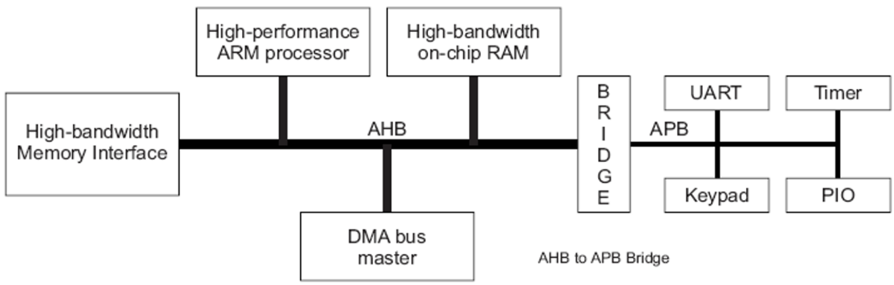

아래 그림에서 Master IP는 방향이 잘못된 것 같다.


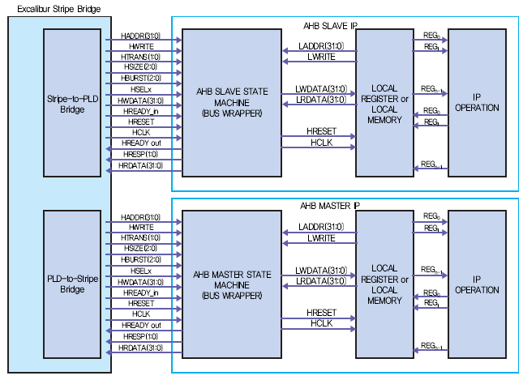


# 3.4 Basic transfer

기본적으로 two phase 로 구성된다. address phase + data phase

address phase: 1 cycle이고, `data phase: <16 cycles`이다.

**그림 3-3:**

T0: address setup @ M

T1: address catch @S + data setup @S

T2: data catch@M

```jsx
                                                                                             0                          1                          2
```


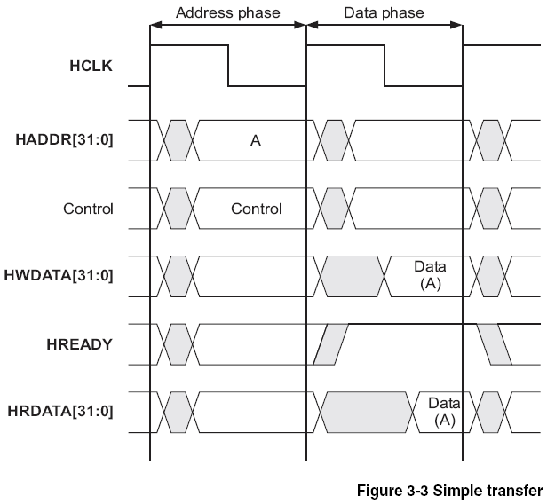

```
address와 data phase가 다르게 갈 수 있다. → pipelined, high performance
```

: 위 그림에서, Data phase인 T1에 A+4가 들어갈 수 있다.

**그림 3-4:**

T1-T2: HREADY=0@S → `2 wait states` 추가

```jsx
                                                                              0                     1                         2                       3                      4
```


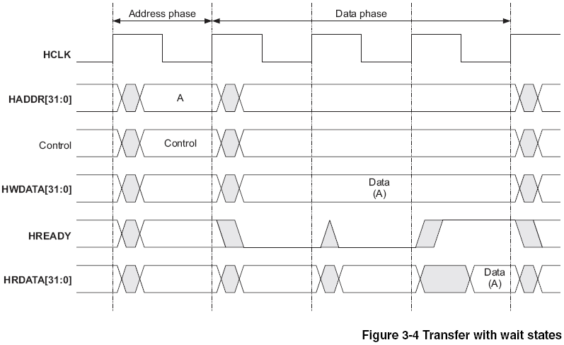

**그림 3-5:**

pipelined transfer를 보여준다.

address A와 C는 zero wait state이고,

address B만 one wait state가 된다.

data 에서 HREADY=0이 되면, address phase도 같이 길어진다.


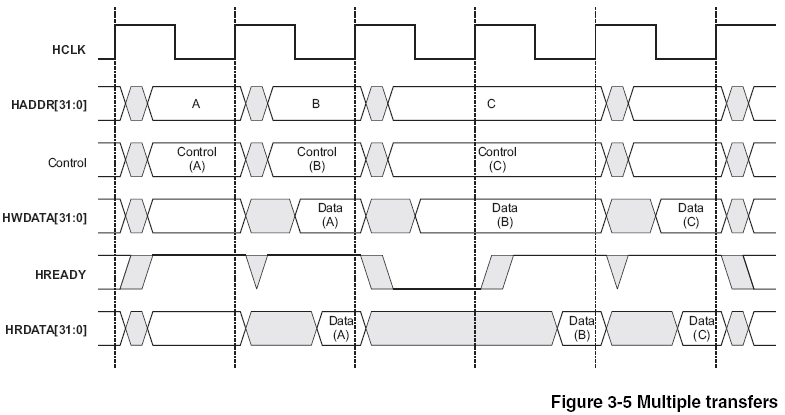

이정도로 구현할 수 있을 것 같다.

```jsx
// master
always @(posedge CLK or negedge RSTN) begin
	switch(State)
	case IDLE: 		if(any_next_addr)		State <= SETUP; 
	case SETUP:		if(HREADY) begin
						if(any_next_addr)	State <= SETUP;
						else				State <= IDLE;
						else				State <= WAIT;
	case WAIT:		if(HREADY) begin
						if(any_next_addr) 	State <= SETUP;
						else				State <= IDLE;
					end
	endswitch
end

// slave

	wire [31:0]		rdata = MEM[HADDR];
	
	always @(*) begin
		switch(State)
		case IDLE:		if(any_addr)		Nstate = RESP;
		case RESP:		if(any_addr)		Nstate = RESP;
						else				Nstate = IDLE;
		endswitch
	end
	
always @(posedge CLK) begin
	switch(Nstate)
	case RESP:		if(HWRITE)				Hwdata <= HWDATA;
					else					HRDATA <= rdata;
					if(rdy)					HREADY <= rdy;
	endswitch
end
```


# 3.5 Transfer Type

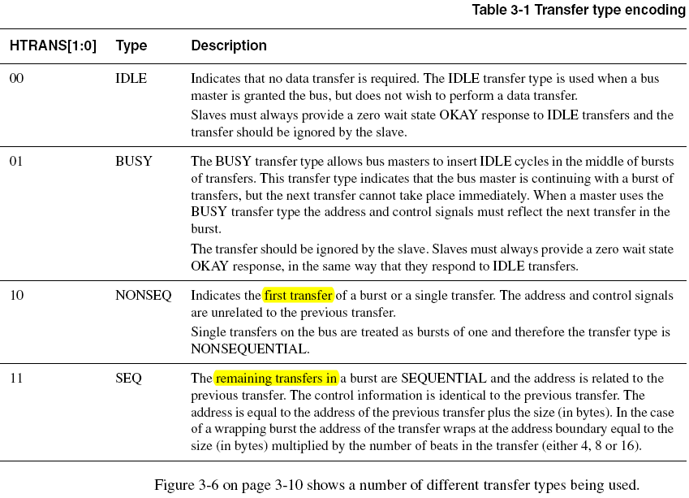

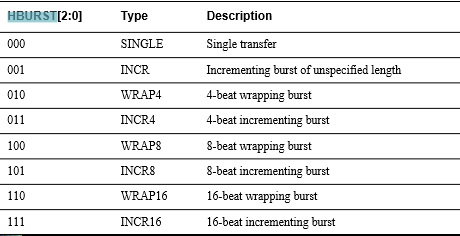


이정도로 구현할 수 있을 것 같다.

```jsx
// master

always @(posedge CLK or negedge RSTN) begin
	switch(State)
	case IDLE: 		if(HTRANS)				State <= SETUP; 
	case SETUP:		if(HREADY) begin
						if(HTRANS)			State <= SETUP;
						else				State <= IDLE;
						else				State <= WAIT;
	case WAIT:		if(HREADY) begin
						if(HTRANS) 			State <= SETUP;
						else				State <= IDLE;
					end
	endswitch
end

// slave

	wire [31:0]		rdata = MEM[HADDR];
	
	always @(*) begin
		switch(State)
		case IDLE:		if(HTRANS)			Nstate = RESP;
		case RESP:		if(HTRANS)			Nstate = RESP;
						else				Nstate = IDLE;
		endswitch
	end
	
always @(posedge CLK) begin
	switch(Nstate)
	case RESP:		if(HWRITE)				Hwdata <= HWDATA;
					else					HRDATA <= rdata;
					if(rdy)					HREADY <= rdy;
	endswitch
end

end
```


# 3.7 Control signals

`NOTE` control signal들인 HWRITE, HSIZE, HPROT 은 burst 동안 이들은 constant로 유지되어야 한다.

# 3.7.1

# 3.7.2

# 3.7.3 Protection control

HPROT: 4’b 는 bus access에 대한 정보를 제공한다.

- opcode fetch/data access
- priviledged mode / user mode
- bufferable
- cacheable

default value: `4’b0011`


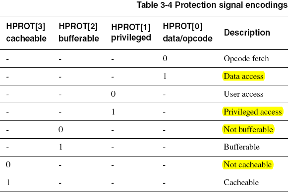

비교: PPROT@APB, AxPROT @AXI


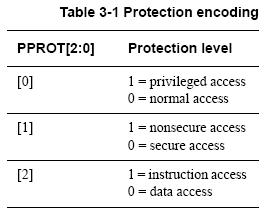


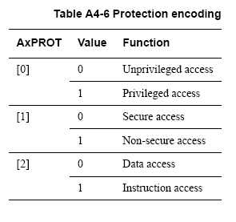


# 3.8 Address decoding

2022년 12월 17일

중앙의 decoder가 HADDR을 받아서, 각 slave의 HSELx를 생성할 수 있다.

상위 어드레스를 사용해서 최대한 간단히 만들어야 high speed operation 가능

```jsx
@S[x]: catch HADDR @HSEL[x]=1 and HREADY=1
```


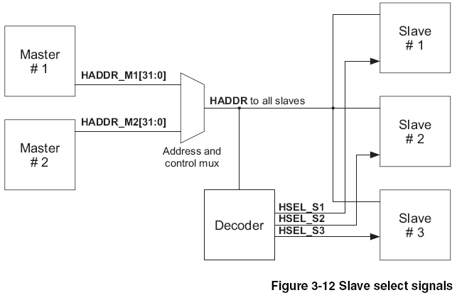

```
한 slave의 최소 address space = 1kB
```

따라서, master는 1KB이상의 transfer를 하지 않도록 설계해야 한다.

시스템이 완전히 memory map을 cover하지 않기 때문에, 존재하지 않는 address에 대해 응답하는 `default slave`가 구현되어야 한다.

- NONSEQ나 SEQ transfer가 이 주소를 접근시, default slave는 `HRESP=ERROR` 상태를 응답한다
- IDLE/BUSY 전송에 대해서는 OKAY 로 응답한다.

이러한 defalue slave는 address decoder에 구현하면 된다.

```jsx
@HADDR not in address map:
	HREADY = 1
	@HTRANS=NONSEQ|SEQ: HRESP=ERROR
	@HTRANS=IDLE|BUSY:  HRESP=OKAY
// default slave @ decoder

	always @(*) begin
		switch(State)
		case IDLE:		if(HTRANS)			Nstate = RESP;
		case RESP:		if(HTRANS)			Nstate = RESP;
						else				Nstate = IDLE;
		endswitch
	end
	
always @(posedge CLK) begin
	switch(Nstate)
	case RESP:		if(HADDR not in the address map) begin
													HREADY <= 1;
						if(HTRANS==NONSEQ|SEQ) 		HRESP<=ERROR;
						else if(HTRANS==IDLE|BUSY)  HRESP<=OKAY
					end
	endswitch
end
```


# 3.9 Slave transfer responses

2022년 12월 16일

master가 transfer를 시작하면 수정할 수 없다.

slave는 transfer에 대한 상태를 제공한다.

HREADY + HRESP가 transfer를 연장하는데 사용

HRESP 신호가 transfer 상태를 제공

slave가 transfer시 할 수 있는 것:

- 즉시 완료:
- 완료하기 위해 wait 상태 추가: `HREADY=0`
- transfer가 fail했다고, error 를 signal함: `HREADY=1 & HRESP=ERROR`
- `transfer의 완료를 지연?`

# 3.9.1 Transfer done

HREADY=0로 만들어 wait를 추가할 수 있다.

`16 wait state를 넘기지 말아야` 한다.

# 3.9.2 Transfer response

**OKAY 응답:** transfer completed `@ HREADY=1 & HRESP=OKAY`

**ERROR 응답:** 보통 protection error에서 사용된다. 즉, read only memory에서 write할때 발생

**SPLIT | RETRY 응답:**

delay the completion of a transfer @ `HREADY=1 & HRESP=SPLIT | RETRY`

: HREADY=1이므로, bus를 다른 master가 사용토록 비워준다

: 주로 high access latency인 slave에서 사용

: high access latency를 가진 slave를 접근할때 너무 오랫동안 bus를 점유하는 것을 방지할 수 있다

RETRY: 실패했으므로 다시 보내라는 의미

```
SPLIT: 성공적으로 끝나지 않았다?
HRESP는 1bit는 AHB-LITE이고, 2bits는 AHB-FULL이다.
```


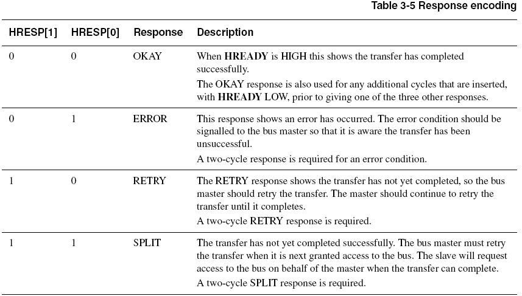

`cf` 이 코드는 AXI에서와는 다르다.


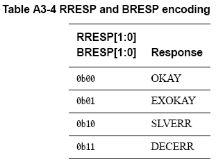


# 3.11 Arbitration

only 1 master access the bus at any time


# 3.12 Split transfers

2022년 12월 17일

**상황:** http://vlsibuzz.blogspot.com/2009/11/what-is-split-transfer-in-ahb.html?m=1

master가 slave에게 data를 요청했지만, slave는 준비하는데 오랜 시간이 걸린다.

이때 arbiter는 다른 master에게 grant를 해서 bus를 사용할 수 있게 한다.

이후 slave가 arbiter에게 data가 준비되었음을 알린다.

arbiter는 원래 master에게 bus를 사용하도록 grant해서 transaction을 완료하도록 한다.

SPLIT 전송은 address 를 전송하는 것과 data를 전송하는 것을 분리해서, 전체적인 효율을 증가시킨다.

master가 transfer를 요청했을때,

slave는 응답하는데 많은 cycle이 걸리면, SPLIT 으로 응답할 수 있다.

이는 arbiter에 신호를 보


# 기타

HREADY와 HSELx는 decoder신호이다.

AHB Lite는 slave각각의 선택 신호인 HSELx가 있고,

해당 slave가 선택되었을때, HREADY를 monitor헤서 이전 bus transfer가 끝났는지 확인해야 한다.

HSELx는 address bus의 comb. logic으로 구현된다.


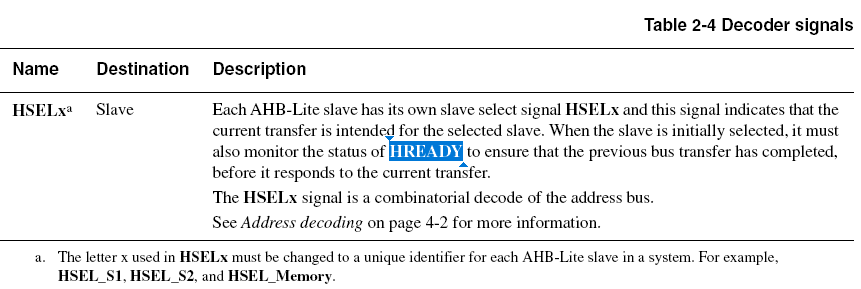