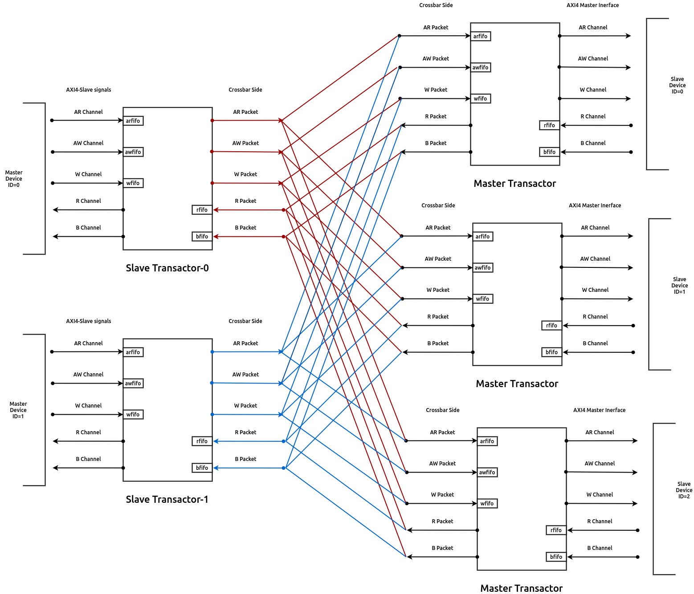

# AMBA: APB, AHB, AXI

AHB, APB: Bus

AXI: P2P interconnect

- AXI4Stream: no address, only data transfer
- AXI4Full: burst mode for large size of data: for Ethernet frames, PCIe
- AXI4Lite: small size of data: for peripherals

| AXI           |      |                                                              | TL-U |
| ------------- | ---- | ------------------------------------------------------------ | ---- |
| WriteAddress  | aw   | **Address**, burst, cache, ID, LEN, LOCK, PROT, **Ready**, Size, **Valid** | A    |
| ReadAddress   | ar   | “                                                            | A    |
| WriteData     | w    | **Data**, ID, LAST, **Ready**, STRB, **Valid**               | A    |
| ReadData      | r    |                                                              | D    |
| WriteResponse | b    | ID, **Ready**, Resp, **Valid**                               | D    |

CPU: TL-U > AXI due to least lanes and R/W not at the same time → no redundancy

ISP+CPU: AXI > TL-U due to R/W happens at the same time → maximize performance

# APB

[On-Chip-Bus-Interconnections.pdf](https://s3-us-west-2.amazonaws.com/secure.notion-static.com/905f5777-1eb0-4ad4-9121-d2f72518a2a6/On-Chip-Bus-Interconnections.pdf)

# Ref

https://fabrics.readthedocs.io/en/latest/axi4_crossbar.html

