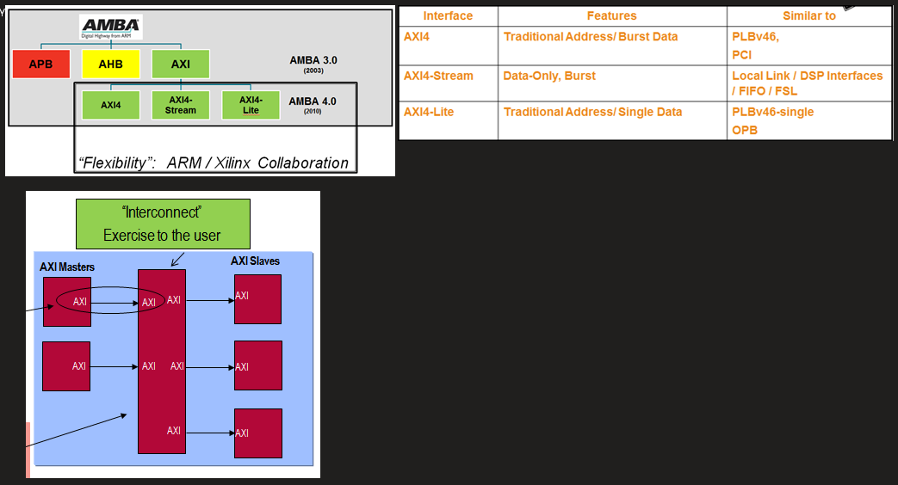
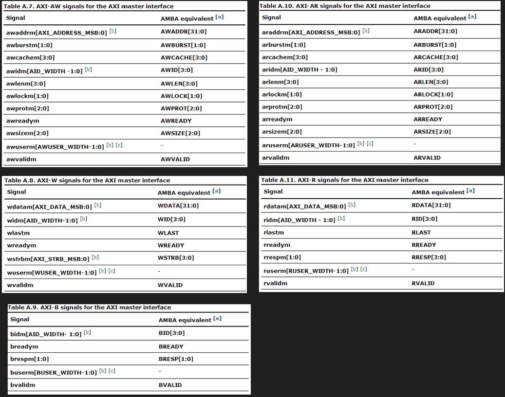

# 22) AXI 인터페이스 핵심

- **5채널**(AW/W/B/AR/R), **VALID/READY** 핸드셰이크, **out-of-order**/ID, burst 길이/정렬.
- **스루풋**: 한 사이클 1beat 유지하려면 다운스트림 backpressure에 **skid buffer** 배치, `ready` 경로 콤비 지연 최소화.

```
TODO
```

기본 개념


[🌚 [ \] AMBA: AXI4, AHB, APB](https://www.notion.so/AMBA-AXI4-AHB-APB-e971cb12ad9a41a8a9708b7b0547f48a?pvs=21)

AXI

(

[웹 보기](https://onedrive.live.com/view.aspx?resid=4148CDAF76221EE6!3144&id=documents&wd=target(ARM.one|BDB76EB5-75D3-4143-9914-B6430680CD6E%2FAXI|AD982BA1-1324-40E4-B7A1-F3ADC62CDD4E%2F))

)

# Introduction

- 종류: AXI, AHB, APB
  - AHB, APB:
    - Bus protocol
    - AXI와 Bridge형태로 연결
  - AXI (Advanced Extensible Interface)
    - AXI4Stream: Address는 관심없고, data만 전송, FIFO사용
    - AXI4Full: 마스터와 슬레이브간에 수십-수K byte 데이터 교환시 한꺼번에 전송시 사용
      - 예: 이더넷 프레임, PCIe
    - AXI4Lite: 적은 데이터를 간헐적으로 교환시 사용
      - 예: 주변장치




## AXI 이해

- AXI: master와 slave간의 Point-to-point 방식 I/F, (Not a bus)
- Bus vs. P2P (Interconnect)
  - Bus: M과 S간에 address, data, ctrl신호를 공유하므로, 자원 적지만, 여러M, 여러 S간 고속 전송이 어려움
  - P2P: 여러 M, 여러 S간 연결시 중간에 스위치 (**Interconnect**) 를 둠
- Interconnect
  - 기본적으로 ack가 8 clock내에 돌아오지 않으면 오류 처리
- 5 Channels

|               |      |                                                         |
| ------------- | ---- | ------------------------------------------------------- |
| WriteAddress  | aw   | **Address**, burst, cache, ID, LEN, LOCK, PROT, , Size, |
| ReadAddress   | ar   | “                                                       |
| WriteData     | w    | **Data**, ID, LAST, , STRB,                             |
| ReadData      | r    |                                                         |
| WriteResponse | b    | ID, **Ready**, ,                                        |

- naming

[aw|ar|w|r|b] [signal name] [m|s?]




# 2. Brainstorm

AXLEN: burst length, # of beats

AXSIZE = log2(data width / 8)

- 110b = 6d → 2^6 * 8 = 64 * 8 = 512 bits
- 0b = 2^0 * 8 = 8 bits
- 2b = 2^2 * 8 = 32 bits

AXBURST: 01b- incremental, 10b - wrap

# 3. Research

[SoC Bus and Interconnect Protocols #2: Interconnect (AXI)](https://www.linkedin.com/pulse/soc-bus-interconnect-protocols-2-axi-simon-southwell/)

한글

[[SoC\] AMBA | AXI protocol을 쉽고 자세히 이해해보자 - 1편](https://safetyzone.tistory.com/entry/SoC-AMBA-On-Chip-Interconnect-AXI의-이해)