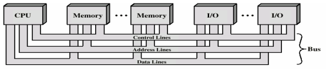
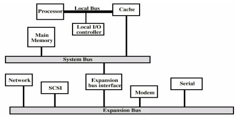

# Interconnect scheme: Bus vs crossbar

```
[Q] bus 와 interconnect의 구체적인 설계 방법 코드 있나? toy example로
```

Interconnect scheme: common communication path connecting all of the functional units. multiple masters and multiple slaves

- Bus vs. P2P (Interconnect)
  - Bus: M과 S간에 address, data, ctrl신호를 공유하므로, 자원 적지만, 여러M, 여러 S간 고속 전송이 어려움
  - P2P: 여러 M, 여러 S간 연결시 중간에 스위치 (**Interconnect**) 를 둠, 기본적으로 ack가 수 clock내 (AXI: 8 clocks)에 돌아오지 않으면 오류 처리

# Bus vs Crossbar

https://link.springer.com/referenceworkentry/10.1007/978-0-387-09766-4_476#:~:text=Although crossbars incur a higher,within switched-media network routers.

Bus:

- `A shared blocking interconnect` used for connecting multiple compoents
- A master places request signals on the bus and wait for the acknowledge signals from a slave
- Only `one master` can use a bus at a time → blocking interconnect

Crossbar

- `A non-blocking interconnect`
- Multiple masters place request signals on the crossbar
- No need to wait for the acknowledge signals → Can do other jobs → non-blocking interconnect → **ID** used
- `Multiple masters` can use a crossbar together

# Examples

Bus: WB, APB, AHB, TL-UL

Crossbar: AXI, TL-UH, TL-C

# Ref

### Bus: WB, APB, AHB

[Bus.pdf](https://s3-us-west-2.amazonaws.com/secure.notion-static.com/68c0c031-1680-4b8c-8227-819873d46fff/Bus.pdf)

Single bus: shared control lines, address lines, data lines




Multiple bus: local bus, system bus, expansion bus, …




### 